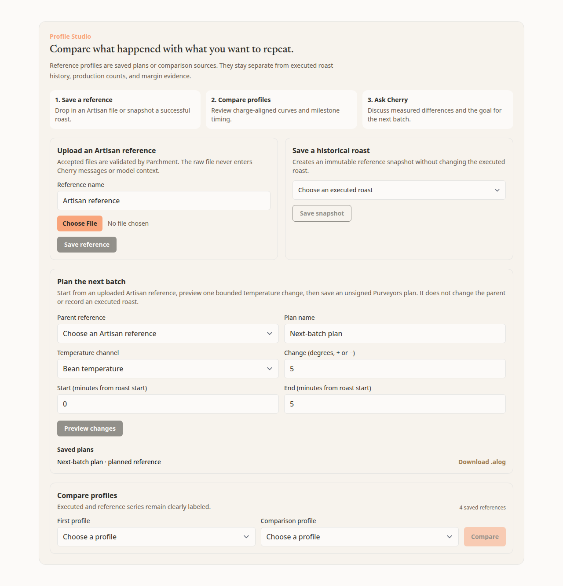
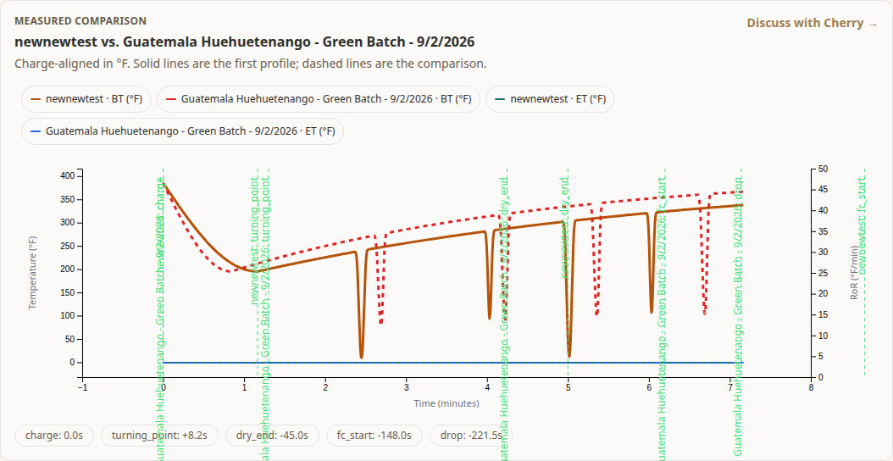
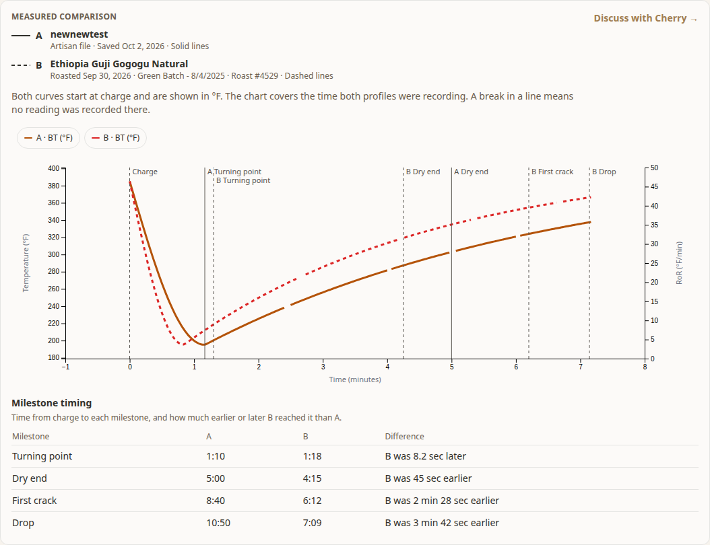
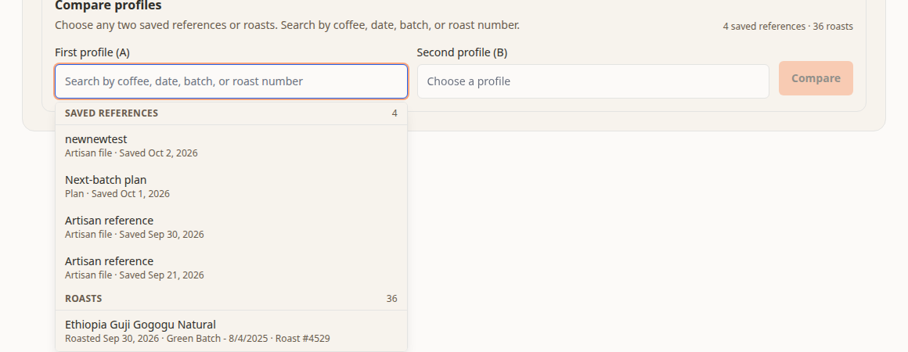
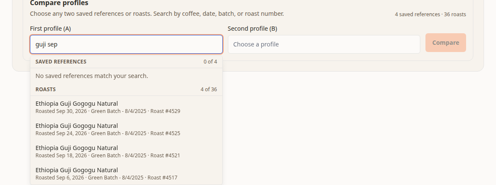

# Profile Studio restructure

**Status:** Superseded on 2026-10-04 by [Roast and portfolio workflows](2026-10-04-roast-and-portfolio-workflows.md), which replaces the Option A recommendation below with an Option B structure. The inventory of the page and the list of confusions remain valid inputs. Nothing in this document is built.
**Date:** 2026-10-03
**Related:** parchment-api [Artisan Interoperability Epic 3](https://github.com/reedwhetstone/parchment-api/blob/main/docs/plans/2026-09-21-artisan-interoperability-epic-3.md), parchment-api PR #336 (missing readings at import), parchment-api PR #337 (plan from a roast in history, SDK 0.54.0)

## Why this exists

Reed, 2026-10-03: "The profile studio is a total mess. Its very confusing what is actually being offered."

Epic 3 says Profile Studio should let a roaster bring an Artisan profile or a past roast into a reference library, compare it with another roast, build a planned revision with a preview, and export an `.alog` for Artisan. The API does all of that. The page presents it as five forms arranged by how the data is stored, so the roaster has to work out which form matches what they came to do.

This plan reorganizes the page around four jobs:

1. See a past roast's curve.
2. Compare two roasts or references.
3. Make a plan for the next roast from a past roast or reference.
4. Send the plan to Artisan.

The picker and chart bugs Reed reported the same day are fixed separately in the PR that carries this document. They are listed at the end so this plan does not repeat them.

## What the page offers today

Everything below lives on `/roast`. Access is the same throughout: the page requires a signed-in session, the Studio section and every `/api/reference-profiles` route require the member role (Mallard Studio), and Parchment checks the Mallard Studio entitlement again on every reference-profile read and write. Parchment Intelligence on its own does not unlock any of it. A viewer sees the locked state in the last row.

| #   | Section on the page                                   | What the user can do                                                                             | States                                                        | Access                                                                                                     |
| --- | ----------------------------------------------------- | ------------------------------------------------------------------------------------------------ | ------------------------------------------------------------- | ---------------------------------------------------------------------------------------------------------- |
| 1   | Page hero, "Roast studio"                             | Open the new-roast form; four summary tiles                                                      | Loading, error with retry                                     | Signed in; "New roast profile" needs Mallard Studio                                                        |
| 2   | Profile Studio header and three numbered steps        | Read only                                                                                        | Always shown                                                  | Signed in                                                                                                  |
| 3   | "Upload an Artisan reference"                         | Name a reference, choose an `.alog`, save it                                                     | Saving; success notice; error                                 | Mallard Studio                                                                                             |
| 4   | "Save a historical roast"                             | Pick a roast, save a snapshot of its chart as a reference                                        | Saving; success notice; error                                 | Mallard Studio                                                                                             |
| 5   | "Plan the next batch"                                 | Pick an uploaded Artisan reference; set channel, degrees, start and end minutes; preview; save   | Loading parent chart; preview; "inputs changed"; saved; error | Mallard Studio                                                                                             |
| 6   | "Saved plans" (inside 5, only once one exists)        | Download a plan as `.alog`                                                                       | Hidden until a plan exists                                    | Mallard Studio                                                                                             |
| 7   | "Compare profiles"                                    | Pick two roasts or references, compare                                                           | Comparing; error                                              | Mallard Studio                                                                                             |
| 8   | "Measured comparison" (after 7)                       | Read the chart and milestone timing; "Discuss with Cherry"                                       | Shown after a comparison                                      | Mallard Studio; Cherry also accepts Parchment Intelligence, but Intelligence alone cannot read roast files |
| 9   | Roast list and roast session chart (below the Studio) | Browse batches, open a roast, see its curve, log a live roast, import an Artisan file as a roast | Browse and active tabs                                        | Signed in to view; Mallard Studio to create, edit, or import                                               |
| 10  | Locked Studio                                         | One paragraph and "Unlock Mallard Studio"                                                        | Shown to viewers                                              | Links to `/subscription?plan=studio-monthly`                                                               |

Related entry points outside the section: the new-roast form and the roast chart both import an `.alog` as an executed roast, and the Cherry composer can attach an `.alog` as a saved reference.

Things the API supports that the page does not offer: a list of saved references, seeing a saved reference's curve, renaming, archiving, or deleting a reference, and linking a reference to a roast.

## Why it is confusing

These come from rendering the page locally with seeded roasts and references and reading each component.

1. **Three things are called a studio.** The plan is "Mallard Studio", the page hero says "Roast studio", and the section says "Profile Studio". Nothing says how they relate.
2. **The page is ordered by storage, not by task.** The cards run: store a file, store a snapshot, generate a revision, compare. The most common reason to come here, looking at a roast, sits below all of it. The Studio section alone is about 1,300 pixels tall at desktop width.
3. **The numbered steps do not match the cards.** The steps read "Save a reference, Compare profiles, Ask Cherry". The cards are upload, snapshot, plan, compare. Planning is not a step. "Ask Cherry" is not a card; it is a link that appears only after a comparison.
4. **Saving a roast as a reference has no visible payoff.** Roasts can already be compared directly. A snapshot cannot be planned from or exported, and the page only says so later, in a different card, after one exists.
5. **Planning looks broken for most users.** The plan form only accepts an uploaded Artisan file. A user with 200 roasts and no upload sees an empty "Choose an Artisan reference" list and no explanation.
6. **Fourteen names for three things.** On one screen: reference profile, reference, Artisan reference, saved reference, historical roast, executed roast, snapshot, immutable reference snapshot, plan, planned reference, unsigned Purveyors plan, parent reference, parent, comparison profile. The user needs three: a roast, a saved reference, and a plan.
7. **The copy explains our system instead of the user's benefit.** Examples: "Accepted files are validated by Parchment. The raw file never enters Cherry messages or model context." "Creates an immutable reference snapshot without changing the executed roast." "preview one bounded temperature change, then save an unsigned Purveyors plan."
8. **The plan form is written for the API.** "Temperature channel", "Change (degrees, + or −)", "Start (minutes from roast start)". It does not say what a plan is for or what happens after saving.
9. **Sending to Artisan is nearly invisible.** The download link appears only after a save, and again in a small "Saved plans" list. Nothing says what to do with the file in Artisan.
10. **There is no library.** Saved references cannot be seen, opened, renamed, or removed. The only evidence they exist is a count and a dropdown. The default name "Artisan reference" makes uploads identical.
11. **The same `.alog` file has three upload points with different results.** The roast form and roast chart record it as a roast. The Studio and the Cherry composer save it as a reference. The page does not explain the difference where the choice is made.
12. **Messages appear far from the action.** One shared notice area sits under the header for upload and snapshot results, while the buttons are up to a screen away.

## Options

Both options keep the existing brand language and components: `OperationsHero`, the bordered panel cards, the existing tab row pattern from the roast list, `RoastChart`, and the new `ProfilePicker`. Neither adds a new visual treatment.

### Option A: one Studio section with three tabs, placed after the roast (recommended)

The roast list and roast chart move to the top of the page, because looking at a roast is job 1. Profile Studio follows as one section with three tabs.

- **Compare.** Two pickers and the comparison result. This is what exists after the picker fix.
- **Plan next roast.** A four-step flow in one card: choose what to start from, say what to change, check the preview, save and take it to Artisan.
- **Saved profiles.** The missing library: every saved reference and plan with its source and date, and the actions to open its curve, compare it, plan from it, download it, rename it, or remove it. Adding an Artisan file lives here.

The roast chart header gains two links, "Compare this roast" and "Plan next roast from this", which open the matching tab with the roast already chosen. That connects job 1 to jobs 2 and 3 without merging the surfaces.

"Save a historical roast" stops being its own card. Comparing never needed it, and once PR #337 ships, planning from a roast saves the reference as part of saving the plan.

### Option B: no Studio section; actions live on each roast

Each roast's chart gets an action bar with Compare and Plan. A comparison draws the second profile over the roast chart in place. The plan editor opens as a panel beside the chart. A short "References and plans" list sits in the batch sidebar.

This matches how a roaster thinks ("this roast, versus that one") more closely than A. It costs more and carries more risk:

- It changes `RoastChartInterface`, which also runs live roast logging.
- Comparing two saved references, with no roast involved, has no natural home.
- Viewers lose the single place that explains what Mallard Studio adds.

### Recommendation

Option A, with the two roast-chart links from Option B. It fixes the ordering, the vocabulary, and the missing library by rearranging components that exist, and leaves live roast logging untouched. Option B's overlay can follow later if the links show that people start from a roast.

## Copy for Option A

Three nouns only: **roast** (something that was roasted), **saved reference** (an Artisan file or a roast kept to repeat), **plan** (a curve to follow next time). Retire from the screen: executed roast, historical roast, snapshot, immutable, parent, planned reference, unsigned, charge-aligned, bounded.

**Section header**

- Kicker: Profile Studio
- Heading: Compare roasts and plan the next one.
- Body: Line up any two roasts or saved references, turn one into a plan for your next batch, and take that plan into Artisan.

**Tabs:** Compare · Plan next roast · Saved profiles

**Compare**

- Heading: Compare two profiles
- Body: Choose any two roasts or saved references. Search by coffee, date, batch, or roast number.
- Empty, no roasts and no references: Record or import a roast, and it will appear here to compare.
- Empty, only one profile: You have one profile so far. Roast again or add an Artisan file to compare.

**Plan next roast**

- Heading: Plan your next roast
- Body: Start from a roast or reference you liked, adjust it, and save the result as a curve to follow in Artisan. Your roast history is not changed.
- Step 1, "Start from": a `ProfilePicker` listing what a plan can be built from.
- Step 2, "What to change": Raise or lower [bean temperature / environmental temperature] by [5] °F, from [0] to [5] minutes after charge. Helper: Up to 20 °F (10 °C).
- Step 3, "Preview": Plan preview · not saved yet. The dashed line is what you started from.
- Step 4, "Save and send to Artisan": buttons "Save plan", then "Download for Artisan (.alog)".
- After download: In Artisan, open Roast, then Background, and load this file. The plan appears behind your live curve as a guide. It does not control your roaster. (Confirm the menu wording against the current Artisan release before shipping.)
- Empty, nothing to start from: A plan starts from a roast or reference that still has its Artisan file. Import a roast from Artisan, or add an Artisan file under Saved profiles.
- Roasts that cannot be used, after PR #337: [N] older roasts were imported before Artisan files were kept. Import the roast's .alog again to plan from it.

**Saved profiles**

- Heading: Saved profiles
- Body: References you kept and plans you made. They are never counted as roasts.
- Row labels: Artisan file · Saved Sep 28, 2026; Saved from a roast · Saved Oct 2, 2026; Plan · Saved Oct 1, 2026
- Row actions: View curve · Compare · Plan from this · Download for Artisan (plans) · Rename · Remove
- Add button: Add an Artisan file. Helper: Keeps the file as a reference to compare or plan from. To record it as a roast you ran, import it from the roast instead.
- Empty: Nothing saved yet. Add an Artisan file to keep a profile you want to repeat, or make a plan from a roast.

**Locked (viewer)**

- Heading: Compare roasts and plan the next one.
- Body: Profile Studio is part of Mallard Studio. Compare any two roasts, plan your next batch from one you liked, and take the plan into Artisan.
- Button: Unlock Mallard Studio

## Accounting for PR #337 (SDK 0.54.0, not released)

Nothing above depends on it until the fourth PR below. When it is released:

- "Start from" lists roasts from `referenceProfiles.roastCandidates`, newest first, next to uploaded references and saved plans. The response also counts roasts with no Artisan file on record, which feeds the "cannot be used" line.
- Preview for a roast uses `referenceProfiles.previewFromRoast`, which is read-only.
- Save calls `referenceProfiles.fromRoast` with `basis: "artisan_source"`, then the existing generate call. If the second call fails, the user keeps a correct saved reference and a retry reuses it.
- A roast with no file returns `roast_artisan_source_unavailable` with a reason. Show the reason as the next step, not as a failure.
- Only 3 of 58 imported roasts have a stored file today. Until older imports are re-imported or backfilled, most roasts will show the "cannot be used" line, so that copy matters.

## Rough PR breakdown

1. **Picker and chart fixes.** Done in the PR that carries this document.
2. **Reorder and rename.** Move the Studio below the roast list and chart. Add the three tabs with Compare and the existing plan form. Apply the copy above. Put each message next to its own button. Remove the three numbered steps and the standalone "Save a historical roast" card. No API change.
3. **Saved profiles.** The library list, "View curve" (existing chart route), "Compare" and "Plan from this" (prefill the other tabs), "Add an Artisan file", and rename and remove through the SDK's existing `update` and `delete`. Adds two thin BFF routes.
4. **Plan from a past roast.** Needs PR #337 deployed and SDK 0.54.0 released. Adds the candidate list, roast preview, the combined save, and the "cannot be used" reasons.
5. **Send to Artisan and roast-chart links.** The step 4 download block with instructions, and "Compare this roast" and "Plan next roast from this" on the roast chart header.

PRs 2 and 3 are independent of the unreleased SDK. PR 5 can ship before PR 4.

## Decisions for Reed

1. **Option A or B.** Recommendation: A, with the two roast-chart links.
2. **Three studios.** Recommendation: keep "Mallard Studio" for the plan and "Profile Studio" for this section, and change the page hero title from "Roast studio" to "Roasts". This is a naming decision that belongs in `BRAND.md`.
3. **"Save a historical roast".** Recommendation: remove the standalone card. This is the same question as decision 4 in PR #337.
4. **Following a roast unchanged.** A plan needs at least one temperature change. If "send this roast to Artisan as it is" should be possible, it is the small follow-up described as decision 2 in PR #337, and it would add one button to step 4.

## Already fixed alongside this plan

For reference, the same PR fixes the reported picker and chart problems:

- The picker hid every roast without a recorded output weight. In production that was 163 of 252 roasts on the main account, including all 3 from the last 30 days and 40 of 47 Artisan imports. It now lists every roast that has anything recorded and says how many are left out.
- Roasts in the same batch had identical labels, and the only date shown was the green batch date. Labels now show coffee, roast date, batch, and roast number.
- Saved references were at the bottom of one long list. They are now a separate group above roasts, and both groups are newest first and searchable.
- The comparison chart drew long vertical labels on top of each other, plotted missing readings as real temperatures, and showed timing as unexplained chips.

