# Roast and portfolio workflows

**Status:** Proposed for review. Nothing in this document is built.
**Date:** 2026-10-04
**Replaces:** the Option A recommendation in [Profile Studio restructure](2026-10-03-profile-studio-restructure.md). That document's inventory of what the page offers and its list of 12 confusions still stand and are not repeated here. Its access claims do not: it says a signed-in viewer can open `/roast` and see a locked Studio, and section 4.10 shows the server redirects them first. That document now carries the correction.
**Related:** [Catalog filter and sort UX rework](2026-10-02-catalog-filter-ux-rework.md), [ADR-009 progressive depth with task parity](../decisions/009-progressive-depth-task-parity.md), parchment-api PR #346 (batch identity, PADR-0029), parchment-api PR #337 (plan from a roast in history)

## Summary

Reed's direction on 2026-10-04: portfolio is the main portal, the roast page is where people go to work on specific roasts, lean toward putting actions on the roast (Option B), and measure the result against the catalog page without copying its weak parts.

What the audit found:

1. **The roast page hides the roast.** At desktop size the first roast in the list starts 1.9 screens down, below a hero, four tiles, and a 1,272 pixel Studio section. On a phone it is 4.2 screens down. Opening a roast by link scrolls to a tab row and leaves the chart under the fold.
2. **The actions sit above and away from the thing they act on.** To compare the roast you are looking at, you scroll up, find that same roast again in a picker, find the second one, and scroll back down: 7 clicks. From the roast it should be 2.
3. **Portfolio already has the right entry point and too little in it.** The Roasting tab lists a coffee's roasts but shows only weights and loss. Roast time, drop temperature, and development are missing, so reviewing a coffee means opening every roast, each with a full page reload.
4. **Catalog has three patterns worth adopting everywhere:** state in the URL, the compare tray leading to a dedicated comparison page, and the non-blocking detail panel. It has several worth leaving behind: the header tiles, filters hidden behind an icon for signed-in members, 15-per-page paging, and three names for one saved state.
5. **Option B's main cost can be avoided.** Comparison and planning can live on their own pages under `/roast`, opened from the roast with the roast already chosen. The component that runs live roast logging is not touched until late, and only after it has tests and a guard against losing a roast in progress.
6. **Viewers never see the roast page.** The server redirects non-members from `/roast` to `/dashboard`, so the locked Studio message in the page cannot be reached. Option B loses nothing for viewers.

The proposal: `/roast` opens on the roast list; an open roast shows its chart first with an action bar (Compare with…, Plan next roast from this, Log sale); comparison, planning, and the saved library become `/roast/compare`, `/roast/plan`, and `/roast/saved`; portfolio's Roasting tab becomes a trend table whose rows and buttons link into those pages with the right roast already selected.

## Method

- Read the catalog, portfolio, roast, and profit routes and their components, `BRAND.md`, `UI-FRAMEWORK.md`, `PRODUCT_VISION.md`, ADR-009, and both existing plans.
- Rendered the app locally at 1440×900 and 390×844 against a stand-in backend. Portfolio and roast use seeded data: 5 coffees, 14 roasts in 10 batches, 3 saved references, 7 sales. Catalog uses real rows from the Parchment API. The signed-out catalog was captured from production at `purveyors.io/catalog`. The stand-in backend is not part of this PR.
- Measured positions in the rendered page with the browser, not by eye.
- Checked backend capability against the SDK version the app pins (0.46.0) and the current SDK (0.56.0).

Limits: seeded data is small. Production holds 257 roasts in 127 batches (parchment-api PR #346), so the roast list is much longer in practice. Positions above the list do not depend on its length.

### Where the content starts

| Page                                   | Desktop (900 px tall)                     | Phone (844 px tall)         |
| -------------------------------------- | ----------------------------------------- | --------------------------- |
| Catalog: first coffee card             | 439 px, 0.5 screens                       | 1,045 px, 1.2 screens       |
| Portfolio: first coffee card           | 754 px, 0.8 screens                       | 1,552 px, 1.8 screens       |
| Roast: first roast in the list         | 1,731 px, 1.9 screens                     | 3,527 px, 4.2 screens       |
| Roast: height of the Studio section    | 1,272 px                                  | 2,408 px                    |
| Roast opened by link: where it scrolls | 1,660 px                                  | 3,488 px                    |
| Roast opened by link: top of the chart | 2,550 px, starts 890 px below the landing | 4,724 px, 1.5 screens below |

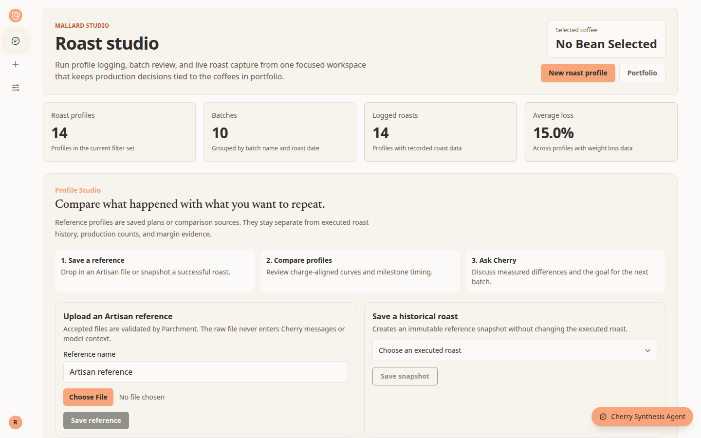

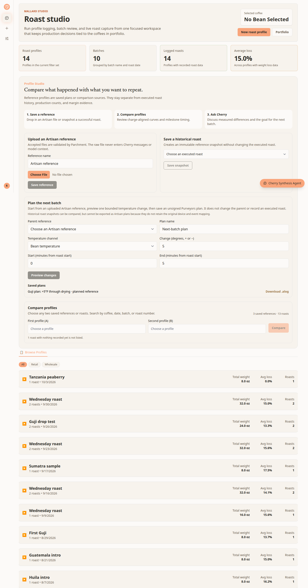

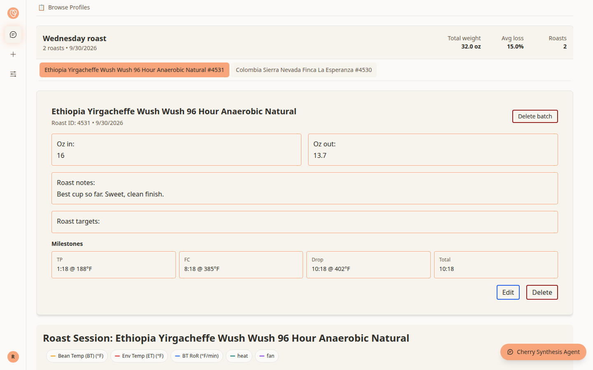

## 1. Catalog pattern audit

Verdicts: **Adopt** across the app, **Adopt with changes**, or **Do not copy**.

| #   | Pattern             | What catalog does                                                                                                                                                                                                                         | Verdict            | Reason                                                                                                                                                                                                                                                                                                                                                                           |
| --- | ------------------- | ----------------------------------------------------------------------------------------------------------------------------------------------------------------------------------------------------------------------------------------- | ------------------ | -------------------------------------------------------------------------------------------------------------------------------------------------------------------------------------------------------------------------------------------------------------------------------------------------------------------------------------------------------------------------------- |
| 1   | Page header         | Kicker, serif title, three-line description, four count tiles, and a Market Index card with "Copy filtered link".                                                                                                                         | Do not copy        | Three of the four tiles describe the 15 rows on screen, not the query ("Origins shown on this page", "Priced rows shown"). On a phone the tiles stack into four full-width rows and the first coffee starts 1.2 screens down. The promotion card takes the space where a primary action belongs. Keep a title, one line, one row of numbers at most, and the page's main action. |
| 2   | Filters and sort    | Signed-out visitors get an inline bar: origin, process, search. Signed-in members get no inline control. Everything is in a panel behind an icon, sort defaults to "None", and an active filter shows only as a number on that icon.      | Do not copy        | A paying member sees fewer controls than a visitor. The 2026-10-02 plan already replaces this with a primary row, one panel, and removable chips. Adopt that target, not today's page. Roast and portfolio inherit the same hidden panel and should get the primary row too.                                                                                                     |
| 3   | Coffee card         | Name, supplier, price, tier count, price against origin median, origin, process, freshness, Purveyor Score, tasting dots, description excerpt, four small actions. Three columns at 1440 px.                                              | Adopt with changes | Right for a coffee, and portfolio already reuses it. Wrong for a roast: roasts are compared row against row, so they need dense rows. Two fixes for the card itself: the description is cut mid-line, and two different actions are both called compare (an unlabeled arrows icon for "Compare matches" beside a labeled "Compare").                                             |
| 4   | Detail panel        | Clicking a card opens a panel from the right that does not dim or block the grid. On a phone it becomes a full-width sheet. Pill tabs inside. One panel open at a time.                                                                   | Adopt with changes | Good for coffee detail; portfolio already uses it. Changes: write the open item and tab to the URL, and use one tab style (portfolio puts emoji underline tabs inside the same panel). Do not use the panel for a roast curve: a chart needs the page width.                                                                                                                     |
| 5   | Compare             | A toggle on each card fills a bottom tray with removable chips, a count against the limit, Clear, and a button. The button opens `/catalog/compare?ids=…`, a page with a baseline choice, "Show differences only", and "Back to catalog". | Adopt              | Catalog's best pattern. Choose, see the choice, open a comparison page with a URL that can be shared. Roast comparison should work the same way. Two fixes: the tray is drawn under an open detail panel, and on a phone three chips stack and the tray covers about 140 px of the list.                                                                                         |
| 6   | Tracking and saved  | Bookmark toggle on the card with an immediate response, a count line in the header, `/catalog?tracked=only`, and the same list in portfolio's second tab.                                                                                 | Adopt with changes | The mechanics carry over to saved references: a toggle on the item and a list of what was saved. The naming does not: the same state is called "tracked", "watchlist", and "bookmarked" on different screens. Pick one. This is the same problem as the fourteen names in Profile Studio.                                                                                        |
| 7   | Loading             | A skeleton on first load. After that, old rows stay visible, dim slightly, and a thin bar pulses under the count while new results load.                                                                                                  | Adopt              | Nothing jumps and the page stays usable. Portfolio shows the word "Updating…"; roast reloads everything.                                                                                                                                                                                                                                                                         |
| 8   | Empty state         | A heading, one explanation, and two buttons: clear filters, or go to the Market Index.                                                                                                                                                    | Adopt with changes | Keep the structure. Replace the copy: "No catalog rows match this supply query… before returning to row-level catalog inspection" describes our system. It also does not say which filter is active, and the page shows it nowhere else.                                                                                                                                         |
| 9   | Errors              | Inline warning bands for partial problems, such as "Some requested filters were not applied", with the reason.                                                                                                                            | Adopt              | Says what happened and stays on screen. Roast shows failures as a corner notice that disappears after five seconds.                                                                                                                                                                                                                                                              |
| 10  | Paging              | 15 per page, Previous and Next at the bottom only, "Page 1 of 184 (2760 total items)".                                                                                                                                                    | Do not copy        | 184 pages with no way to jump. It works only because filters narrow the set. Roasts need "newest first, load more" with date presets.                                                                                                                                                                                                                                            |
| 11  | Phone layout        | One column of cards; detail and filters become sheets; the compare tray stays reachable.                                                                                                                                                  | Adopt with changes | The sheets are right. The header is not (see row 1). The floating Cherry AI button covers content on every page checked, including the "Copy filtered link" button and roast milestones.                                                                                                                                                                                         |
| 12  | URL and links       | Filters, sort, and page are written to the URL. `?coffee=<id>` opens that coffee's panel even when it is not on the current page. `?view=map`, `?tracked=only`, and `/catalog/compare?ids=` all work as links.                            | Adopt with changes | The strongest part of catalog and the biggest gap elsewhere. Two changes: opening a card by clicking it does not write `?coffee=`, so only links made elsewhere can reopen a panel; and every change replaces the history entry, so Back never closes a panel or undoes a filter. Opening an item should add a history entry; adjusting a filter should not.                     |
| 13  | List and map toggle | A two-segment control that switches the view and keeps the choice in the URL.                                                                                                                                                             | Adopt              | The right control for "Roasts / Saved references and plans". Portfolio's Purchased / Bookmarked toggle fills the active segment orange; catalog's raises it in white. Use one.                                                                                                                                                                                                   |
| 14  | Locked features     | A band tells visitors what members get. A filter the account cannot use produces a notice, not a failure.                                                                                                                                 | Adopt              | Matches `BRAND.md`: say what unlocks without making the page look broken. Roast does the opposite for non-members: a silent redirect.                                                                                                                                                                                                                                            |
| 15  | Copy                | Mostly plain. Exceptions: the empty state above, "Active rows in this query", and the matches panel: "Fetched on demand from the canonical similarity endpoint. Treat matches as sourcing leads, not accepted bean identities."           | Do not copy        | These sentences explain implementation. The repo's customer-facing copy rule excludes them.                                                                                                                                                                                                                                                                                      |

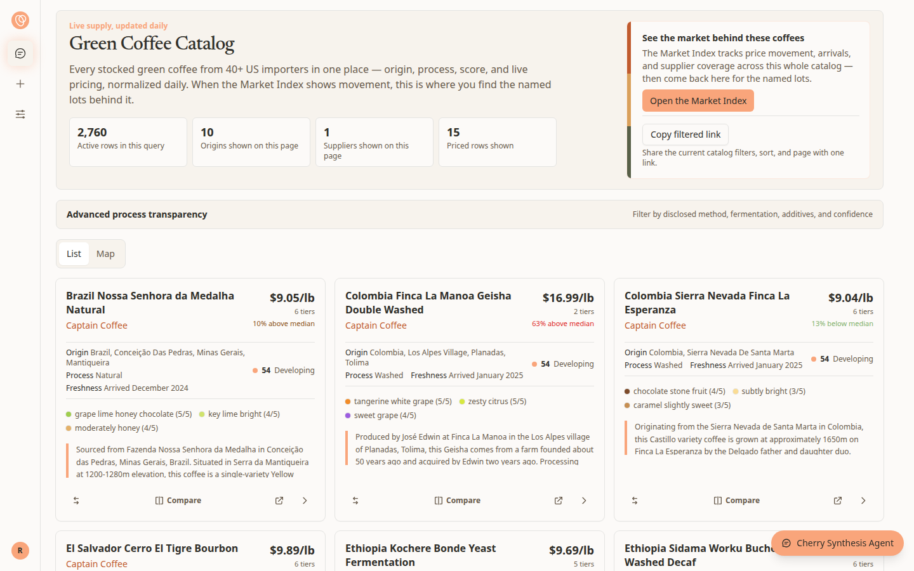

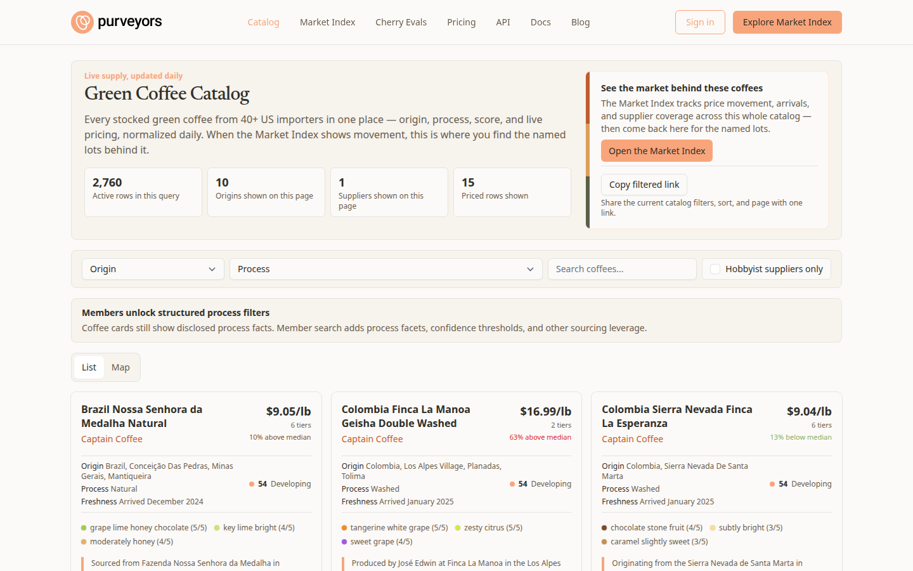

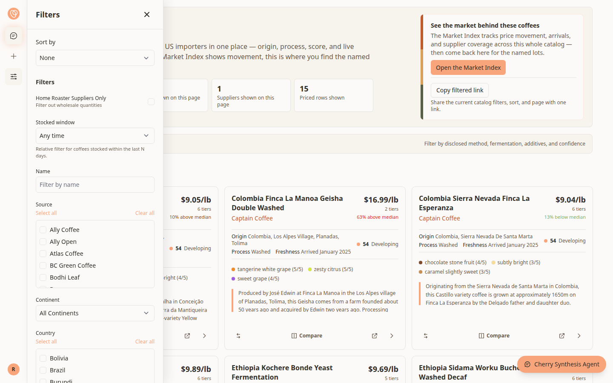

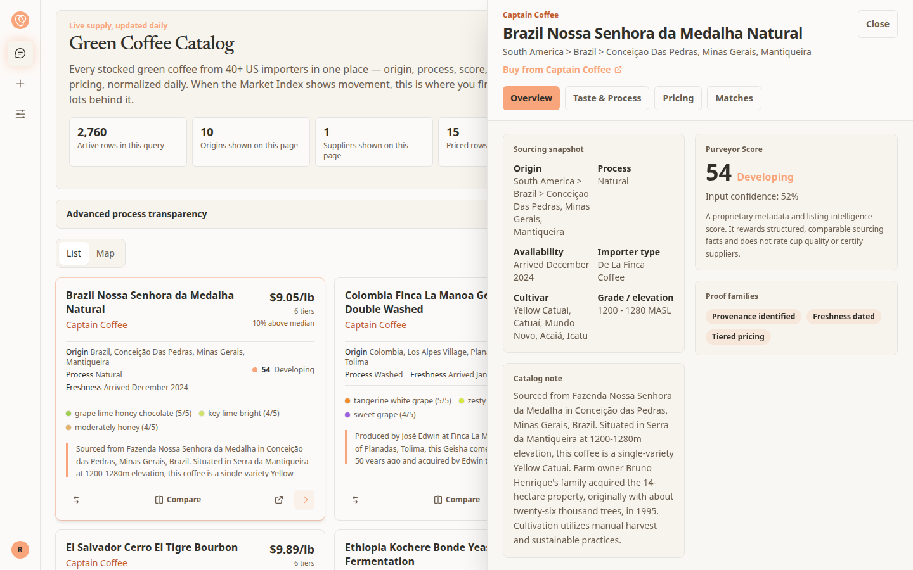

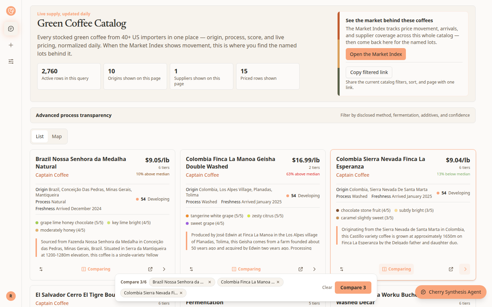

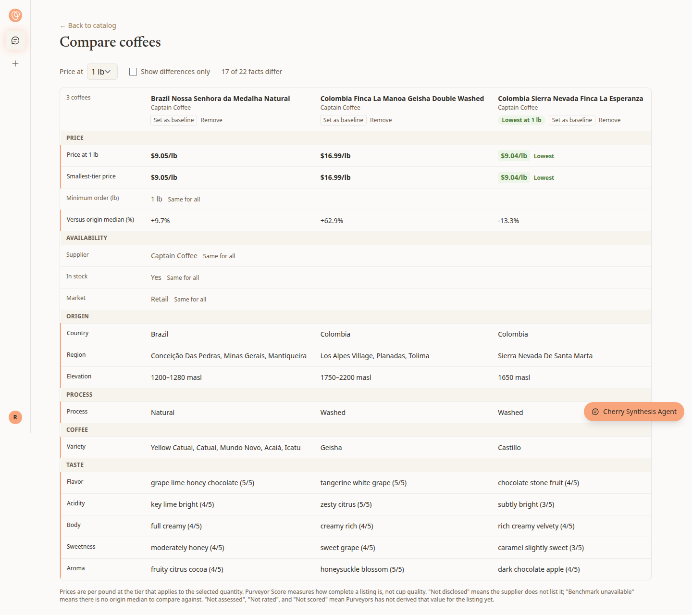

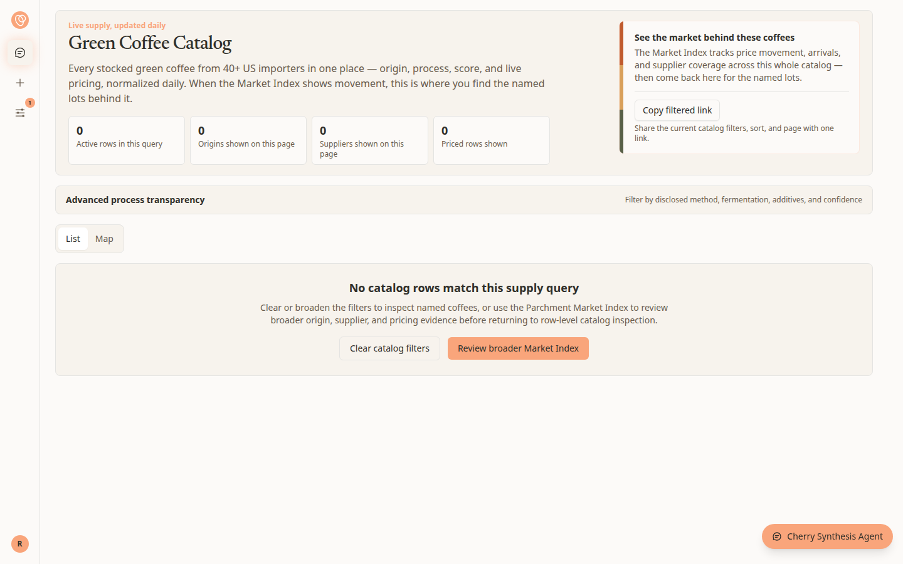

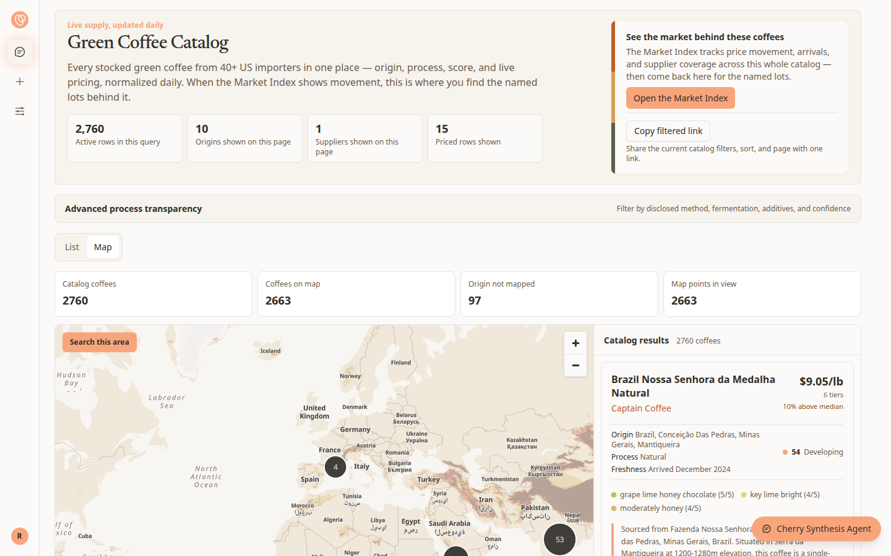

Phone: [first screen](2026-10-04-roast-and-portfolio-workflows/catalog-signed-in-phone.png), [detail sheet](2026-10-04-roast-and-portfolio-workflows/catalog-detail-phone.png), [filter sheet](2026-10-04-roast-and-portfolio-workflows/catalog-filters-phone.png), [compare tray](2026-10-04-roast-and-portfolio-workflows/catalog-compare-tray-phone.png).

The catalog fixes in rows 1, 2, 6, 8, and 15 belong to the 2026-10-02 catalog plan, not to this one. They are listed so the same mistakes are not carried into roast and portfolio.

## 2. Consistency gaps

| Pattern worth having        | Catalog                                     | Portfolio (`/beans`)                                                                   | Roast (`/roast`)                                                                                          | Gap to close                                                                                                 |
| --------------------------- | ------------------------------------------- | -------------------------------------------------------------------------------------- | --------------------------------------------------------------------------------------------------------- | ------------------------------------------------------------------------------------------------------------ |
| Content on the first screen | First card at 0.5 screens                   | First card at 0.8 screens, after the hero, tabs, five tiles, and "Portfolio by source" | First roast at 1.9 screens                                                                                | Roast first. Portfolio: move "by source" below the cards.                                                    |
| Open item is in the URL     | `?coffee=<id>` from links, not from a click | No. The open coffee and its tab cannot be linked or restored                           | `?profileId=<id>`, written on selection                                                                   | Portfolio: `?coffee=<id>&tab=`. All three: add a history entry when an item opens.                           |
| Filters in the URL          | Yes                                         | No. `?tab=bookmarked` is read on load and not written when the tab changes             | No                                                                                                        | Roast: coffee, date range, search, and retail or wholesale in the URL. Portfolio: tab and filters.           |
| Visible search and sort     | Signed out only                             | Hidden panel with 14 fields, most of them catalog fields                               | Hidden panel; "Roast Date" lists one exact date per option, with no range                                 | A primary row on each page.                                                                                  |
| Compare                     | Tray, then a page with a URL                | None                                                                                   | Two pickers inside the Studio section, above the roast; the result is not linkable                        | Roast comparison at its own URL, started from a roast or from portfolio.                                     |
| Detail                      | Panel, pill tabs                            | Same panel, different tabs with emoji, and a Delete button at the foot of every tab    | An inline block under a tab row; detail fields and two delete buttons sit above the chart                 | One tab style. Destructive actions in a menu, away from the top.                                             |
| Navigation between pages    | In-app links                                | A roast opens with `window.location.href`, a full reload                               | "Browse Profiles" is the only tab shown; the open-roast view has no tab of its own                        | In-app navigation. A plain "← Roasts" link.                                                                  |
| Empty states                | Heading, reason, two actions                | Emoji, Title Case ("No Coffee Beans Yet")                                              | An icon and one line, plus a leftover debugging line: "No roast profiles available (0 items in raw data)" | One structure, sentence case, no emoji, no debugging text.                                                   |
| Header                      | Serif title, compact                        | `OperationsHero`: large sans title, context box, two buttons                           | Same hero, titled "Roast studio"; the context box reads "No Bean Selected"                                | One compact header for work pages. Two header systems exist today.                                           |
| Dates                       | "Arrived December 2024"                     | "2026-07-28"                                                                           | "9/30/2026" in the list, "Oct 1, 2026" in the picker                                                      | One date format. In the local render one seeded roast showed as both dates; check against production values. |
| Words for the same thing    | tracked, watchlist, bookmarked              | "Add coffee" in the header, "New bean" in the + menu                                   | roast, roast profile, profile, executed roast, historical roast                                           | One word each: coffee, roast, saved reference, plan.                                                         |

**Where portfolio and roast are already better than catalog**

- **Owner context on the card.** Portfolio adds one line above the catalog card: "10.0 lb purchased · 6.0 lb remaining · Rated 9". It answers the page's question without opening anything.
- **Tiles that describe the whole set.** Portfolio's tiles (value, weight, remaining, average cost) cover every coffee in the filter and feed a decision. Catalog's describe one page of fifteen.
- **A primary action in the header.** "Add coffee", "New roast profile", and "Log sale" sit in the hero. Catalog's header has a promotion there.
- **The + menu.** New bean, New roast, and New sale are reachable from any page and open through `?modal=new`, so they can be linked.
- **The roast picker.** `ProfilePicker` is searchable, grouped, shows "4 of 36", and labels each roast with coffee, date, batch, and number. It is the "searchable select with counts" that the catalog filter plan asks for and catalog does not have.
- **The comparison readout.** A and B named in a key, and milestone timing in words ("B was 45 sec earlier"). Reuse it as is.
- **Row density.** A roast batch is one line. A catalog card is about 380 px tall.
- **Page size.** Portfolio pages by 50. Catalog pages by 15.

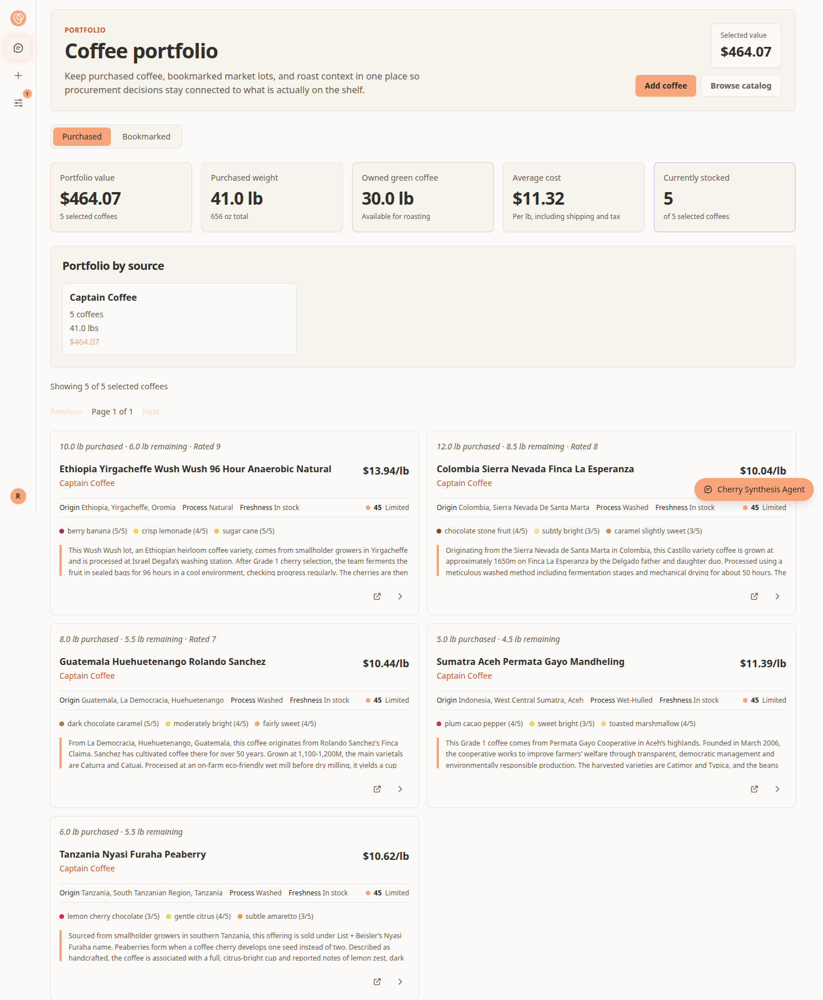

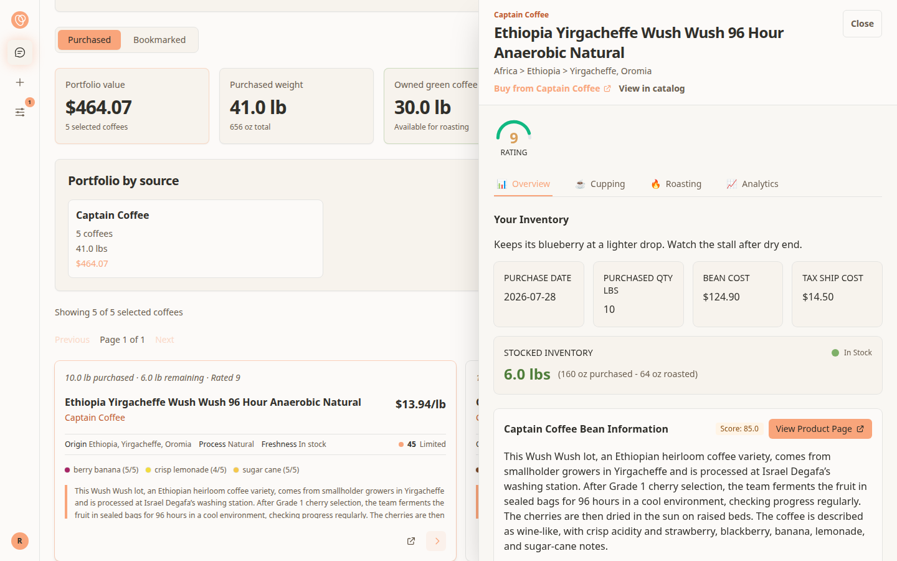

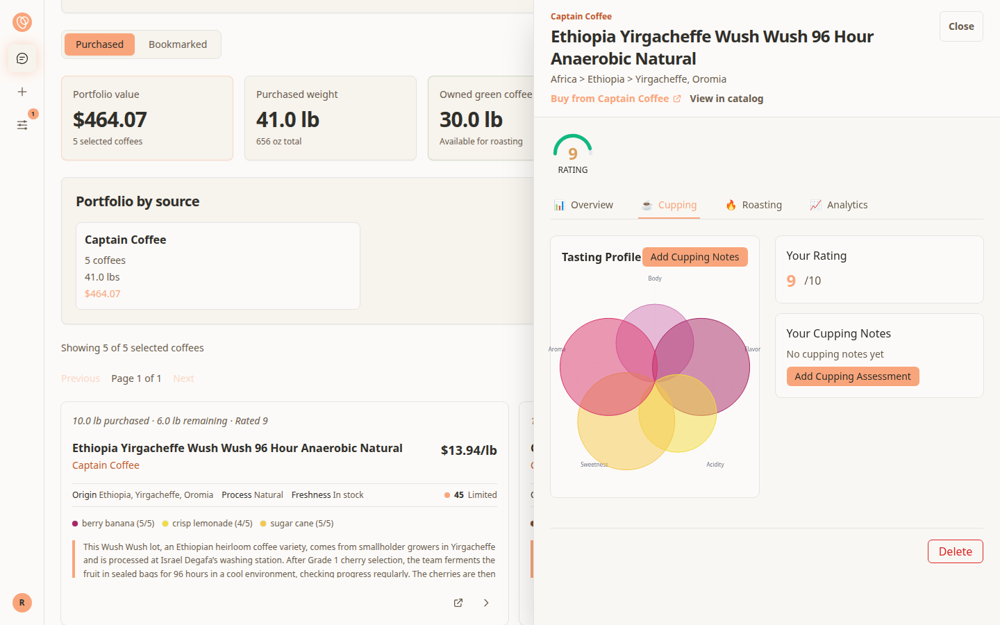

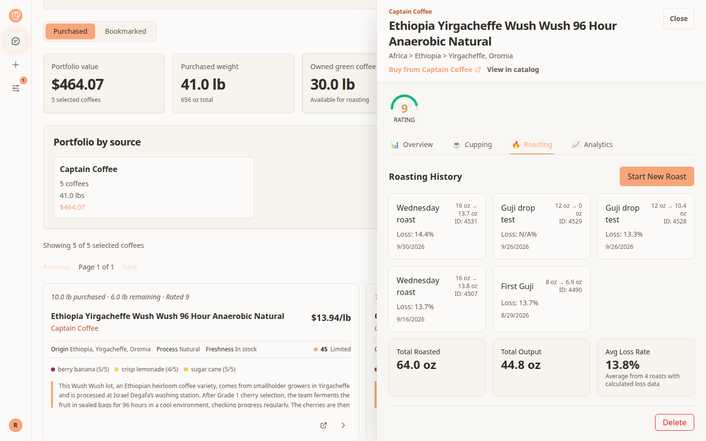

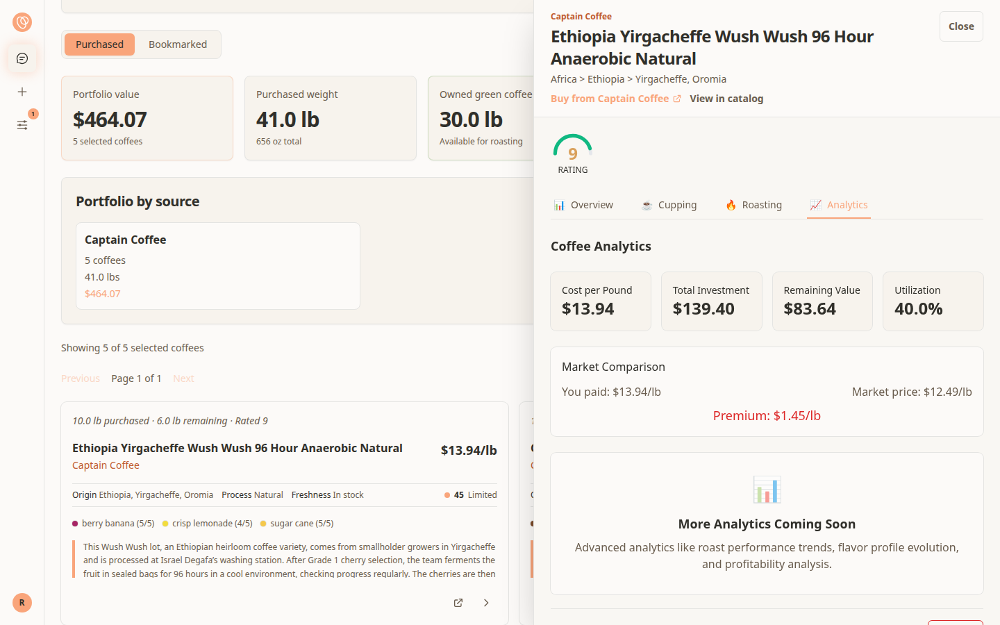

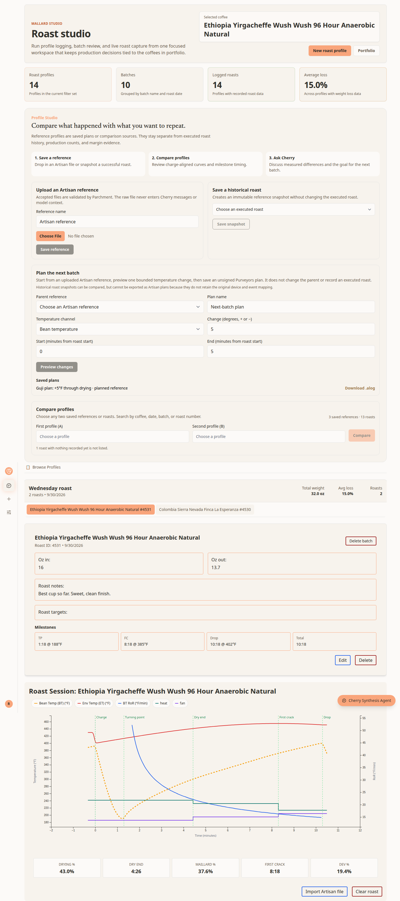

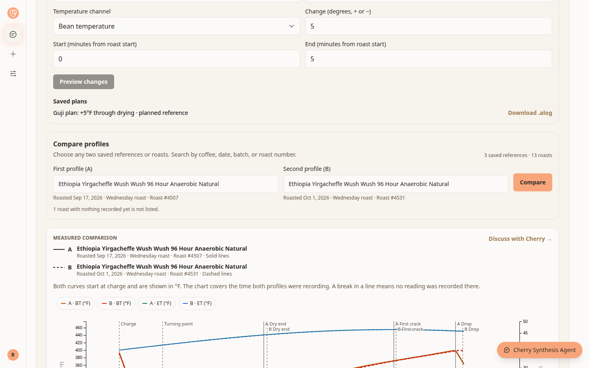

Also captured: [portfolio filter panel](2026-10-04-roast-and-portfolio-workflows/portfolio-filters-desktop.png), [roast filter panel](2026-10-04-roast-and-portfolio-workflows/roast-filters-desktop.png), [profit page](2026-10-04-roast-and-portfolio-workflows/profit-desktop.png), and on a phone the [portfolio list](2026-10-04-roast-and-portfolio-workflows/portfolio-list-phone.png), [Roasting tab](2026-10-04-roast-and-portfolio-workflows/portfolio-detail-roasting-phone.png), [roast page](2026-10-04-roast-and-portfolio-workflows/roast-list-phone.png), and a [roast opened by link](2026-10-04-roast-and-portfolio-workflows/roast-deep-link-landing-phone.png).

## 3. Workflow maps

How to read the counts:

- Counting starts with the entry page loaded. Reaching a page from elsewhere costs 2 clicks (open the navigation rail, choose the page) today and in the proposal.
- A click is one click, tap, or option chosen. Typing a search term counts as 1.
- A screen is one full viewport of scrolling at desktop size. Phone figures are in brackets.
- Form fields are listed separately from clicks.

| #   | Job                                                   | Owner                                                           | Entry points                                                                                | Today                                                                                                                                                                                                                                                                                                                              | Proposed                                                                                                                                                                          |
| --- | ----------------------------------------------------- | --------------------------------------------------------------- | ------------------------------------------------------------------------------------------- | ---------------------------------------------------------------------------------------------------------------------------------------------------------------------------------------------------------------------------------------------------------------------------------------------------------------------------------- | --------------------------------------------------------------------------------------------------------------------------------------------------------------------------------- |
| 1   | Review how a coffee has been roasting over time       | Portfolio                                                       | Portfolio. Cherry AI can also answer it.                                                    | Coffee card (1), Roasting tab (2). The tab shows batch, weights, loss, and date. Roast time, drop temperature, and development are missing, so each roast has to be opened: 1 click, a full page reload, and 1 screen of scrolling, then Back and 2 clicks to reopen the panel. **About 17 clicks and 5 reloads for five roasts.** | Coffee card (1), Roasting tab (2). The table carries the trend columns. **2 clicks, no reload.** 0 clicks from `/beans?coffee=101&tab=roasting`.                                  |
| 2   | Evaluate one roast's curve                            | Roast                                                           | Roast page directly; portfolio; a link from Cherry AI or the CLI                            | Directly: scroll 1.9 screens [4.2], open the batch (1, unless it is the newest), choose the roast (2), then scroll 1 more screen [1.5] to the chart. **1 to 2 clicks and about 3 screens [5.7].** From portfolio: 3 clicks, a reload, and 1 screen. By link: 0 clicks and 1 screen [1.5].                                          | Directly: roast row (1), chart at the top. **1 click, 0 screens.** From portfolio: 3 clicks, no reload, 0 screens. By link: 0 and 0.                                              |
| 3   | Compare this roast with an earlier one                | Roast                                                           | The open roast; portfolio's Roasting tab                                                    | Scroll up about 1 screen to the Compare card. First profile (1), type (2), choose (3), second profile (4), type (5), choose (6), Compare (7), scroll down to the result. **7 clicks and 2 scrolls**, and the roast already on screen has to be found again.                                                                        | "Compare with…" (1) lists the same coffee's other roasts, newest first; choose one (2). **2 clicks.** From portfolio: tick two rows (2), Compare (3).                             |
| 4   | Plan the next roast from one I liked, send to Artisan | Roast                                                           | The open roast; the saved library; portfolio's Roasting tab                                 | The plan form lists only uploaded Artisan files, so a roast in history cannot be used. With the original file in hand: name (1), choose file (2), Save reference (3), parent (4, 5), values, Preview (6), Save (7), Download (8). **8 clicks, a re-upload, and no link back to the roast.**                                        | "Plan next roast from this" (1), adjust if wanted, Preview (2), Save plan (3), Download for Artisan (4). **4 clicks.** Needs the SDK update in PR 5.                              |
| 5   | Log or import a roast                                 | Roast                                                           | The + menu on any page; the roast page; a portfolio coffee; the CLI (`purvey roast import`) | + (1), New roast (2), fill the form, Create (3). The new roast opens with the live controls about 1.5 screens down. From a portfolio coffee: card (1), Roasting (2), Start New Roast (3), with the coffee prefilled.                                                                                                               | Same entries and form. The new roast opens with the chart and Start control at the top: **0 screens.** A "Roast" action on the portfolio card: **1 click** to the prefilled form. |
| 6   | Record a sale against a batch                         | Profit owns the sales list. The action also lives on the roast. | The + menu; the profit page; proposed: a batch or roast                                     | + (1), New sale (2), coffee (3), batch (4), four fields, Save (5). The batch list shows names only, and a name such as "Wednesday roast" repeats every week. There is no way to start from the batch on screen. **5 clicks and 4 fields.**                                                                                         | "Log sale" on the batch or roast (1). Coffee and batch arrive filled in. Three fields, Save (2). **2 clicks and 3 fields.** With batch IDs the batch is exact.                    |
| 7   | Check stock and decide what to roast next             | Portfolio                                                       | Portfolio; Cherry AI                                                                        | Scroll 0.8 screens [1.8] to the cards. Each card states what remains. There is no sort by remaining and no sign of when a coffee was last roasted. Then card (1), Roasting (2), Start New Roast (3). **3 clicks.**                                                                                                                 | Cards on the first screen, a "Remaining" sort, and "last roasted Oct 1" on the card. "Roast" on the card (1). **1 click.**                                                        |
| 8   | Find a roast from last week                           | Roast                                                           | Roast page directly                                                                         | Scroll 1.9 screens [4.2]. Batches are newest first, so last week is near the top, each one closed: open (1), choose (2), scroll 1 more. The filter panel offers one exact date per option and no range. **2 clicks and about 3 screens.**                                                                                          | The list is the first thing on the page, newest first, with roasts visible. "Last 7 days" (1) if needed, roast row (2). **1 to 2 clicks, 0 screens.**                             |

**Which page owns what**

- **Portfolio is the portal.** It answers questions about a coffee: what do I have, how has it roasted, what should I roast next, what did it cost. Anything about a roast on this page is a link into the roast page with the target already selected.
- **The roast page is for targeted work.** It answers questions about roasts: this curve, this against that, the plan for next time, logging one now. People arrive from portfolio, from a link Cherry AI or the CLI gave them, or directly when they already know which roast they want.
- **Profit owns sales and margin.** A sale can be started from a batch or roast, because that is where the roaster is standing when a bag is sold.
- **Cherry AI and the CLI are entry points, not owners.** Cherry AI's roast cards open `/roast?profileId=` today (`RoastProfilesBlock`), and a CLI import ends with a roast ID that maps to the same link. Both benefit from the same landing fix.

## 4. The proposal

### 4.1 Structure

```text
/beans                         Portfolio (the portal)
/beans?coffee=101&tab=roasting   a coffee's panel, opened on a tab

/roast                         Roast list
/roast?roast=4531              One roast: chart first, action bar, details
/roast/compare?a=…&b=…         Comparison of any two roasts or saved references
/roast/plan?from=…             Plan the next roast
/roast/saved                   Saved references and plans
```

The Profile Studio section is removed from `/roast`. Its three jobs become three pages that are opened from a roast, from portfolio, or from the list header, with the selection carried in the URL.

Why separate pages and not an overlay drawn on the roast's own chart, as Option B was first described:

- They do not touch `RoastChartInterface`, which runs live logging.
- Comparing two saved references with no roast involved gets a natural home, which was the second cost listed against Option B.
- A comparison or plan can be linked, shared with Cherry AI, and reopened. Today neither can.
- It is the catalog compare pattern, which already works.

An overlay on the roast's own chart can follow once the viewer and the live logger are separate (PR 9). Nothing here depends on it.

### 4.2 What portfolio shows about roasts

The Roasting tab of a coffee's panel becomes a trend table. The same panel and tabs stay.

```text
Roasts of this coffee                    [ Roast this coffee ]  See all in Roasts →
5 roasts · 64 oz roasted · 6.0 lb left · 13.8% average loss

[ ] Date     Batch             In → out       Loss    Time    Drop    Dev
[ ] Oct 1    Wednesday roast   16 → 13.7 oz   14.4%   10:18   402°F   19.4%
[ ] Sep 27   Guji drop test    12 oz          —       9:56    398°F   17.4%
[ ] Sep 27   Guji drop test    12 → 10.4 oz   13.3%   10:40   407°F   21.9%
[ ] Sep 17   Wednesday roast   16 → 13.8 oz   13.7%   10:05   400°F   18.3%
[ ] Aug 30   First Guji        8 → 6.9 oz     13.7%   9:40    395°F   17.2%

2 selected   [ Compare ]                         row menu: Plan next roast · Log sale
```

- **The newest roast says how it differs** from the one before it, in words under its row: "22 sec longer · 4°F hotter drop than Sep 27". A value that was not recorded shows "—", never a zero.
- **Row click** opens `/roast?roast=<id>` with in-app navigation. No reload.
- **Tick two rows, then Compare** opens `/roast/compare?a=roast:<id>&b=roast:<id>`.
- **Plan next roast** in the row menu opens `/roast/plan?from=roast:<id>`. It shipped with PR 6, and is offered only on a roast whose Artisan file is on record, because a plan cannot be built on any other. **Log sale** is added by PR 8, or earlier with name and date prefill if that part of PR 8 is brought forward.
- **Roast this coffee** opens the new-roast form with the coffee filled in. It exists today as "Start New Roast".
- **See all in Roasts** opens `/roast?coffee=<inventory id>`. PR 3 makes the roast list read that parameter and show only that coffee's roasts, with the coffee named in a chip that can be removed. Until PR 7 the page still holds every roast, so PR 3 narrows them in the browser; the filter moves to Parchment's `coffee_id` with PR 7, when the list loads a page at a time. The control for choosing a coffee on the list itself comes with PR 7.
- **Phone:** each row becomes two lines (date and batch, then loss, time, drop, and development). Selection and Compare stay. This is the ADR-009 column-priority form.
- **Data:** the panel's current roast list carries six fields. The trend columns come from `GET /v1/roasts?coffee_id=`, which Parchment already supports and the pinned SDK already types. The app's `/api/roast-profiles` route ignores query parameters today and needs to forward `coffee_id`. No Parchment or SDK change.

On the portfolio list itself:

- The card's top line gains the last roast: "6.0 lb remaining · last roasted Oct 1 · 5 roasts".
- A "Remaining" sort is added. Parchment's portfolio query cannot order by what is left to roast, so the app's server route reads the whole filtered selection, 100 coffees per request, and sorts it there. That is what PR 3 ships.
- A "Roast" action is added to the card's action row.
- "Portfolio by source" moves below the cards so the first card is on the first screen. Measured in PR 3: at desktop size the first card moves from 754 px to 522 px of a 900 px screen. On a phone it moves from 1.8 screens to 1.6, because the hero and the five tiles still stack above it.
- The last-roast date and count need either a join against the roast list in the app's server route or two fields added to Parchment's portfolio response. The first needs no upstream change and is what PR 3 assumes.

### 4.3 The roast page

**Arriving directly (`/roast`)**

```text
Roasts                                         [ New roast ]  [ Import from Artisan ]
14 roasts in 10 batches · 15.0% average loss

( Roasts )  ( Saved references and plans )

[ Search coffee, batch, or roast number ]  [ All coffees ▾ ]  [ Any time ▾ ]  All · Retail · Wholesale

Oct 1 · Wednesday roast                         32 oz · 15.0% loss      [ Log sale ]
  Ethiopia Yirgacheffe Wush Wush   #4531   16 → 13.7 oz   10:18   402°F   19.4%
  Colombia Sierra Nevada           #4530   16 → 13.5 oz   10:55   411°F   20.3%
Sep 27 · Guji drop test                         24 oz · 13.3% loss      [ Log sale ]
  Ethiopia Yirgacheffe Wush Wush   #4529   12 oz          9:56    398°F   17.4%
  …
[ Load more ]
```

- The header is one title, one count line, and two actions. The four tiles become the count line.
- Batches are open by default with their roasts visible. Today every batch but the newest is closed, which costs a click per batch.
- Search, coffee, date range, and retail or wholesale are on the page and in the URL: `/roast?coffee=101&range=30d&q=guji&market=wholesale`.
- The list loads a page at a time, so every one of those filters has to run in Parchment, not in the browser. Coffee and date already can. Search and retail or wholesale cannot yet: `GET /v1/roasts` has separate coffee-name, batch-name, and roast-ID filters that all have to match at once, and nothing for wholesale. Section 5 and decision 9 cover what PR 7 needs.
- The count line has the same limit. Today the page adds up roasts, batches, and average loss in the browser from every roast it loaded, and `GET /v1/roasts` returns rows with no totals. From PR 7 the page holds one page of rows, so the totals for the filters in force have to come from Parchment as well. Until PR 7 the page still loads every roast and the line is correct as it is.
- A batch header shows its date first. Names repeat; dates do not.

**Arriving with a roast (`/roast?roast=4531`)**

```text
← Roasts
Ethiopia Yirgacheffe Wush Wush 96 Hour Anaerobic Natural
Roast #4531 · Oct 1, 2026 · Wednesday roast · 16 → 13.7 oz (14.4% loss) · In portfolio →

[ Compare with… ]  [ Plan next roast from this ]  [ Log sale ]  [ More ▾ ]

Charge 392°F · Turning point 1:18 · Dry end 4:26 · First crack 8:18 · Drop 10:18 at 402°F · Development 19.4%

┌───────────────────────────── chart ─────────────────────────────┐
│                                                                 │
└─────────────────────────────────────────────────────────────────┘

Notes and targets (editable)
Also in this batch: Colombia Sierra Nevada #4530
Same coffee: ← Sep 27 #4529 · next →
```

- No hero, tiles, or Studio section when a roast is open. The chart starts within the first 300 px on desktop and within one screen on a phone.
- The page does not scroll itself. Today it scrolls to a tab row that leaves the chart out of view.
- **More** holds: Save as reference, Edit details, Import Artisan file, Clear recorded data, Delete roast, Delete batch. The two delete buttons leave the top of the page. From PR 6 it also holds "Download Artisan file" for a roast whose Artisan file is on record.
- "In portfolio" opens `/beans?coffee=<id>&tab=roasting`. "Same coffee" steps through that coffee's roasts without going back to a list.
- A roast with nothing recorded shows the timer and controls in place of the milestone line. That is today's behavior, moved to the top.
- A milestone that was not marked is named in the line ("First crack not marked") instead of being left out.
- **Phone:** title, then "Compare with…" as the one visible action and the rest under More, then the milestone line as a two-row grid, then the chart.

The only difference between the two arrivals is which of these two views is drawn. "← Roasts" returns to the list with its filters intact.

### 4.4 Comparing, with or without a roast

`/roast/compare?a=roast:4531&b=roast:4507`

- Each side is `roast:<id>` or `ref:<id>`. The page is the existing comparison card on its own: two `ProfilePicker` controls, the A and B key, the chart, the milestone table, and "Discuss with Cherry AI".
- **From a roast:** "Compare with…" opens `/roast/compare?a=roast:4531` with the second picker open and that coffee's other roasts listed first.
- **From portfolio:** both sides are already chosen, so the result is on screen when the page opens.
- **Two saved references, no roast:** `/roast/compare?a=ref:<id>&b=ref:<id>`, reached from the saved library by ticking two rows, or by opening the page and choosing both sides. No roast has to be open.
- **The largest milestone difference is stated first,** above the chart: "First crack: B was 45 sec earlier". A milestone missing on either side is shown as not recorded, not as a difference.
- **Back** returns to wherever the comparison was opened from.
- No tray is needed on the roast list at first. A roast comparison has exactly two sides, and the picker reaches any roast. If selecting from the list turns out to be wanted, the catalog tray is the pattern.

### 4.5 Planning and sending to Artisan

`/roast/plan?from=roast:4531`, or `from=ref:<id>`

The four-step card from the 2026-10-03 plan, unchanged in content, on its own page with "Start from" filled in:

1. Start from: a roast or a saved reference.
2. What to change: raise or lower bean or environmental temperature by a number of degrees between two times after charge.
3. Preview: the plan over what it started from.
4. Save and send to Artisan: "Save plan", then "Download for Artisan (.alog)", with the Artisan instructions.

Starting from a roast uses `referenceProfiles.previewFromRoast` and `fromRoast`. Those need the SDK update in PR 5. Until then the page accepts saved references only and says why a roast cannot be used yet. After saving, the page stays on the plan with its download button, and the plan appears in the saved library.

### 4.6 The saved library

`/roast/saved`, reached from the second segment on the roast list and from a "Manage saved references" link in every picker.

```text
Saved references and plans                               [ Add an Artisan file ]
References you kept to repeat, and plans you made from them. They are never counted as roasts.

[ ] Guji plan: +5°F through drying       Plan · Oct 2        Download for Artisan · ⋯
[ ] Guji natural, September keeper       Artisan file · Sep 28   View curve · ⋯
[ ] Colombia Sierra Nevada, Sept 24      Saved from a roast · Sep 25   View curve · ⋯

2 selected   [ Compare ]
```

- Row menu: View curve, Compare, Plan from this, Download for Artisan (plans), Rename, Remove, and for an Artisan file, "Record as a roast I ran".
- List, rename, and remove use `referenceProfiles.list`, `update`, and `delete`, all in the pinned SDK. Two thin server routes are added.
- "Record as a roast I ran" uses `roasts.importFromReference` and needs the SDK update. It closes confusion 11 from the earlier plan: the same file had three upload points with different results.
- The library lives under Roast, not Portfolio. A saved reference does not have to belong to a coffee in the portfolio. Where one is linked to a roast, the Roasting tab can show it later.

Corrected when PR 6 was built ([evidence](2026-10-04-roast-and-portfolio-workflows/pr-6/README.md)):

- **Download for Artisan is on every row, not only plans.** Approved on 2026-10-04: a reference added from an Artisan file, or kept from a roast with that roast's file, downloads the stored file unchanged; a plan downloads its own export. A reference that holds a roast's curve without its file says so and links to the roast. This needs SDK 0.61.0 (`referenceProfiles.downloadArtisanFile`, `roasts.downloadArtisanFile`, and the `artisanFileAvailable` and `artisan_file_available` flags).
- **"Record as a roast I ran" asks which coffee.** A roast belongs to a coffee in the portfolio and a saved reference does not, so the action opens a short question with the portfolio's coffees. The reference is kept.
- **Four server routes, not two.** Rename and remove share one route; the reference's file, the roast's file, and "Record as a roast I ran" have one each. Each checks the member role itself.
- **A reference kept from a roast with its file can be planned from.** "Plan from this" follows `artisanFileAvailable`, so it is offered on uploads, on plans, and on references kept from a roast's Artisan file, and left off a reference that holds only a curve.
- **A plan's row leads with its download and its name opens the plan.** "View curve" is the first action on a reference and is in every row's menu.
- **Row labels use the wording in 4.11** ("Plan · Saved Oct 2, 2026"), not the shorter form in the sketch above.

### 4.7 Protecting live roast logging

`RoastChartInterface.svelte` is both the viewer for a saved roast and the live logger. What makes it risky:

- **One component, two modes.** Which mode is active is derived from several values at once (`isBeforeRoasting`, `isDuringRoasting`, whether saved chart data exists). A new prop or effect can flip the mode.
- **Shared stores.** The live readings sit in page-level stores (`roastData`, `roastEvents`, `temperatureEntries`, `eventEntries`) that the page also clears.
- **No guard.** Choosing another roast, or "Browse Profiles", resets the timer and empties those stores without asking. There is no navigation or unload guard in the roast route. A stray click during a roast loses it today.
- **No tests.** The roast route has one test file, for the new-roast form. Nothing covers start, log an event, or save.

Phases:

| Phase | What changes                                                                                                                                                                                                    | Touches `RoastChartInterface`                |
| ----- | --------------------------------------------------------------------------------------------------------------------------------------------------------------------------------------------------------------- | -------------------------------------------- |
| 0     | Page layout only: what is drawn above and below the component, and where the page scrolls. PR 1.                                                                                                                | No                                           |
| 1     | The action bar is added in the page, outside the component, as plain links to the new pages. The links are disabled while a roast is recording. PR 2.                                                           | No                                           |
| 2     | A guard: while the timer is running or paused with unsaved readings, selecting another roast, leaving the page, or closing the tab asks first. Component tests for start, log event, pause, and save. PR 4.     | No. The guard is in the page; tests wrap it. |
| 3     | Split the read-only viewer from the live logger. A saved roast uses the viewer; the logger mounts only for a roast with nothing recorded. An overlay on the roast's own chart becomes possible. PR 9, optional. | Yes, after phase 2's tests exist             |

PR 4 is worth doing whatever else is decided. It fixes a way to lose data that exists now.

### 4.8 URL scheme

| URL                                                   | Opens                                       | Notes                                                                                                                                                                                                                                  |
| ----------------------------------------------------- | ------------------------------------------- | -------------------------------------------------------------------------------------------------------------------------------------------------------------------------------------------------------------------------------------- |
| `/beans?coffee=<inventory id>&tab=roasting`           | Portfolio with that coffee's panel on a tab | New. Tabs: `overview`, `cupping`, `roasting`, `analytics`. Mirrors catalog's `?coffee=`.                                                                                                                                               |
| `/beans?tab=bookmarked`                               | The second portfolio tab                    | Exists for reading. Start writing it when the tab changes.                                                                                                                                                                             |
| `/roast`                                              | Roast list                                  | Filters: `coffee=<inventory id>`, `range=7d` / `30d` / `ytd`, `from=` and `to=` dates, `q=`, `market=retail` / `wholesale` (left out for All), `batch=<batch id>` once batch IDs ship. `coffee` is read from PR 3; the rest from PR 7. |
| `/roast?roast=<id>`                                   | One roast, chart first                      | New name. `?profileId=<id>` keeps working for existing links from Cherry AI and bookmarks.                                                                                                                                             |
| `/roast?modal=new&beanId=<id>&beanName=<name>`        | New-roast form, coffee filled in            | Exists. Unchanged.                                                                                                                                                                                                                     |
| `/roast/compare?a=<side>&b=<side>`                    | Comparison                                  | A side is `roast:<id>` or `ref:<uuid>`. With only `a`, the second picker opens.                                                                                                                                                        |
| `/roast/plan?from=<side>`                             | Plan editor                                 | `/roast/plan?plan=<uuid>` reopens a saved plan with its download.                                                                                                                                                                      |
| `/roast/saved`                                        | Saved references and plans                  |                                                                                                                                                                                                                                        |
| `/profit?modal=new&coffee=<id>&batch=<id>&roast=<id>` | Sale form, filled in                        | `modal=new` exists. The three prefill parameters are new. Until batch IDs ship, `batch` carries the name and `date` its date.                                                                                                          |

Rules:

- Opening an item adds a history entry, so Back closes it. Changing a filter replaces the entry.
- Every `/roast` path stays under the existing member guard in `hooks.server.ts`. It matches on the path prefix, so `/roast/compare`, `/roast/plan`, and `/roast/saved` are covered without a new rule. One exception is proposed and only if decision 4 is yes: the exact path `/roast` renders a locked page for a signed-in account without Mallard Studio. That is a guard change with its own slice, PR 10. The three child pages and every roast and reference API route keep their checks.
- Every filter on the roast list is in the URL and survives a reload, a shared link, and Back: coffee, date, search, and retail or wholesale.
- `/roast?roast=` stays a query parameter for now. A path such as `/roast/4531` would unmount the page that holds the live timer. It can come with phase 3.

### 4.9 Naming

**Three nouns**, as in the earlier plan:

- **Roast:** something that was roasted.
- **Saved reference:** an Artisan file or a roast kept to repeat.
- **Plan:** a curve to follow next time.

Retire from the screen: roast profile, profile (alone), executed roast, historical roast, snapshot, immutable, parent, planned reference, unsigned, charge-aligned, bounded. "New roast profile" becomes "New roast". "Browse Profiles" goes away with the tab row.

**Three studios**

| Name           | Today                                     | Proposal                                                                                                                                                                                 |
| -------------- | ----------------------------------------- | ---------------------------------------------------------------------------------------------------------------------------------------------------------------------------------------- |
| Mallard Studio | The paid roaster workspace, in `BRAND.md` | Keep. It is the only "Studio".                                                                                                                                                           |
| Roast studio   | The `/roast` page title                   | Rename the page "Roasts". The navigation label is already "Roast".                                                                                                                       |
| Profile Studio | The section on `/roast`                   | Retire as a name on screen. The section no longer exists, and its parts are named for what they do: Compare, Plan next roast, Saved references and plans. Internal identifiers can stay. |

Other naming to settle in the same pass:

- **Coffee, not bean,** in portfolio and roast copy: "New coffee" in the + menu, and no "No Bean Selected".
- **Cherry AI, not Cherry.** `BRAND.md` lists "Ask Cherry" and standalone "Cherry" as names to avoid. The Studio has "3. Ask Cherry" and "Discuss with Cherry →". Use "Discuss with Cherry AI".
- **One word for a saved catalog lot.** Bookmarked, tracked, or watchlist. This belongs to the catalog plan and is noted here because portfolio's second tab uses it.

### 4.10 What viewers see

Checked in the local render with a viewer account, except the last point, which is read from the code:

- `/roast` redirects to `/dashboard`. So does `/beans` unless the account has Parchment Intelligence. This is the auth guard in `hooks.server.ts`.
- The "Unlock Mallard Studio" block inside Profile Studio is therefore unreachable for a signed-in viewer. Removing the section costs viewers nothing.
- The navigation shows Roast as locked with "Roasting workflows require Mallard Studio." That is the only explanation a viewer gets.
- An account with Parchment Intelligence and no Mallard Studio can open portfolio. Its Roasting tab says "No Roasts Yet" with no button and no reason.

Proposed:

- **Portfolio Roasting tab without Mallard Studio:** "Roast history is part of Mallard Studio. Log roasts against this coffee, compare them, and plan the next one." with "See Mallard Studio".
- **`/roast` without Mallard Studio:** a locked page in place of the silent redirect. This is decision 4. It cannot be done in the page alone, because the guard redirects before the page renders. PR 10 changes the guard for the exact path `/roast` only: the locked page is drawn and no roast data is loaded for that account. `/roast/compare`, `/roast/plan`, and `/roast/saved` keep redirecting to `/dashboard`, and the roast and reference API routes keep their checks. If decision 4 is no, nothing changes and the navigation's locked label stays the only explanation.

### 4.11 Copy

**Roast list**

- Title: Roasts
- Count line: 14 roasts in 10 batches · 15.0% average loss
- Buttons: New roast · Import from Artisan
- Segments: Roasts · Saved references and plans
- Search placeholder: Coffee, batch, or roast number
- Date options: Any time · Last 7 days · Last 30 days · This year
- Empty, no roasts yet: **No roasts yet.** Log a roast live or import one from Artisan, and it will appear here.
- Empty, filters: **No roasts match.** Nothing was roasted in the last 7 days for Ethiopia Yirgacheffe Wush Wush. Button: Clear filters
- Retail or wholesale: All · Retail · Wholesale
- Opened for one coffee: Ethiopia Yirgacheffe Wush Wush ×
- Load failure: **Roasts could not be loaded.** Button: Try again

**One roast**

- Back link: ← Roasts
- Actions: Compare with… · Plan next roast from this · Log sale · More
- More: Save as reference · Edit details · Import Artisan file · Clear recorded data · Delete roast · Delete batch
- Nothing recorded: **Nothing recorded for this roast yet.** Start the timer to log it live, or import the Artisan file from this roast.
- Leaving during a roast: **A roast is still recording.** Leaving now loses the readings that are not saved. Buttons: Keep roasting · Leave
- Milestone not marked: First crack not marked
- Plan not possible: This roast has no Artisan file on record, so a plan cannot be built from it. Import its .alog to plan from it.

**Compare**

- Title: Compare roasts
- Body: Line up any two roasts or saved references. Both curves start at charge.
- One side chosen: Choose a second roast or saved reference to compare with Ethiopia Yirgacheffe Wush Wush, Oct 1.
- Largest difference: First crack: B was 45 sec earlier
- Milestone missing on one side: First crack not recorded for A
- Nothing to compare: Record or import a roast, and it will appear here to compare.
- Link: Discuss with Cherry AI

**Plan**

- Title: Plan your next roast
- Body: Start from a roast or reference you liked, adjust it, and save the result as a curve to follow in Artisan. Your roast history is not changed.
- Steps, helper text, and Artisan instructions: as written in the 2026-10-03 plan, with one change. Its empty state ends "add an Artisan file under Saved profiles"; here that reads "add an Artisan file under Saved references and plans".
- Corrected when PR 5 was built ([evidence](2026-10-04-roast-and-portfolio-workflows/pr-5/README.md)):
  - Roasts that cannot be used: Parchment's count covers every roast with no usable Artisan file, including roasts logged live or entered by hand, so "older roasts were imported before Artisan files were kept" would be false for most of them. The line reads "12 roasts have no Artisan file on record, so a plan cannot be built from them. Import a roast's .alog to plan from it." One roast named in a link gets Parchment's own reason.
  - Artisan instructions: the menu wording was confirmed against Artisan's documentation. "It does not control your roaster" is not true when Artisan is set to play back a background's events or to follow the background, so the sentence ends "unless Artisan is set to play back a background's events or to follow the background."
  - The "Raise or lower" in step 2 is a choice of Raise or Lower, and the number is always positive.
  - Saved plans stay reachable until the saved library ships in PR 6: the plan page lists them under the form, each with its link and its download, and the Studio card says so. The Studio section's own list moved with the form.

**Saved references and plans**

- Title: Saved references and plans
- Body: References you kept to repeat, and plans you made from them. They are never counted as roasts.
- Row labels: Artisan file · Saved Sep 28, 2026; Saved from a roast · Saved Sep 25, 2026; Plan · Saved Oct 2, 2026
- Add button: Add an Artisan file. Helper: Keeps the file as a reference to compare or plan from. To record it as a roast you ran, import it from Roasts.
- Empty: **Nothing saved yet.** Save a roast you want to repeat, add an Artisan file, or make a plan from a roast.

**Portfolio, Roasting tab**

- Heading: Roasts of this coffee
- Summary: 5 roasts · 64 oz roasted · 6.0 lb left · 13.8% average loss
- Newest roast: 22 sec longer · 4°F hotter drop than Sep 27
- Buttons: Roast this coffee · See all in Roasts
- Empty: **No roasts of this coffee yet.** Roast it and its history will build here. Button: Roast this coffee
- Without Mallard Studio: Roast history is part of Mallard Studio. Log roasts against this coffee, compare them, and plan the next one. Button: See Mallard Studio

**Locked roast page** (PR 10, if decision 4 is yes)

- Title: Log, compare, and plan your roasts
- Body: Roasts are part of Mallard Studio. Keep every roast's curve, compare any two, plan the next one, and take the plan into Artisan.
- Button: Unlock Mallard Studio

### 4.12 Task parity (ADR-009)

ADR-009 requires each analytical module to declare ten things. The five modules this proposal adds or reshapes are declared below in the ADR's order. The saved library is a list to manage, not a read of data, so it carries no declaration; on a phone it is the same rows on two lines.

**Portfolio Roasting tab**

- **User question:** How has this coffee been roasting?
- **Decision:** Repeat the last roast, adjust the next one, or compare two.
- **Overview:** The summary line (5 roasts · 64 oz roasted · 6.0 lb left · 13.8% average loss) and the newest roast, both on the first screen of the tab on a phone.
- **Anomaly:** The newest roast leads the table and says how it differs from the one before it: "22 sec longer · 4°F hotter drop than Sep 27".
- **Explanation:** That line, plus loss, time, drop, and development for every roast, so a drift reads down a column.
- **Source:** The roast count in the summary, and the date and batch on each row. Every value is the recorded one; a value that was not recorded shows "—". Without Mallard Studio the tab says roast history is part of Mallard Studio.
- **Action:** Open a roast, tick two and compare, roast this coffee, see all in Roasts. Plan next roast and Log sale join the row menu with PRs 5 and 8.
- **Desktop:** Seven-column table in the panel.
- **Phone:** Two-line rows in column-priority order: date and batch, then loss, time, drop, and development. The same links, selection, and Compare.
- **QA task:** On both sizes, read how the newest roast differs from the one before, then open the comparison of those two from the tab.

**One roast**

- **User question:** What happened in this roast?
- **Decision:** Keep it as a reference, compare it, or plan the next roast from it.
- **Overview:** The coffee, roast number, date, batch, and weight in and out with loss, then the milestone line. All of it sits above the chart.
- **Anomaly:** A milestone that was not marked is named ("First crack not marked"), and a roast with nothing recorded says so in place of the milestone line.
- **Explanation:** The milestone line reads the curve in words: charge, turning point, dry end, first crack, drop time and temperature, development.
- **Source:** Roast number, date, and batch in the header, with the chart of the recorded readings directly below.
- **Action:** Compare with…, Plan next roast from this, Log sale, and More.
- **Desktop:** Chart at full width with the action bar and milestone line above it.
- **Phone:** Title, "Compare with…" and a More menu, the milestone line as a two-row grid, then the chart within one screen.
- **QA task:** On both sizes, open a roast by link and read first crack and drop without scrolling; open a roast with nothing recorded and see that stated.

**Compare**

- **User question:** What differed between these two?
- **Decision:** What to keep or change next time.
- **Overview:** The key naming A and B, and the largest milestone difference.
- **Anomaly:** The milestone with the largest timing difference, stated first: "First crack: B was 45 sec earlier".
- **Explanation:** Every milestone difference in words in the table. Both curves start at charge, so the times line up.
- **Source:** Each side is labelled as a roast or a saved reference, with its coffee and date. A milestone missing on either side is shown as not recorded, not as a difference.
- **Action:** Change either side, go back to the roast, Discuss with Cherry AI.
- **Desktop:** Chart and milestone table side by side with the key.
- **Phone:** Key, the largest difference, the chart, then the table as rows.
- **QA task:** On both sizes, open a comparison by link and read which milestone differed most and by how much.

**Roast list**

- **User question:** Which roast do I want?
- **Decision:** Open one.
- **Overview:** The count line (14 roasts in 10 batches · 15.0% average loss) and the newest batch with its roasts.
- **Anomaly:** Newest first, so the latest batch leads. A roast with no weight out shows its weight in alone.
- **Explanation:** Each batch header totals its weight and loss; each roast row gives time, drop, and development.
- **Source:** The count line counts what matches the filters in force, not only the rows loaded so far. Those filters are visible in the controls and in the URL, and the empty state names them.
- **Action:** Open a roast, New roast, Import from Artisan. Load more comes with PR 7 and Log sale on a batch with PR 8.
- **Desktop:** Batches with one-line roast rows.
- **Phone:** The same rows on two lines each.
- **QA task:** On both sizes, find a roast from last week in two taps.

**Plan preview**

- **User question:** What will this change do to the curve?
- **Decision:** Save it and send it to Artisan, or adjust it.
- **Overview:** What the plan starts from and the change in words: "+5°F bean temperature, 0 to 5 minutes after charge".
- **Anomaly:** The stretch where the plan line leaves the dashed line it started from. When a roast cannot be used, the reason takes the place of the preview.
- **Explanation:** The plan drawn over what it started from: "The dashed line is what you started from."
- **Source:** The roast or saved reference it starts from, named with its date; "Plan preview · not saved yet" until it is saved; "Your roast history is not changed."
- **Action:** Preview, Save plan, Download for Artisan.
- **Desktop:** The four steps with the preview chart at full width.
- **Phone:** The steps stacked, the preview chart under step 3, then Save and Download.
- **QA task:** On both sizes, build a plan from a saved reference, read the preview, save it, and download it.

ADR-009 says of Roast: "mobile must support monitoring and lightweight profile review". Today a phone needs 5.7 screens of scrolling to reach a curve.

## 5. PR breakdown

In merge order. PRs 1 and 2 carry most of the click and scroll reduction and do not touch live logging, the SDK, or Parchment. PR 10 ships only if decision 4 is yes, and can merge any time after PR 1.

| #   | PR                                            | What ships                                                                                                                                                                                                                                                                                                                                                                                                                                                                                                                   | Depends on                                                                                 | SDK or Parchment                                                                                                                                                                                                                                                                                                                                                                                       | Risk                                                                                |
| --- | --------------------------------------------- | ---------------------------------------------------------------------------------------------------------------------------------------------------------------------------------------------------------------------------------------------------------------------------------------------------------------------------------------------------------------------------------------------------------------------------------------------------------------------------------------------------------------------------- | ------------------------------------------------------------------------------------------ | ------------------------------------------------------------------------------------------------------------------------------------------------------------------------------------------------------------------------------------------------------------------------------------------------------------------------------------------------------------------------------------------------------ | ----------------------------------------------------------------------------------- |
| 1   | Roast first on `/roast`                       | The list is the first thing on the page; an open roast shows its title, milestone line, and chart first, naming any milestone that was not marked, with the hero, tiles, and Studio section not drawn above it. No self-scroll. "← Roasts". Page title "Roasts"; "New roast". Batches open by default. In-app navigation from portfolio. Remove the debugging empty state. The Studio section stays, below the list.                                                                                                         | None                                                                                       | None                                                                                                                                                                                                                                                                                                                                                                                                   | Low. Layout in `+page.svelte` and `RoastProfileTabs`.                               |
| 2   | Actions on the roast and `/roast/compare`     | The action bar with "Compare with…" and the More menu. The comparison card moves to its own page with `a` and `b` in the URL, the same-coffee roasts listed first, and the largest milestone difference stated above the chart. `?roast=` with `?profileId=` still read.                                                                                                                                                                                                                                                     | PR 1                                                                                       | None. Comparison is in SDK 0.46.0.                                                                                                                                                                                                                                                                                                                                                                     | Low. A new page from an existing card.                                              |
| 3   | Portfolio as the launch point                 | Roasting tab table with time, drop, and development, and the newest roast's change from the one before; row links; tick two and Compare; "See all in Roasts", with the roast list reading `?coffee=` and showing that coffee's roasts under a removable chip; `/beans?coffee=&tab=`; last roast on the card, "Remaining" sort, "Roast" action; "by source" below the cards; one tab style.                                                                                                                                   | PR 1 for the roast list that `?coffee=` filters; PR 2 for the compare target and `?roast=` | None. The server route forwards `coffee_id`, which `GET /v1/roasts` already accepts. The Roasting tab and `/roast?coffee=` both use it.                                                                                                                                                                                                                                                                | Low to medium. Touches the shared coffee panel.                                     |
| 4   | Live roast guard and tests                    | Confirmation before leaving or switching away from a roast in progress; component tests for start, log event, pause, and save.                                                                                                                                                                                                                                                                                                                                                                                               | None. Can merge at any point.                                                              | None                                                                                                                                                                                                                                                                                                                                                                                                   | Low. Additive, and it removes an existing way to lose data.                         |
| 5   | `/roast/plan` and plan from a roast           | The plan page; "Plan next roast from this" on the roast and "Plan next roast" in portfolio's row menu; start from a roast; the "cannot be used" reasons; download with Artisan instructions.                                                                                                                                                                                                                                                                                                                                 | PR 2                                                                                       | **SDK update from 0.46.0 to 0.54.0 or later** (0.56.0 is current) for `roastCandidates`, `previewFromRoast`. Parchment already serves them.                                                                                                                                                                                                                                                            | Medium. The update from 0.46.0 to 0.56.0 needs its own type check.                  |
| 6   | `/roast/saved` and Studio removal             | The list's second segment and the library, with view, compare, plan, download, rename, remove, add an Artisan file, and "Record as a roast I ran". The Studio section is removed from `/roast`. `BRAND.md` updated for the retired names.                                                                                                                                                                                                                                                                                    | PRs 2 and 5                                                                                | Rename and remove are in 0.46.0. "Record as a roast I ran" needs the PR 5 update. The file downloads need SDK 0.61.0. Four new server routes in the app.                                                                                                                                                                                                                                               | Medium. Removes a section people may have learned.                                  |
| 7   | Finding roasts                                | The coffee control, date range, search, and retail or wholesale on the list and in the URL (`coffee`, `range` or `from` and `to`, `q`, `market`); "Load more"; the server route passes every filter and the paging upstream and stops loading every roast on each visit; the count line reads its totals from Parchment.                                                                                                                                                                                                     | PRs 1 and 3; the Parchment additions in the next column, released in the SDK (decision 9)  | **Two new optional parameters on `GET /v1/roasts`, `q` and `is_wholesale`, and totals for the filtered set in its response.** It already takes `coffee_id`, `date_start`, `date_end`, `limit`, and `offset`. Its `coffee_name`, `batch_name`, and `roast_id` filters must all match at once, so they cannot serve one search box; it has no wholesale filter; and it returns no count of what matched. | Medium. The page filters in the browser today, and it waits on a Parchment release. |
| 8   | Batches and sales                             | Group by batch ID; date-first batch headers; `?batch=<id>`; "Log sale" on a batch, a roast, and portfolio's row menu with the sale form filled in, sending the batch ID and, from a roast, the roast ID; delete a batch by ID.                                                                                                                                                                                                                                                                                               | **parchment-api #346 merged, migrated, and deployed; SDK 0.57.0**; PR 7 for `?batch=`      | Yes, as above. "Log sale" with name and date prefill can ship earlier as part of PR 2 if wanted.                                                                                                                                                                                                                                                                                                       | Medium. Follows a production migration.                                             |
| 9   | Viewer and logger split (optional)            | A read-only roast viewer separate from the live logger; an overlay of a second curve on the roast's own chart; `/roast/<id>` as a path if wanted.                                                                                                                                                                                                                                                                                                                                                                            | PR 4                                                                                       | None                                                                                                                                                                                                                                                                                                                                                                                                   | High. The only PR that changes `RoastChartInterface`.                               |
| 10  | Locked roast page (only if decision 4 is yes) | The guard in `hooks.server.ts` lets a signed-in account without Mallard Studio render the exact path `/roast`, which draws the locked page and nothing else. The page's server load skips the roast request for that account. `/roast/compare`, `/roast/plan`, and `/roast/saved` keep redirecting to `/dashboard`; signed-out visitors keep going to `/catalog`; the roast and reference API routes are unchanged. Guard tests cover a viewer on `/roast`, a viewer on each child page, a member, and a signed-out visitor. | Decision 4; PR 1 for the page title                                                        | None                                                                                                                                                                                                                                                                                                                                                                                                   | Medium. It changes an auth guard, so it ships alone with its tests.                 |

**New endpoints needed: none.** PRs 1 to 6, 8, and 10 use what is in the pinned SDK, the current SDK, or PR #346. PR 7 needs three additions to an existing endpoint, two optional query parameters and totals in the response:

- **`q` on `GET /v1/roasts`.** Matches when the coffee name or the batch name contains the text, or when the text is a number equal to the roast ID. Today's `coffee_name`, `batch_name`, and `roast_id` filters narrow together, so passing one search term to all three returns almost nothing.
- **`is_wholesale` on `GET /v1/roasts`.** Parchment works out wholesale from the catalog coffee linked to the roast and returns it on each row, but cannot filter by it. With the list loading a page at a time, the app cannot filter it either.
- **Totals on `GET /v1/roasts`.** The response carries rows and no totals. The count line states roasts, batches, and average loss for everything that matches the filters, and from PR 7 the page holds one page of it. The response needs those three totals for the filters in force.

The two parameters keep Parchment's existing order (newest roast date, then highest roast ID) and its `limit` and `offset` paging, so "Load more" stays correct. The totals describe the whole filtered set, whatever page is asked for. Decision 9 gives the alternative that leaves Parchment unchanged and why it is not recommended.

Two optional upstream additions:

- **Last roast per coffee.** `last_roast_date` and `roast_count` on Parchment's portfolio response would replace the join PR 3 does in the app's server route. Worth doing only if that join is slow on real data.
- **Sort the portfolio by what is left.** A `remaining` sort in Parchment's portfolio query would replace the sort PR 3 does in the app's server route, which reads every coffee in the filtered selection first. Worth doing only for portfolios of several hundred coffees.
- **Follow a roast unchanged.** A plan needs at least one temperature change, so "send this roast to Artisan as it is" has no path. It needs a small Parchment change. See decision 6.

## 6. Decisions for Reed

1. **Comparison and planning as their own pages under `/roast`, or as an overlay and side panel on the roast's own chart.** Recommendation: their own pages now. Same two-click path from the roast, no change to live logging, and two saved references can be compared with no roast. The overlay can come with PR 9.
2. **Retire "Profile Studio" and "Roast studio" as names on screen.** Recommendation: yes. "Mallard Studio" stays as the only Studio. The page is "Roasts". Recorded in `BRAND.md` in PR 6.
3. **`?roast=<id>` as the roast link, with `?profileId=` still accepted.** Recommendation: yes. It matches the noun. A path such as `/roast/4531` waits for PR 9, because it would unmount the page holding the live timer.
4. **What a non-member sees at `/roast`.** Today: a silent redirect to the dashboard. Recommendation: a locked page that says what Mallard Studio adds, with one button. `BRAND.md` asks for gated features to explain what unlocks. Yes means PR 10: a change to the auth guard for the exact path `/roast`, with no roast data loaded for that account and every child page and API route still protected. No means no guard change, and the locked-page copy in 4.11 is dropped.
5. **Keep "Save as reference" for a roast.** Comparing never needed it, and planning from a roast saves the reference as part of saving the plan. Recommendation: keep it as one item in the More menu, as a way to mark a roast worth repeating so it appears first in pickers. Remove the standalone card.
6. **Follow a roast unchanged.** Carried over from the earlier plan. Recommendation: yes, as a Parchment follow-up after PR 5. "Repeat this roast" is the most common reason to send a curve to Artisan, and today it needs a made-up change.
7. **Portfolio coffee detail stays a panel.** The trend table fits the panel at desktop width. Recommendation: keep the panel. Reconsider a full page for a coffee only when charts are added to the Roasting tab.
8. **Catalog items found here.** Header tiles, inline filters for signed-in members, one name for saved lots, the empty-state copy, and the matches-panel copy. Recommendation: fold them into slice 1 of the 2026-10-02 catalog plan instead of opening separate work.
9. **Where roast search, the retail or wholesale filter, and the count line's totals run.** Once the list loads a page at a time (PR 7), none of the three can run in the browser, and `GET /v1/roasts` supports none of them as proposed. Recommendation: add `q` and `is_wholesale` to `GET /v1/roasts` in Parchment, return totals for the filtered set, and release them in the SDK before PR 7. Search rules, order, paging, and totals stay in one place, and the CLI and Cherry AI get the same search. The alternative leaves Parchment unchanged: for a search, the app's server route sends up to three requests (`coffee_name`, `batch_name`, and `roast_id` when the text is a number), asks each for every row up to the end of the page being shown, merges them by roast ID, sorts again, and cuts the page. That gives correct results for "Load more", but each further page costs more, the search rules live in the app only, and neither the retail or wholesale filter nor the count line's totals can be had without loading every roast.
