# PR 7: finding roasts

Evidence for PR 7 of [Roast and portfolio workflows](../../2026-10-04-roast-and-portfolio-workflows.md). It follows parchment-api #355, which added one search term, a retail or wholesale filter, and totals for the filtered set to `GET /v1/roasts`, released in `@purveyors/sdk` 0.62.0.

Rendered locally at 1440×900 and 390×844 behind a stand-in backend that answers `GET /v1/roasts` as Parchment does since #355. It holds 110 roasts in 44 batches: the plan's seeded roasts, a weekly "Wednesday roast" of three coffees back to February 2026, and a monthly wholesale order of the Sumatra. Everything below was read from the rendered page with the browser on 2026-10-05 unless it says "covered by tests".

## The controls

Search, coffee, date, and retail or wholesale sit in one row under the segments, in the same panel, field, and chip styles as the catalog's primary row. "Clear all" appears when a filter is set.

- **Desktop:** the row is 60 px tall and the first roast starts at 335 px of a 900 px screen.
- **Phone:** three rows, 140 px: search; coffee and date; All · Retail · Wholesale. The first roast starts at 603 px of an 844 px screen. No sideways scrolling in any state checked.
- Every control is 30 px tall or more, the same as the catalog's.

| View                       | Desktop                       | Phone                       |
| -------------------------- | ----------------------------- | --------------------------- |
| The list with its controls | 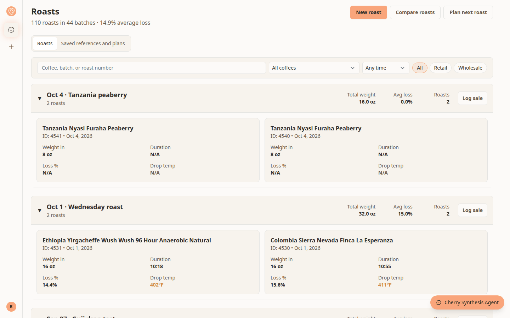   | 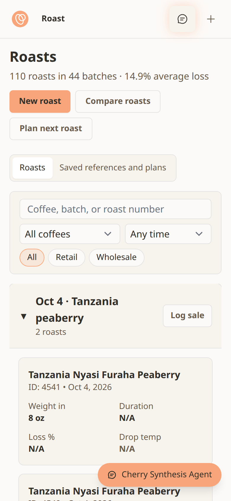   |
| A search                   | 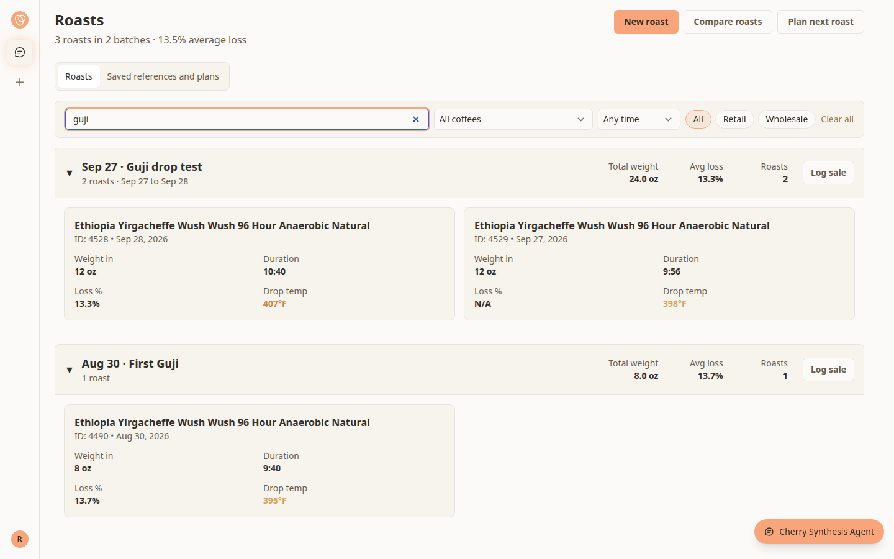       | 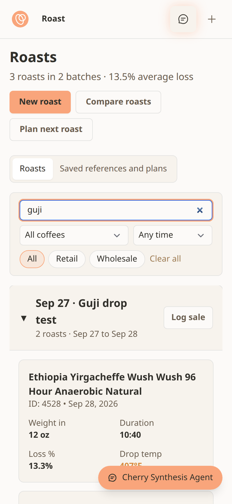       |
| Last 7 days                | 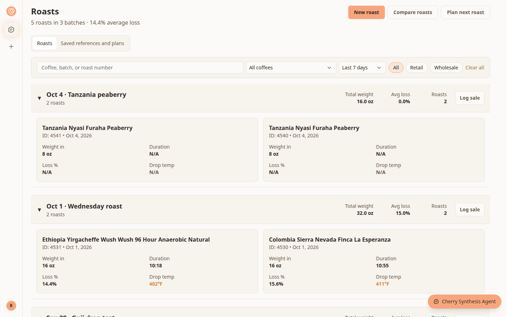  | 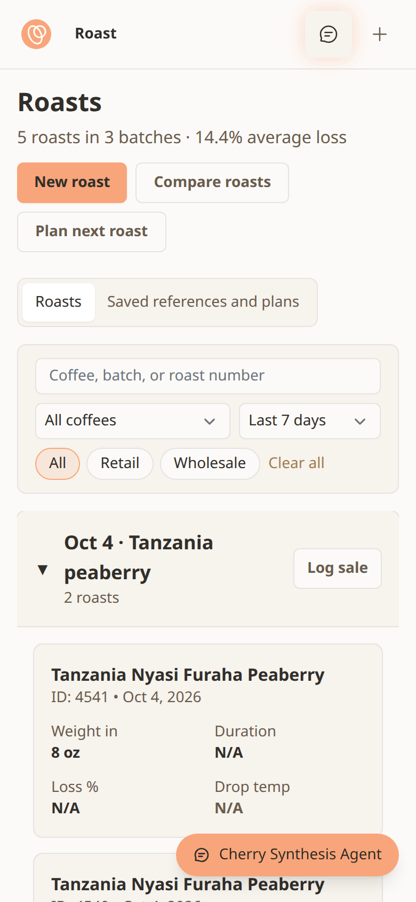  |
| Wholesale                  | 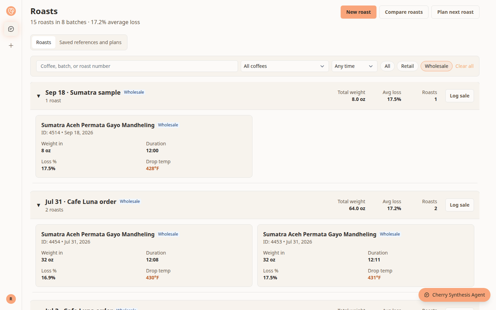    | 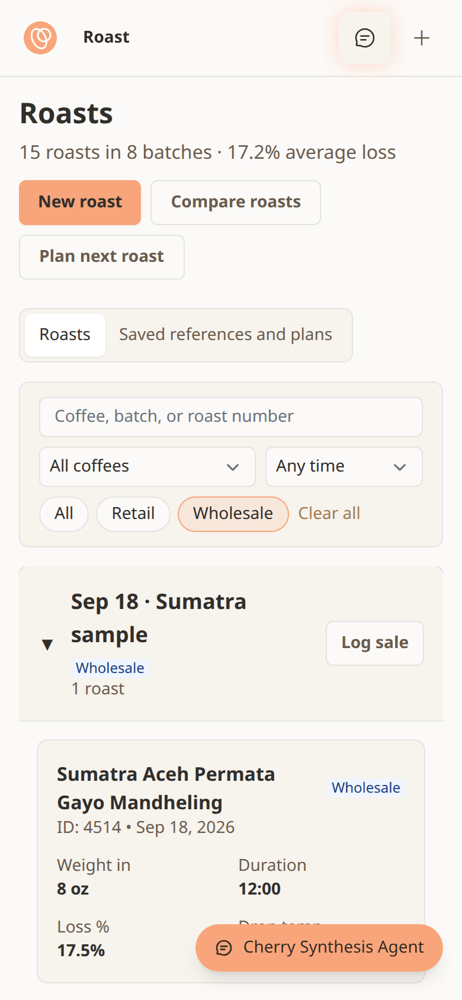    |
| One coffee, with its chip  | 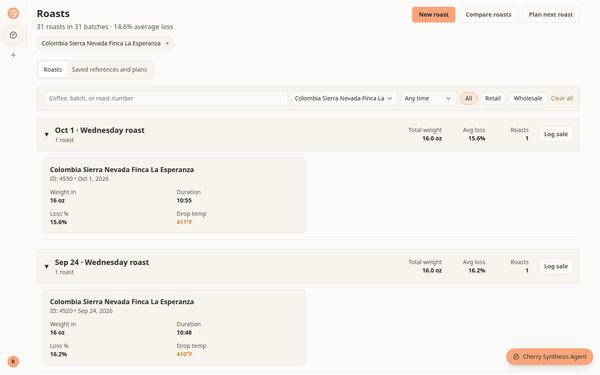   | 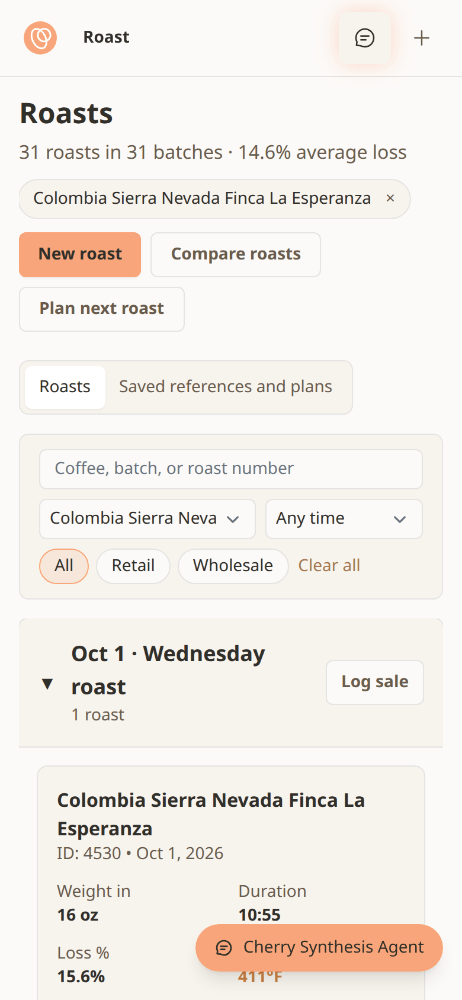   |
| Custom dates               | 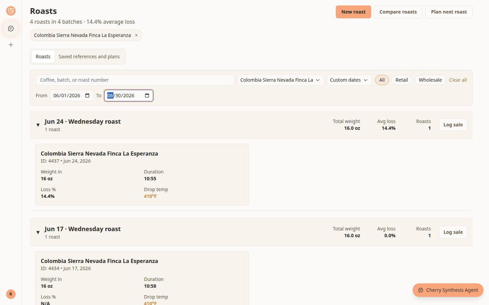 | 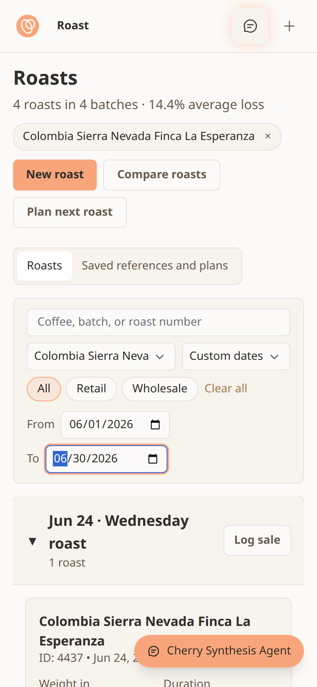 |

## Filters in the address

| Action                              | Address                                                 | Count line                                    |
| ----------------------------------- | ------------------------------------------------------- | --------------------------------------------- |
| None                                | `/roast`                                                | 110 roasts in 44 batches · 14.9% average loss |
| Search "guji"                       | `/roast?q=guji`                                         | 3 roasts in 2 batches · 13.5% average loss    |
| Search "#4514", a roast number      | `/roast?q=%234514`                                      | 1 roast in 1 batch · 17.5% average loss       |
| Search "luna", part of a batch name | `/roast?q=luna`                                         | 14 roasts in 7 batches · 17.2% average loss   |
| Last 7 days                         | `/roast?range=7d`                                       | 5 roasts in 3 batches · 14.4% average loss    |
| Wholesale                           | `/roast?market=wholesale`                               | 15 roasts in 8 batches · 17.2% average loss   |
| Retail                              | `/roast?market=retail`                                  | 95 roasts in 36 batches · 14.4% average loss  |
| All                                 | `/roast`                                                | 110 roasts in 44 batches · 14.9% average loss |
| One coffee                          | `/roast?coffee=102`                                     | 31 roasts in 31 batches · 14.6% average loss  |
| The same coffee, June 2026          | `/roast?coffee=102&from=2026-06-01&to=2026-06-30`       | 4 roasts in 4 batches · 14.4% average loss    |
| A shared link with four filters     | `/roast?coffee=101&range=30d&q=wednesday&market=retail` | 2 roasts in 2 batches · 14.1% average loss    |

- **A shared link** opens with every control showing its filter, and the list request carries `coffee_id=101&date_start=2026-09-05&q=wednesday&is_wholesale=false&limit=50&offset=0`.
- **A reload** of `/roast?range=7d` shows the same five roasts and the date control on "Last 7 days".
- **Back** from another page returns to the filtered list with its search still in the box.
- **Opening a roast** keeps the filters: `/roast?range=7d&roast=4531`, and "← Roasts" links to `/roast?range=7d`.
- Retail and wholesale split the list with nothing lost: 95 and 15 make 110.

## Loading a page at a time

- **One visit to the list** asks Parchment for one page of 50 roasts, the rest of the batch that page ended in, and the portfolio's coffees for the coffee control. Before this PR it read every roast.
- **"Load more"** adds the next 50. The list showed 51, then 102, then all 110, each roast once, and "Load more" was gone after the third page. The requests were `offset=0`, `offset=50`, and `offset=100`.
- **The count line does not change with the pages.** It read "110 roasts in 44 batches · 14.9% average loss" with 51 roasts on screen and with all 110.
- **A page can end partway through a batch.** The rest of that batch is asked for by its ID, so a batch header never counts fewer roasts than the batch has under the filters. That is why the first page shows 51 roasts and not 50.

| View                       | Desktop                              | Phone                              |
| -------------------------- | ------------------------------------ | ---------------------------------- |
| "Load more" after one page | 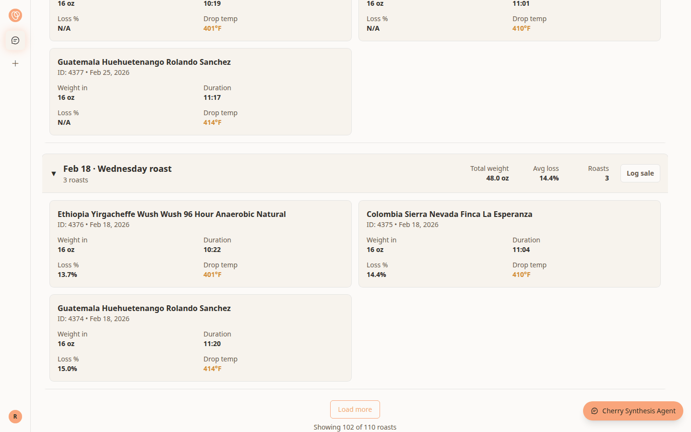           | 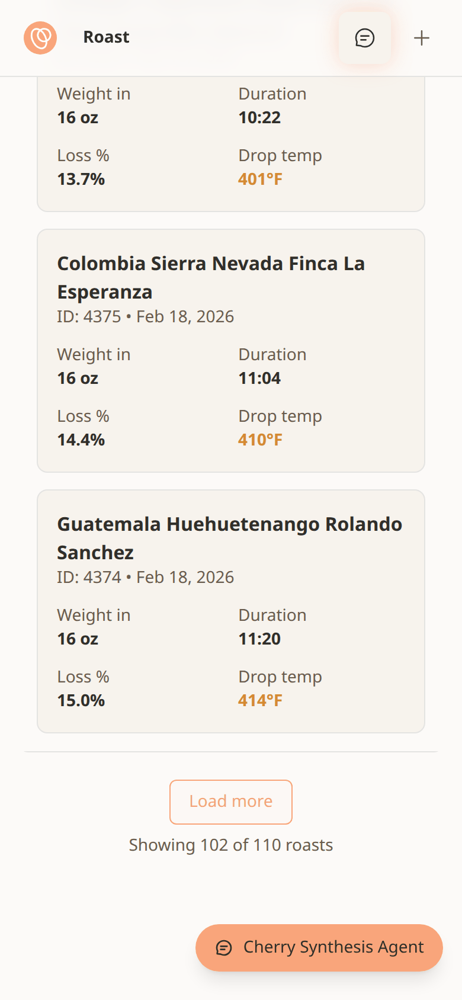           |
| The end of the list        | 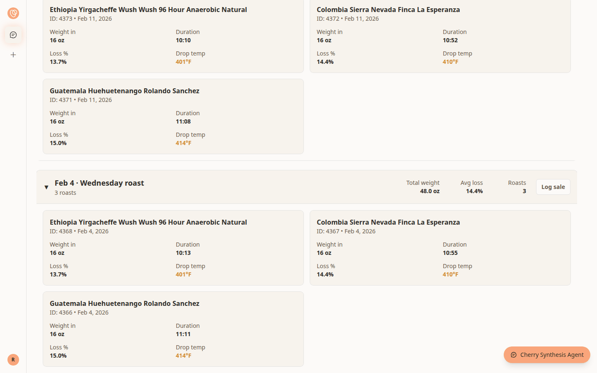 | 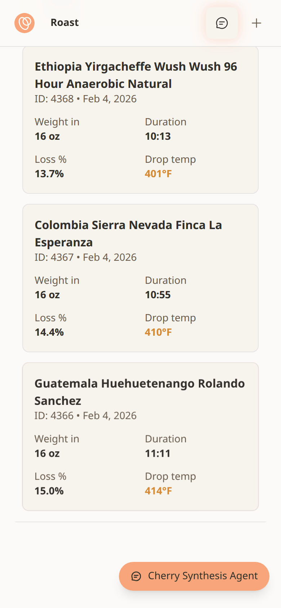 |

## Empty and unusable-search states

- `/roast?range=7d&coffee=104`: "**No roasts match.** Nothing was roasted in the last 7 days for Sumatra Aceh Permata Gayo Mandheling." with "Clear filters", which returns to `/roast`. No count line is shown.
- A search of 101 characters: "**That search cannot be used.** Search for a coffee, a batch, or a roast number, in 100 characters or fewer." with "Clear search". It is drawn as guidance, with no alert, and "Clear search" keeps the other filters: `/roast?market=retail`.
- A list that cannot be loaded says "**Roasts could not be loaded.**" with "Try again", under the controls. Covered by tests.

| View                      | Desktop                                | Phone                                |
| ------------------------- | -------------------------------------- | ------------------------------------ |
| No roasts match           | 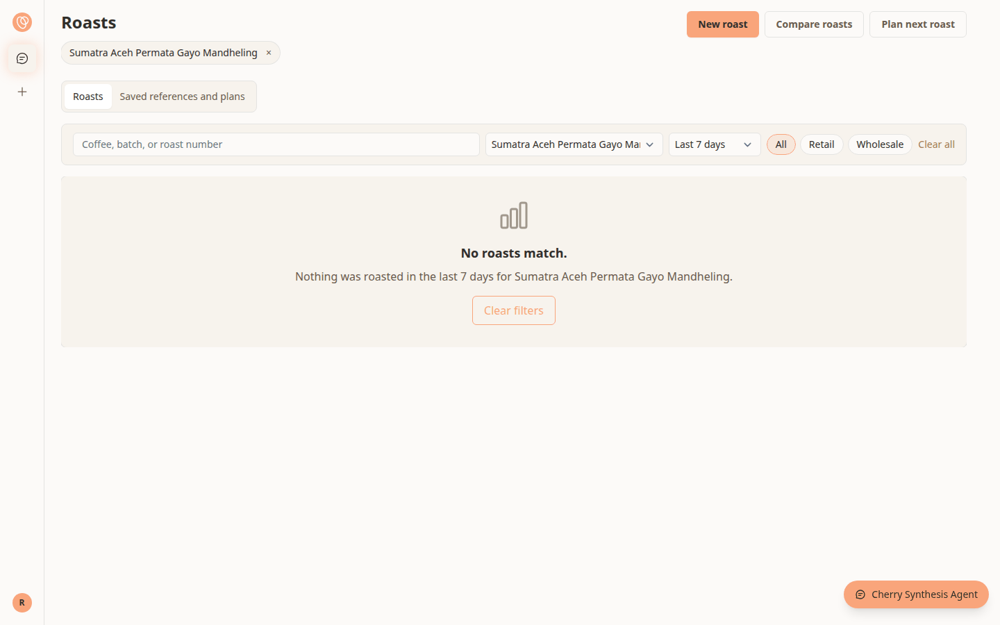       | 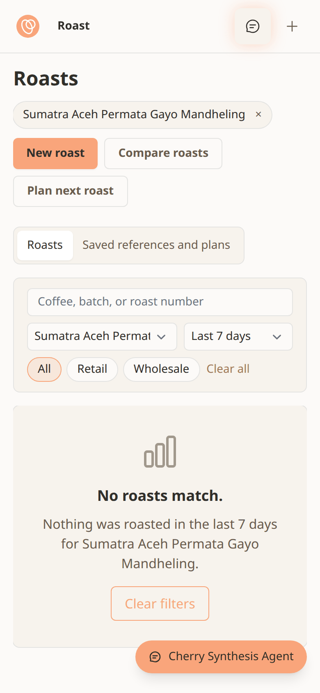       |
| A search that is too long | 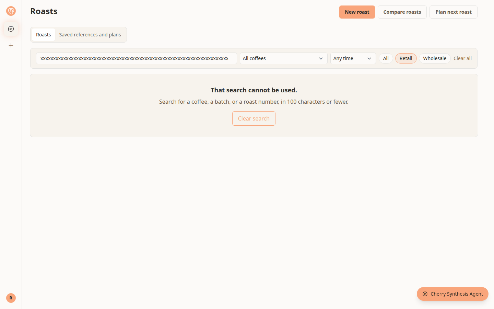 | 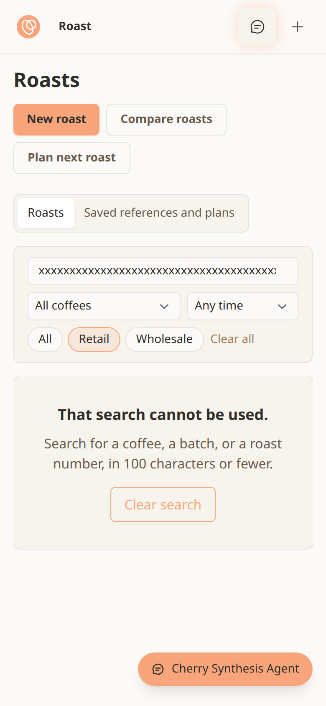 |

## Job 8, "Find a roast from last week"

The plan counted 2 clicks and about 3 screens of scrolling before PR 1.

| Path                                       | Clicks | Screens scrolled                          |
| ------------------------------------------ | ------ | ----------------------------------------- |
| Before PR 1                                | 2      | About 3                                   |
| Now, the roast is on the first page        | 1      | 0 on desktop; under one screen on a phone |
| Now, with "Last 7 days" and then the roast | 2      | 0 at both sizes                           |

- The counts follow the plan's rule, where choosing an option is one click. "Last 7 days" is an option in a select, so on a phone it is two touches: open the select, then choose. By touches the second path is 3 on a phone.
- After "Last 7 days" the list held 5 roasts in 3 batches, all on the first screen. The roast opened with its chart at 270 px on desktop and 476 px on a phone, with no scrolling.

| View                            | Desktop                                 | Phone                                 |
| ------------------------------- | --------------------------------------- | ------------------------------------- |
| The roast opened from that list | 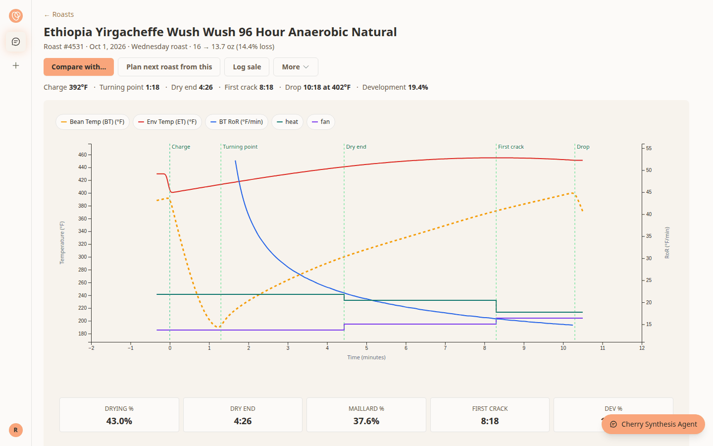 |  |

## What used to rely on the page holding every roast

| Consumer                                           | How it is served now                                                                                                                                  |
| -------------------------------------------------- | ----------------------------------------------------------------------------------------------------------------------------------------------------- |
| A roast opened by link                             | Asked for by its number. Roast #4382, from March and three pages down, opened from `/roast?market=wholesale&roast=4382`, a filter that leaves it out. |
| "Also in this batch" on an open roast              | The open roast's batch, asked for by batch ID. Roast #4382 listed its two batch mates.                                                                |
| "Delete batch" and its confirmation                | The batch is read again by its ID before the question is asked, so the number of roasts it names is the batch's own. Covered by tests.                |
| The new-roast flow, and "Save roast" after logging | The roast is read again by its number, so it opens even when the list's filters leave it out. Covered by tests.                                       |
| The coffee and batch chips                         | The coffee's name comes from the portfolio's coffees; the batch's name and date from the batch as a whole.                                            |
| The compare picker, same coffee first              | Unchanged. `/roast/compare` makes its own request for every roast, because the picker lists every recorded roast. Covered by its tests.               |
| The plan page's candidates                         | Unchanged. Its own Parchment request for roasts that can be planned from.                                                                             |
| Portfolio's Roasting tab                           | Unchanged. Its own request for one coffee's roasts, by `coffee_id`.                                                                                   |
| "Log sale" and the sale form's batch choices       | Unchanged. The profit page makes its own request for every roast, because the form offers every batch.                                                |
| Cherry AI's page context                           | The roasts loaded so far, as before.                                                                                                                  |

Two readers still ask for every roast: the compare picker and the sale form. Both are choosers that list everything. Searching inside them with `q` would bound them, and is a separate change to each.

| View                                       | Desktop                            | Phone                            |
| ------------------------------------------ | ---------------------------------- | -------------------------------- |
| An old roast by link, with its batch mates | 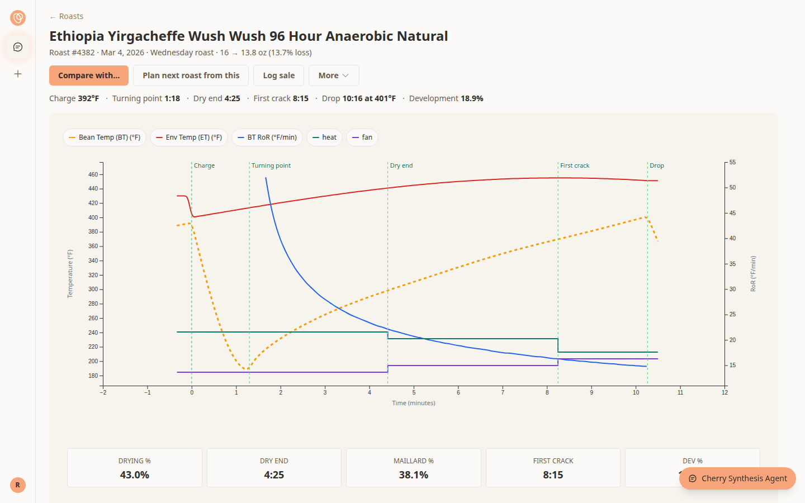 | 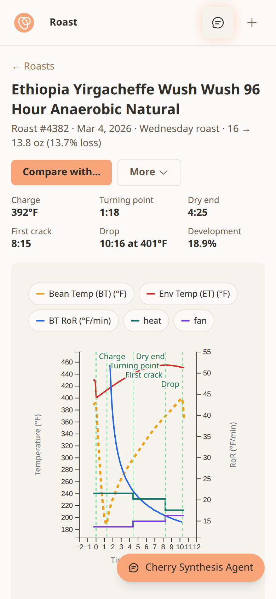 |

## Live logging

`RoastChartInterface` is not changed. With a roast recording at 0:02, a link changed every filter in the address under it (`range`, `q`, `market`, `coffee`). The list for the new filters loaded behind the roast, the timer read 0:04 and still showed "Stop", the roast stayed open, and no question was asked. Covered by tests as well, including when the list behind the roast fails to load.

| View                                      | Desktop                                        | Phone                                        |
| ----------------------------------------- | ---------------------------------------------- | -------------------------------------------- |
| Still recording after the filters changed | 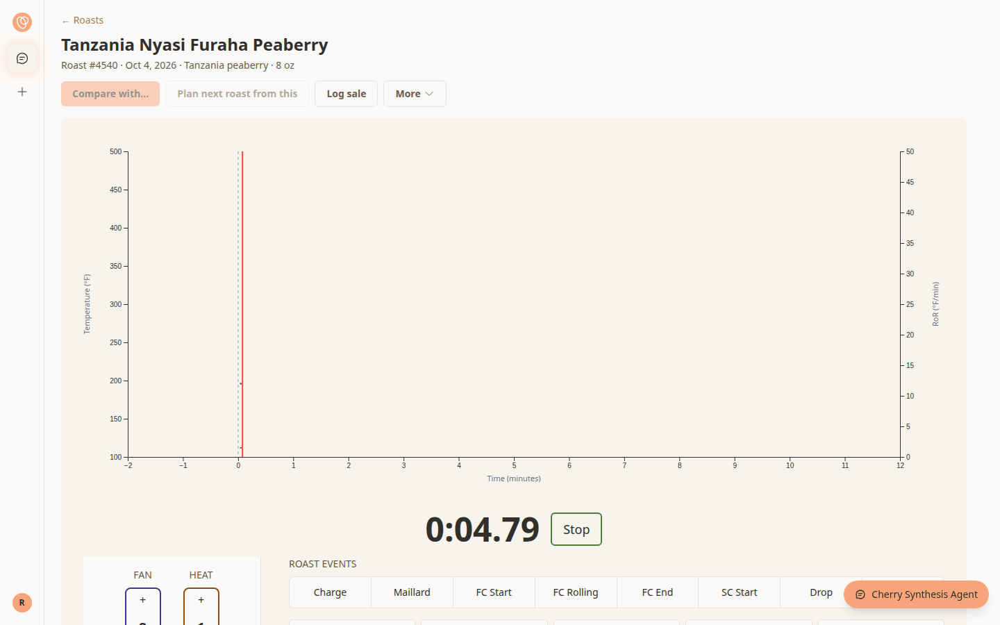 | 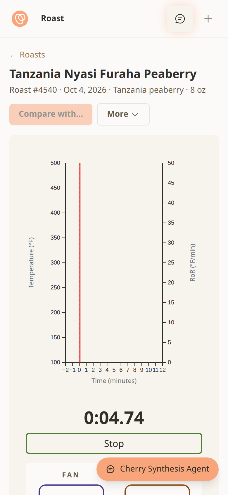 |

## Corrections to the plan found while building

- **A date preset is read on the member's own calendar.** "Last 7 days" starts on the same weekday last week, so a roast from a week ago is in it. Only the browser knows the member's day, so a link with a preset is loaded by the page; any other link has its first page sent with the page.
- **"Custom dates" is a fifth date option.** The address accepts `from` and `to`, so the control needs a state for them: two date fields, From and To.
- **The plan's copy has one sentence for "No roasts match."** A search, a retail or wholesale choice, and custom dates each needed one: "No roasts match “guji”.", "No wholesale roasts.", "Nothing was roasted from Sep 1, 2026 to Sep 30, 2026."
- **A search that cannot be used had no copy.** It reads "That search cannot be used." with one line on how to search and "Clear search".
- **"Load more" says how far the list has got:** "Showing 51 of 110 roasts". When the next page fails it says "More roasts could not be loaded." with "Try again", and keeps what is shown.
- **One new route in the app.** The coffee control's choices come from `/api/roast-coffees`, which reads the portfolio's coffees and nothing else. The portfolio route reads every roast to describe each coffee, so using it would have put that read back on every visit.
- **The navigation no longer loads the roast list on hover.** That request read every roast and the page never used its answer.
- **The filter panel behind the icon is gone from the roast page.** It filtered the roasts the page held, which is now one page of them. Its sort choices went with it: the list is newest first. Its text filters on roast notes and targets have no replacement; search covers coffee, batch, and roast number.
- **Retail or wholesale now filters roasts, not batches.** The old chips kept a whole batch when any roast in it matched.
- **A batch header in a filtered list counts and dates the roasts shown.** The chip for `?batch=` still names the batch as a whole.
- **The wholesale list is empty for every account today.** parchment-api #355 found no wholesale roast in production, so "Wholesale" shows "No roasts match. No wholesale roasts." until one exists.
- **The average loss covers roasts with a loss on record,** as it did before. For the account with the most roasts that is 89 of 252.
