# PR 8: batches by ID, "Log sale", and delete a batch by ID

Evidence for PR 8 of [Roast and portfolio workflows](../../2026-10-04-roast-and-portfolio-workflows.md). It is also step 3, the web step, of Parchment's roast batch identity plan (PADR-0029).

Rendered locally at 1440×900 and 390×844 with the plan's seeded data behind a stand-in backend. The stand-in gives every roast a batch ID, one batch per stored name and day as Parchment's backfill did, and serves the batch list, delete by ID, and sales that carry a batch ID and a roast ID. "Wednesday roast" is the name of four batches, on Oct 1, Sep 24, Sep 17, and Sep 10. One roast of "Guji drop test" is dated a day after the other, as a session that ran past midnight. Everything below was read from the rendered page with the browser unless it says "covered by tests".

## The roast list grouped by batch

- **Headers lead with the date:** "Oct 1 · Wednesday roast", "Sep 24 · Wednesday roast", "Sep 17 · Wednesday roast", "Sep 10 · Wednesday roast". The four are four groups, each with its own roasts. Grouping is by batch ID; the name plays no part.
- **A batch that spans days is one group.** "Sep 27 · Guji drop test" holds both of its roasts, and its second line reads "2 roasts · Sep 27 to Sep 28".
- **The count line is unchanged:** "15 roasts in 10 batches · 15.0% average loss".
- **"Log sale" is on every batch header,** beside the header's open and close control, not inside it. It is 83 × 38 px at both sizes. No sideways scrolling at either size.

| View                                     | Desktop                               | Phone                               |
| ---------------------------------------- | ------------------------------------- | ----------------------------------- |
| The list, first screen                   | 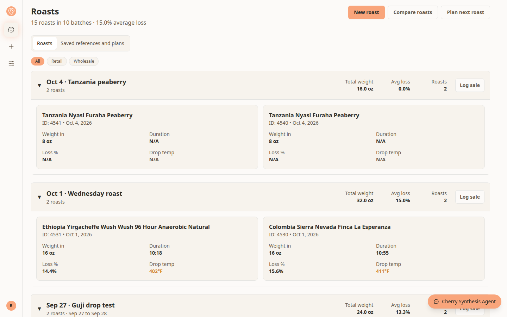           | 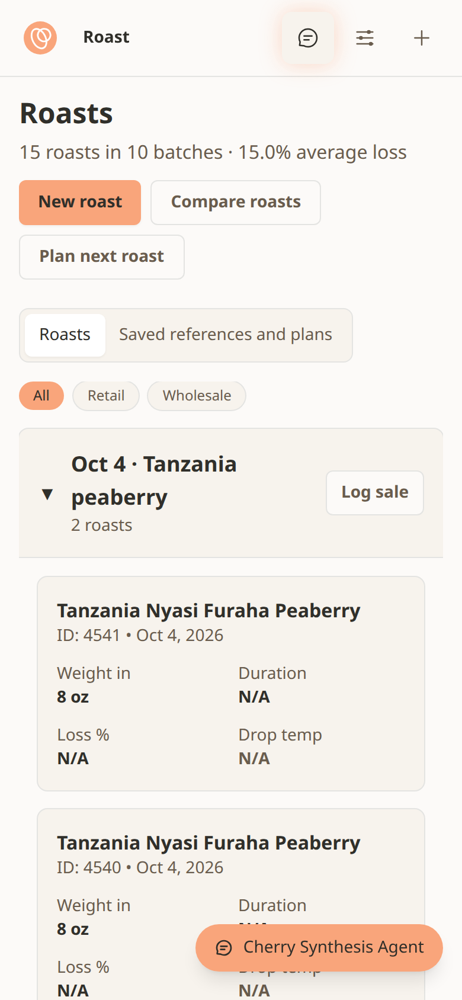           |
| The whole list, with the repeated name   | 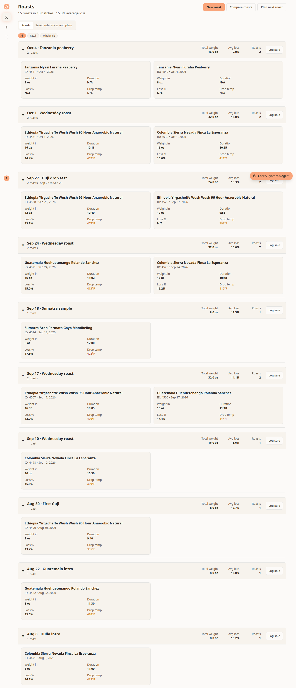      |       |
| A batch header with "Log sale"           | 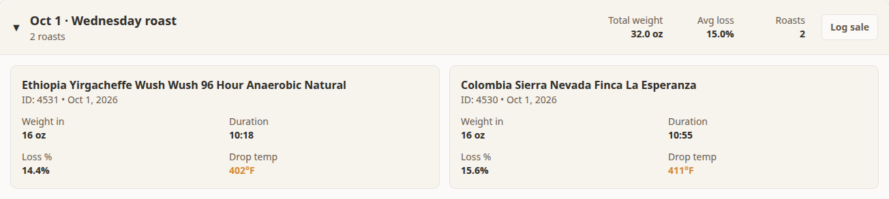         | 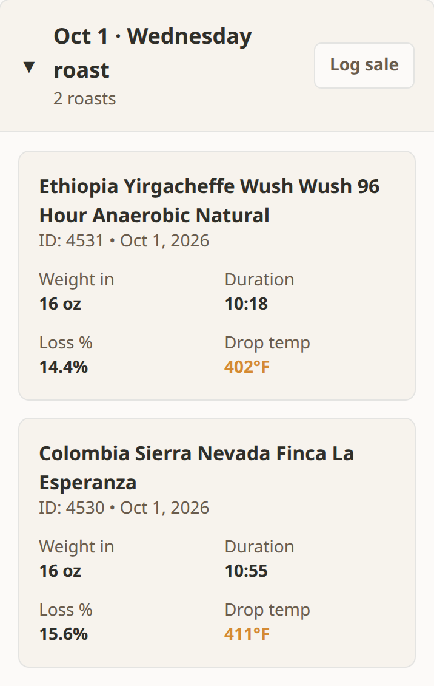         |
| The list opened for one batch, `?batch=` | 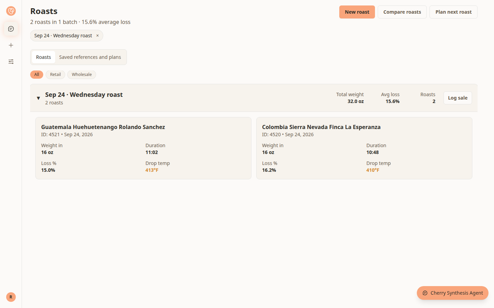 | 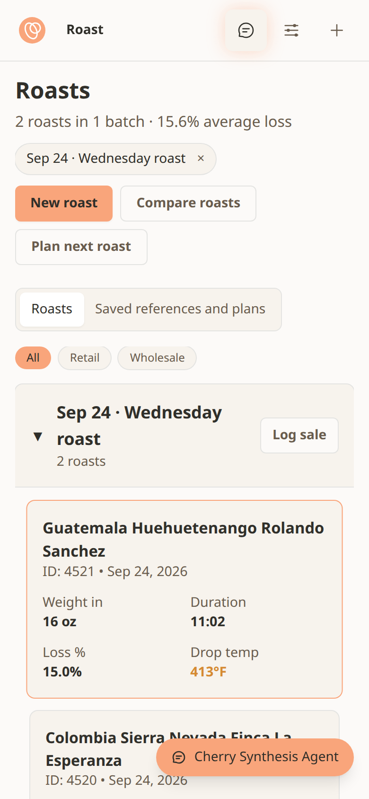 |

## `?batch=<batch id>`

- `/roast?batch=<id of the Sep 24 batch>` lists that batch alone under the chip "Sep 24 · Wednesday roast ×", with the count line "2 roasts in 1 batch · 15.6% average loss". The other three batches named "Wednesday roast" are not listed.
- Removing the chip returns to `/roast` with all ten batches.
- It combines with `?coffee=`: two chips, and only that coffee's roasts of that batch.
- A batch ID that matches no roasts says "**No roasts match.** That batch has no roasts. It may have been deleted." with "Clear filters".
- Opening a roast keeps the batch in the link, and "← Roasts" returns to the narrowed list. Covered by tests.
- **How it works today:** PR 7, the list's filters, is not built, so the page still holds every roast and this narrows them in the browser, as `?coffee=` has since PR 3. It moves to Parchment's `batch_id` filter with PR 7.

## "Log sale"

Job 6 in the plan, "Record a sale against a batch", was 5 clicks and 4 fields: + (1), New sale (2), coffee (3), batch (4), date, buyer, amount, price, Save (5).

| Start                                    | Clicks | Fields typed | What arrives filled in                                             |
| ---------------------------------------- | ------ | ------------ | ------------------------------------------------------------------ |
| A batch header, batch of one coffee      | 2      | 3            | Coffee, batch, today's date                                        |
| A batch header, batch of several coffees | 3      | 3            | Batch, today's date; the coffee is chosen from those roasted in it |
| An open roast, desktop                   | 2      | 3            | Coffee, batch, roast, today's date                                 |
| An open roast, phone                     | 3      | 3            | The same; "Log sale" is under More                                 |
| Portfolio's row menu                     | 3      | 3            | Coffee, batch, roast, today's date                                 |

The three fields are buyer, amount, and price. The batch and roast rows were counted with the browser by clicking through and saving. The portfolio row is the menu, the link, and Save; it was clicked through as far as the opened form.

- **From a batch header** the link is `/profit?modal=new&coffee=<id>&batch=<id>` and the sale is sent with `batchId` and no `roastId`.
- **From a roast** the link is `/profit?modal=new&coffee=<id>&batch=<id>&roast=<id>`, and the sale is sent with `batchId` and `roastId`. The form shows "From roast #4531 only", ticked, with "Clear this if the sale drew from more than one roast of the batch." Cleared, the sale is sent with the batch alone.
- **In portfolio** every roast row now has a menu, since every roast can be sold from. "Plan next roast" stays on the roasts it applies to, above "Log sale".
- **The batch choices** read "Oct 1 · Wednesday roast", "Sep 24 · Wednesday roast", "Sep 10 · Wednesday roast", so the weeks can be told apart. Two batches with the same name on the same day also name their coffees, and their roast numbers if they still read the same. Covered by tests.
- **A coffee that is out of stock** is offered when the link names it or it was roasted in the chosen batch. The form used to list only coffees in stock, which left out a lot that had been roasted to the end.
- **A sale saved** sends no batch name beside the ID. After saving, the page stays on `/profit` with the link's values removed from the address.

| View                              | Desktop                               | Phone                               |
| --------------------------------- | ------------------------------------- | ----------------------------------- |
| The sale form opened from a roast | 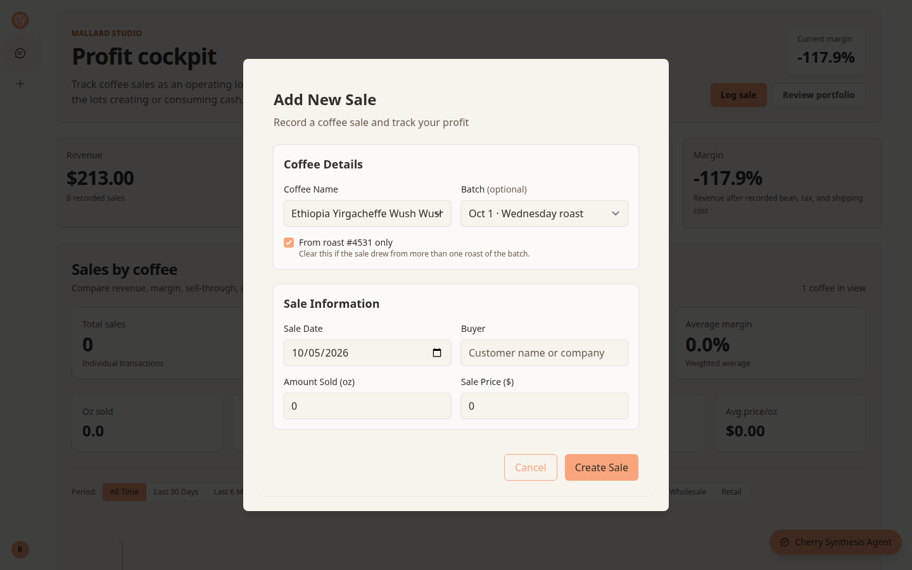 | 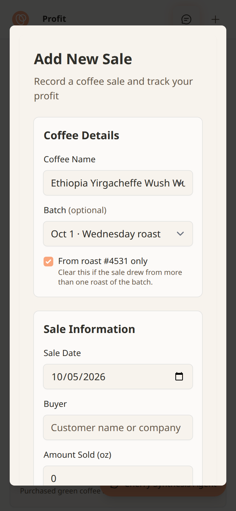 |
| The sale form opened from a batch | 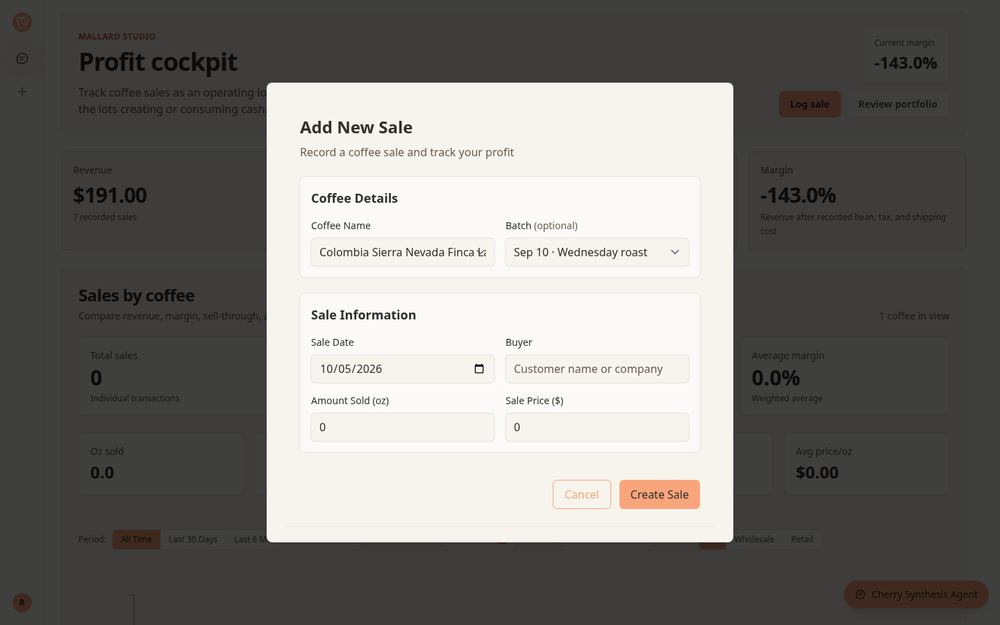 | 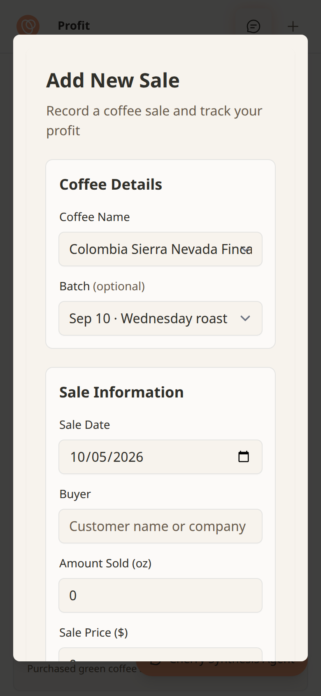 |
| An open roast's actions           | 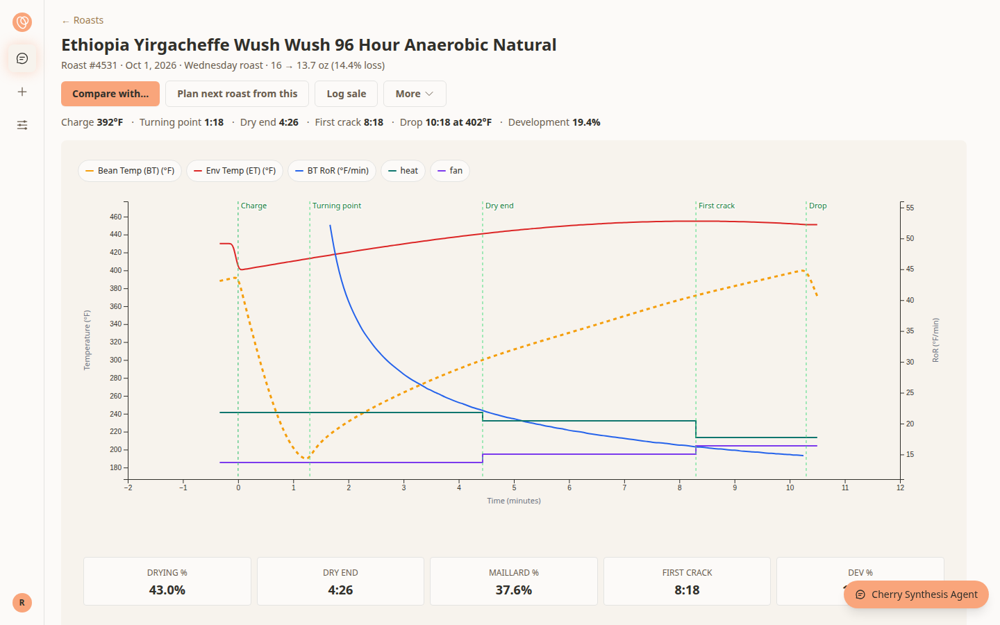        | 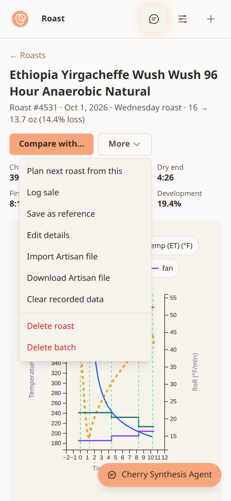      |
| Portfolio's row menu              | 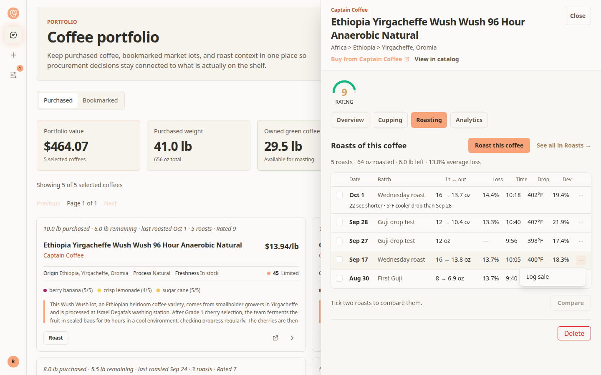   | 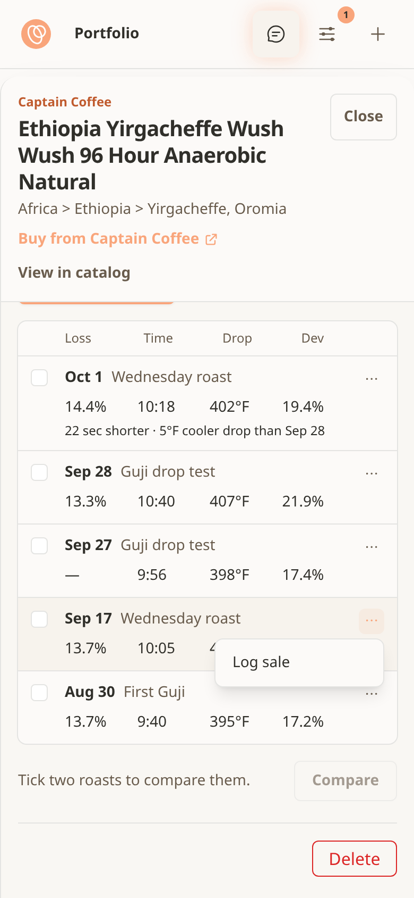   |

### Sales recorded before batches had IDs

Covered by tests on the form; the profit page has no list of single sales and no way to open one for editing, so there is nothing to render.

- A sale with a batch name and no batch opens with the batch reading "Not linked · recorded as “Wednesday roast”" and the note "This sale was recorded with a batch name and is not linked to a batch. Choose the batch to link it."
- Saving another change to it sends neither a batch ID nor a batch name, so what it names is left alone.
- Choosing a batch sends that batch's ID, which links the sale.
- A linked sale shows its batch and roast, and an unrelated edit sends neither.

## Delete a batch

- "Delete batch" is in an open roast's More menu, as before. It now asks, in the browser's own confirmation: "Delete the batch “Wednesday roast” from Sep 24, 2026? This removes its 2 roasts and everything recorded for them, and cannot be undone. Sales recorded against the batch are kept."
- Declined, nothing is sent. Confirmed, one request deletes that batch by its ID. The list comes back with "Oct 1 · Wednesday roast", "Sep 17 · Wednesday roast", and "Sep 10 · Wednesday roast" still on it, and no error.
- The count is of every roast in the batch, whatever the list is narrowed to. Covered by tests.
- **Before this PR** the request went by name. Parchment refuses a name that more than one batch carries, so for a name such as "Wednesday roast" nothing was deleted and the page showed the refusal. That is Parchment's contract; the earlier page was not rendered again here.
- **While a roast is recording**, "Delete batch" first asks "A roast is still recording. Leaving now loses the readings that are not saved." "Keep roasting" leaves the timer running and asks nothing further. "Leave" goes on to the confirmation above; declining that also leaves the roast recording.

The confirmation is the browser's own dialog, which a screenshot of the page does not include. Its text above is what the browser was handed, read from the dialog itself.

| View                                        | Desktop                                  | Phone                                  |
| ------------------------------------------- | ---------------------------------------- | -------------------------------------- |
| More, with "Delete batch"                   | 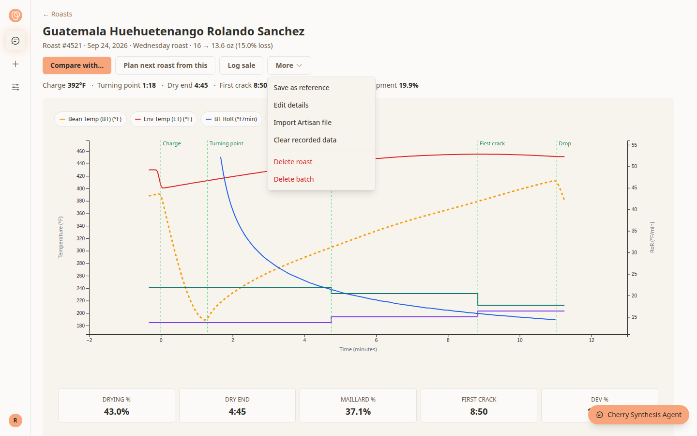 | 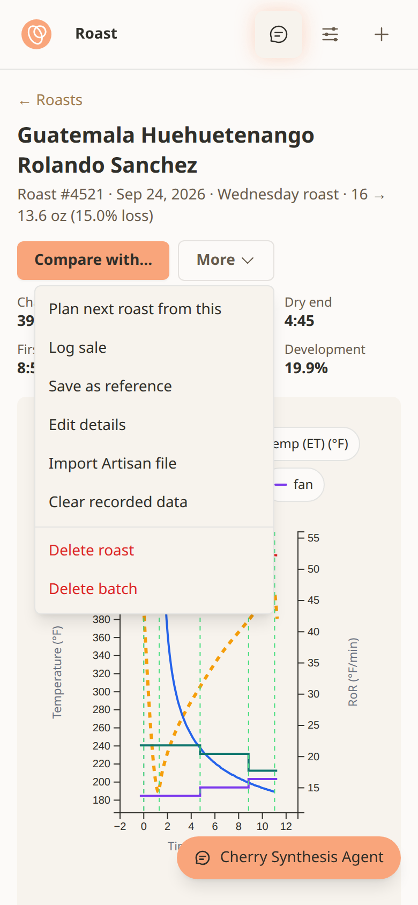 |
| "Delete batch" on a roast that is recording | 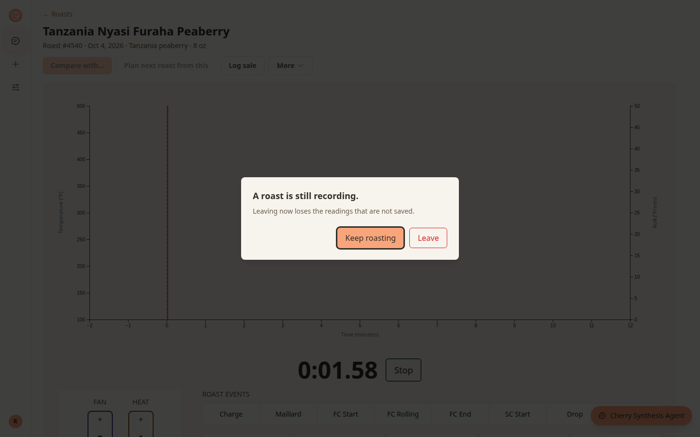 | 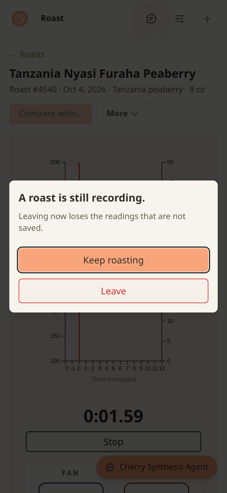 |

## Access

| Route                                   | What it checks itself                                              | Changed here                                                     |
| --------------------------------------- | ------------------------------------------------------------------ | ---------------------------------------------------------------- |
| `GET /api/roast-batches`                | Signed in, Mallard Studio (`requireMemberRole`)                    | New                                                              |
| `DELETE /api/roast-batches/[id]`        | Signed in, same-site request, Mallard Studio (`requireMemberRole`) | New                                                              |
| `POST /api/profit`                      | Cookie session, same-site request, Mallard Studio                  | Sends `batch_id` and `roast_id`; check unchanged                 |
| `PUT /api/profit`                       | Cookie session, same-site request, Mallard Studio                  | Sends `batch_id` and `roast_id`; the Mallard Studio check is new |
| `DELETE /api/profit`, `GET /api/profit` | Cookie session; `DELETE` also same-site request                    | Not changed                                                      |
| `GET /api/roast-profiles`               | Cookie session                                                     | Not changed                                                      |
| `POST`, `PUT /api/roast-profiles`       | Cookie session, same-site request                                  | Not changed                                                      |
| `DELETE /api/roast-profiles`            | Cookie session, same-site request                                  | Deletes by roast ID only; check unchanged                        |

The roast routes leave the Mallard Studio decision to Parchment, as they did before. That is recorded here and not changed.

## End-to-end test data

- Deleting a roast keeps its batch, so each run of `api-contracts.spec.ts` and `critical-path.spec.ts` left one empty batch on the test account. Each spec now deletes the batch it created, through `DELETE /api/roast-batches/[id]`.
- The global teardown then removes the empty batches created since the run started, through the app's routes, signed in as the test account. It runs whether or not the account has inventory, and does nothing unless the saved session is the test account's.
- An empty batch is listed under a placeholder name, so a test batch cannot be recognised by `API_TEST_ROAST_` or `E2E_TEST_ROAST_`. The teardown goes by "holds no roasts" and "created during this run".
- **Batches earlier runs left behind are not touched by default.** Setting `E2E_EMPTY_BATCH_CLEANUP=all` makes the teardown remove every empty batch on the test account. See the PR description for the one-time cleanup.

## Where the plan was wrong or unclear

Recorded in the plan (sections 3, 4.8, 4.11, and the PR 8 row).

- **`?batch=` was listed as waiting on PR 7.** It ships here, narrowing in the browser as `?coffee=` does.
- **The sale link's stand-in form never shipped.** Section 4.8 described `batch` carrying a name, with a `date`, until batch IDs existed. "Log sale" ships with IDs only.
- **"2 clicks" holds from a batch of one coffee and from a roast on desktop.** A batch of several coffees needs the coffee chosen, and on a phone a roast's "Log sale" is under More. Both are 3.
- **The header's date is the batch's first roast day.** Parchment keeps a date on the batch, but a roast does not carry it, and the list is built from roasts. The two are the same for every batch made so far. They would differ after a batch is re-dated, which the web cannot do yet.
- **Rename and re-date are not in the plan.** Parchment supports both. Listed as a follow-up.
- **The batch header keeps its three figures** (total weight, average loss, roasts) on desktop, where the plan's sketch shows "32 oz · 15.0% loss". On a phone the figures are not shown, as before.

## Follow-ups, not in this PR

- **Rename and re-date a batch.** Parchment's `PATCH /v1/roast-batches/{id}` does both. With it, the header should read the batch's own date.
- **New roasts still join a batch by name and day.** The new-roast form calls the name-based create, which Parchment plans to remove. Moving it to a batch record needs a way to add a roast to an existing batch in the form; without one, every submit would start a new batch.
- **A list of sales with their batches.** Parchment's plan for this step includes showing a sale's batch and linking an unlinked sale. The form does both, and nothing on the profit page opens a sale.
- **Deleting a roast that is recording** asks only the browser's "Are you sure", and leaves the timer running after the roast is gone. Deleting its batch now goes through the live-roast guard and stops the timer.
- A few older messages on `/roast` still say "roast profile".
