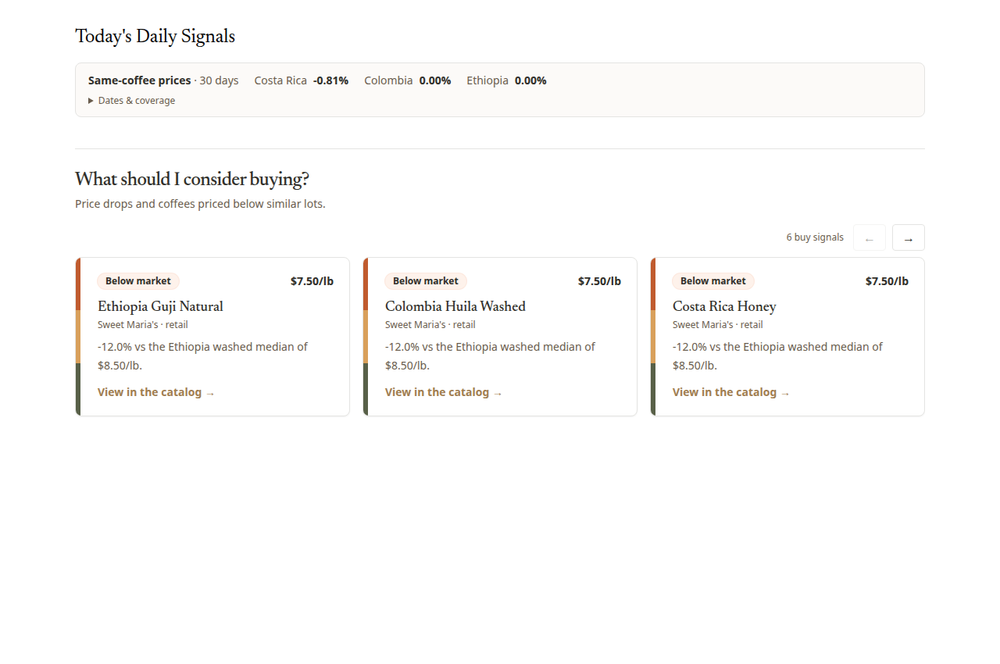
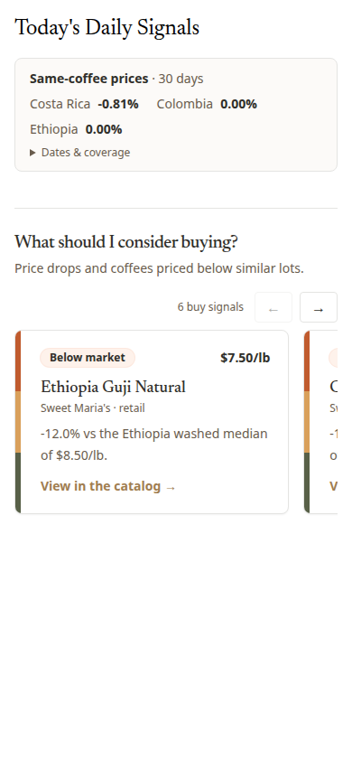

# Compact analytics signals

Price comparisons now sit immediately below the daily signal overview, not inside the Market Index chapter. All qualifying origin/market changes are visible together; dates, starting-cohort coverage and supplier counts remain available under **Dates & coverage**. The exact 30-day backend contract, entitlement boundary, retry and cancellation behavior are unchanged.

Buying recommendations occupy one horizontal scroll-snap row: three cards at large desktop widths, two at tablet widths, and one with a next-card peek on narrow screens. Previous/next controls support keyboard activation, disable at the ends and honor reduced motion. Native touch scrolling and existing card details remain available. Scope/data changes reset the row. The existing six-card cap remains unchanged.

## Validation

- `pnpm test -- src/lib/components/analytics/MatchedPriceComparison.svelte.test.ts` ran the full suite: 204 files / 1,470 tests passed; 14 tests skipped. Component expectations now verify simultaneous origins and separate markets without a dropdown.
- `pnpm check --fail-on-warnings`: passed with static-only placeholder environment values.
- Changed-file ESLint/Prettier and `git diff --check`: passed.
- `pnpm lint`: blocked by formatting in 17 pre-existing unrelated notes files; no unrelated formatting changes included.
- Chrome/Playwright component harness, 1280px and 390px: next/previous scroll worked; all six cards retained the same top coordinate; no document-wide horizontal overflow or browser runtime errors. This used fixture data, not an authenticated production-page check.
- Customer-facing copy reviewed independently.

## Component previews (fixture data)

These demonstrate component layout, not the complete deployed analytics page. The buying examples use the fallback card variant; the existing CoffeeCard remains unchanged.

