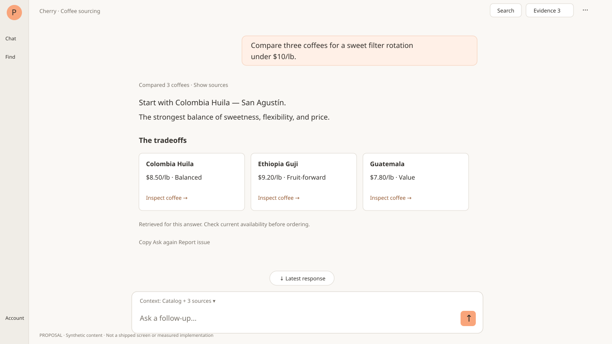

# Cherry chat UI/UX benchmark and gap audit

**Date:** September 11, 2026

**Scope:** Product-design audit; no production UI changes.

**Code baselines:** main `8bbc5de9693ddaf6a9a1b5cb8925508fc1a0be20`; open [PR #610](https://github.com/reedwhetstone/coffee-app/pull/610) at `a6d805a8bcbdc11d1e3d790810375175be09b781` (including corrections after initial handoff). PR #610 is not treated as merged or deployed.

## Executive assessment

**Cherry has a useful domain-evidence foundation, but not yet the reading efficiency, conversation control, and continuity expected of a first-class chat product.** PR #610 improves evidence continuity, comparisons, and keyboard behavior. It also increases permanent UI around the conversation. Passing interaction tests did not establish good space utilization; the previous component screenshots omitted the outer app shell.

**Recommendation: remove the dedicated full-width identity/header strip from desktop `/chat`.** Keep the existing narrow app rail; place a small role/context label and necessary conversation controls locally, with no duplicate branding row or divider spanning the work area. Put account/navigation in the rail, context at the composer, and evidence controls in the evidence pane. Do not remove navigation, necessary status, or mobile menu access just to reach a zero-header slogan.

The companion priority is **compact composer chrome**. Suggestions, persistent context pills, a context-count disclosure, a multiline placeholder, and repeated agent identity currently compete with the answer. Removing the top bar alone leaves much of the problem intact.

Next priorities: transcript search and jump-to-latest; writing the next draft while Cherry works; visible save/recovery states and durable drafts; message correction and more precise action/clear semantics. Multi-conversation history and model selection are product decisions, not automatic parity requirements.

## Method and limits

Three evidence levels are kept separate:

1. **Direct live observation:** signed-out ChatGPT and Grok entry screens were inspected visually and through DOM reads. ChatGPT puts navigation/search at left and composition in the work area; Grok exposes attach and mode controls in the composer. These were not signed-in conversation/recovery tests. Claude resolved to its login screen. No messages, uploads, logins, or business actions were submitted.
2. **Primary-source documented behavior:** current official OpenAI, Anthropic and xAI pages were read, not just search snippets. Codex links currently redirect into ChatGPT Learn; desktop/Codex documentation is not misrepresented as proof of every ChatGPT website control. Claude Code terminal, Claude Code Desktop and Claude website are distinct comparators. Sources below were retrieved September 11.
3. **Cherry source and controlled geometry:** source inventory at the two pinned revisions plus actual main/PR610 toolbar and composer components mounted with identical synthetic fixtures. Wrapper spacing/breakpoint classes match the app layout; the rail/mobile bar and transcript are geometry fixtures, not a fully authenticated route. No provider or production calls. This is stronger than CSS estimates, but not deployed end-to-end validation.

The existing shared browser was available. `/chat` redirected to signed-out `/catalog`; a DOM read confirmed Sign in. Its screenshot path timed out twice, so desktop state and direct DOM/source evidence were used without restarting the gateway or changing authentication. Claude sign-in and missing entitled Purveyors access prevent authenticated comparative journeys. Browser screenshots that could be saved were viewed directly despite the screenshot tool's vision-processing error. No claim is made about competitor accessibility conformance, exact signed-in pixel sizes, or feature availability on every plan.

No arbitrary overall numerical UX score is assigned: features have unequal value and source presence is not usability proof.

## What to learn from the benchmarks

| Comparator              | Verified/documented pattern                                                                                                                                                  | Transfer to Cherry                                                                                      | Do not copy blindly                                                                                                                                 |
| ----------------------- | ---------------------------------------------------------------------------------------------------------------------------------------------------------------------------- | ------------------------------------------------------------------------------------------------------- | --------------------------------------------------------------------------------------------------------------------------------------------------- |
| ChatGPT website         | Live signed-out view: persistent left navigation, New chat/Search chats, compact product control, composer-local attachment/mic/send.                                        | Give retrieval/navigation a stable home; leave the central canvas for reading and writing.              | Signed-out availability is not proof a feature works without login; do not infer signed-in history or recovery from this screen.                    |
| Codex / ChatGPT desktop | Projects/chats, pin/rename/search/archive, attachments; inspectable review pane with line-specific feedback [O1], [O2].                                                      | Stable task continuity; direct references into reviewable objects; expandable work beside conversation. | Git, terminal, worktree and model controls are not coffee-user requirements. Current docs distinguish Chat/Work/Codex surfaces [O3].                |
| Claude website          | Sidebar conversation management, project knowledge, composer attachments/search controls, cited sources, versioned artifacts and selection-based revisions [A1]–[A5].        | Progressive disclosure, explicit context scope, source-rich answers and reversible iteration.           | Projects should not force users to classify every coffee question. An artifact is not a reason to hide the useful answer.                           |
| Claude Code Desktop     | Session navigation, prompt-area context/mode controls, steer/stop, adjustable panes, normal/verbose/summary transcript modes [A6].                                           | Compact truthful progress, scope close to input, user-controlled detail density, steerable long work.   | It still has a session toolbar; “best in class” does not mean every product has no header.                                                          |
| Claude Code terminal    | Input history, draft preservation, interrupt/rewind, expandable transcript; dedicated screen-reader behavior [A7], [A8].                                                     | Strong keyboard ownership, non-destructive correction, clear activity/attention states.                 | Terminal keybindings/redraw behavior are not a website layout or browser-accessibility standard.                                                    |
| Grok                    | Live signed-out composer includes Attach and mode selection. Docs describe upload progress/retry, cross-device continuity, usage/reset visibility, data controls [G1], [G2]. | Treat attachments and asynchronous failures as full lifecycles; make limits/recovery understandable.    | Enterprise team-sharing is not a universal consumer feature. Old Grok Studio screenshots are stale: current FAQ says Studio is no longer supported. |

These establish a **pattern inventory**, not a claim that each competitor has every expectation below. Privacy, accessibility and domain-specific action safeguards are also normative Cherry requirements, even where competitor evidence is incomplete.

## Desktop top bar: diagnosis, measurement, recommendation

### Which bar actually exists?

`+layout.svelte` renders `UnifiedHeader` for public/marketing pages, not an entitled signed-in `/chat`. Desktop chat already has a 64 px left app rail. Its wrapper still adds 16 px top spacing and 24/48 px left/right inset; `ChatToolbar` then spans the content area with role identity, a tagline and evidence/actions controls [C1], [C2]. PR610 does not change the outer layout.

So the concrete change is **not deleting the marketing header site-wide**. It is retiring desktop chat's dedicated identity strip, removing unnecessary chat-route padding, and relocating its useful controls. If a signed-in deployed `/chat` shows the marketing navigation anyway, that is a separate route/session/deployment discrepancy to reproduce; this audit did not observe that authenticated state.

Mobile has a separate 64 px app bar accommodated within an 80 px top allowance, followed by the chat toolbar. The full shell therefore matters: a standalone ChatWorkspace screenshot does not reveal duplicated mobile chrome [C1], [C3].

### Controlled space budget

Same settled synthetic conversation; three suggestion chips; four context sources; context disclosure closed; empty composer; evidence closed; default zoom; no on-screen keyboard. Actual toolbar/composer components, source-matched shell spacing. Values are fixture measurements, not universal constants; long names, visible errors and keyboard state change the budget.

| Viewport   | Baseline | Top allowance | Chat toolbar | Composer region | Transcript viewport |
| ---------- | -------- | ------------: | -----------: | --------------: | ------------------: |
| 1440 × 900 | main     |         16 px |        53 px |          174 px |              657 px |
| 1440 × 900 | PR610    |         16 px |        61 px |          208 px |              615 px |
| 1366 × 768 | main     |         16 px |        53 px |          174 px |              525 px |
| 1366 × 768 | PR610    |         16 px |        61 px |          208 px |              483 px |
| 390 × 844  | main     |         80 px |        55 px |          266 px |              443 px |
| 390 × 844  | PR610    |         80 px |        59 px |          364 px |              341 px |

On the laptop fixture, PR610 leaves **42 px less transcript height (8% less than main)**. Its top allowance plus toolbar consumes 77 px, but the 208 px composer costs considerably more. On the mobile fixture, wrapping and the long empty-state placeholder increase the composer further: the transcript receives only about **40%** of viewport height before the keyboard opens. This is a concrete density problem, not evidence that every PR610 improvement should be reverted.

Raw measurements: [geometry.json](assets/cherry-ui-benchmark/geometry.json). Screens: [laptop main](assets/cherry-ui-benchmark/laptop-main.png), [laptop PR610](assets/cherry-ui-benchmark/laptop-pr610.png), [mobile main](assets/cherry-ui-benchmark/mobile-main.png), [mobile PR610](assets/cherry-ui-benchmark/mobile-pr610.png).

### Proposed dedicated chat shell

- Preserve the 64 px app rail, with account/navigation low and chat/search discoverable. Do not add a second permanent navigation sidebar just for feature parity.
- No reserved full-width branding band. Show “Cherry” and a short meaningful role/context label only where useful. Move the tagline out of working UI and stop repeating the full role name beneath the composer.
- Keep search, evidence and overflow in a small local utility group, reserving enough room that it never covers the first answer or a scroll target. Necessary runtime/save status stays discoverable there.
- Keep prose around 65–85 readable characters per line; let shortlist/comparison components use a wider lane. Gaining height must not produce edge-to-edge paragraphs.
- Default composer: one short placeholder, text box, send/stop, and one compact “Context · N” disclosure. Show explicit user-added entities as bounded/removable chips; do not permanently repeat every inferred context source. Suggestions belong mainly in empty states or a bounded optional row.
- While evidence is open, put title, expand/close, pin/remove, and source return within that pane; retain source focus and the active object. Do not add another global header to operate the pane.
- On mobile, combine app/menu and conversation navigation into one compact row with adequate touch targets. Remove the second identity row and unnecessary top gap. Do not use desktop's corner-control geometry unchanged on mobile.

**Proposed acceptance budget, not a measured shipped result:** at 1366 × 768, the standard one-line-input fixture should reserve at most 32 px for local top utilities and about 112 px for the compact composer, yielding about 624 px for reading (roughly 141 px more than the PR610 fixture). Expanded context, multiline input and errors may consume more. At 390 × 844 before keyboard, target at least 60% transcript height in the standard settled fixture, no duplicate app/chat headers, and no hidden essential controls. Validate on an actual mobile keyboard before claiming task parity.

## Full expectation checklist and Cherry audit

**Status legend:** **Present** = source implements the basic capability, not a blanket runtime pass; **Partial** = useful behavior exists with specified gaps; **Missing** = absent from the inspected UI; **Decision** = deliberate product tradeoff; **Unverified** = needs runtime/assistive-technology evidence. The PR610 column credits only its actual changes. **Now / Next / Later** are recommended delivery order; **Keep** means protect an existing strength. Sources `[C#]` point to relevant pinned code, and `[O#]/[A#]/[G#]` to benchmark evidence.

### A. Shell, space and visual hierarchy

| ID    | Expected experience                                                     | Main    | PR610 / remaining gap                                                | Priority | Evidence   |
| ----- | ----------------------------------------------------------------------- | ------- | -------------------------------------------------------------------- | -------- | ---------- |
| UX-01 | No marketing navigation competing with dedicated chat                   | Present | Unchanged; marketing header already excluded                         | Keep     | [C1]       |
| UX-02 | Compact identity without a full-width branding strip                    | Partial | 61 px full-width toolbar retains tagline                             | Now      | [C2]       |
| UX-03 | Use available viewport, without ornamental top/side gutters             | Partial | Outer 16 px desktop / 80 px mobile top allowance unchanged           | Now      | [C1], [C3] |
| UX-04 | Readable prose plus wider purpose-built comparisons                     | Present | Wider transcript lane and responsive coffee comparisons              | Keep     | [C4], [C8] |
| UX-05 | Discoverable, collapsible app navigation/account access                 | Present | Existing narrow app rail remains                                     | Keep     | [C1], [O1] |
| UX-06 | Controls belong to input, conversation or evidence—not duplicated bands | Partial | One drawer header improved; evidence still has stacked control rows  | Now      | [C2], [C8] |
| UX-07 | Compact resting composer; optional detail expands deliberately          | Partial | Visible context chips add density; measured regression               | Now      | [C5]       |
| UX-08 | Mobile combines app navigation and chat identity efficiently            | Partial | Single evidence surface, but outer app bar plus chat toolbar remains | Now      | [C1], [C3] |

### B. Conversation continuity and retrieval

| ID    | Expected experience                                                       | Main     | PR610 / remaining gap                                               | Priority | Evidence       |
| ----- | ------------------------------------------------------------------------- | -------- | ------------------------------------------------------------------- | -------- | -------------- |
| UX-09 | Restore the existing conversation reliably                                | Present  | Existing server restoration and settled-message save                | Keep     | [C6]           |
| UX-10 | Search old conversation text and navigate matches                         | Missing  | No transcript search control                                        | Now      | [C2], [C4][O1] |
| UX-11 | Find old decisions/evidence without scrolling entire history              | Partial  | Evidence shelf exists; no searchable conversation/evidence index    | Next     | [C4], [C8]     |
| UX-12 | New chat, history list, titles, rename/archive                            | Decision | Intentionally one implicit ongoing conversation                     | Decision | [D1], [O1][A1] |
| UX-13 | Branch a question or revisit alternative answers                          | Decision | No branches/version tree; Ask again appends a new turn              | Decision | [C6], [A5]     |
| UX-14 | Preserve draft and context through route changes/reload                   | Missing  | Mounted continuity improves; durable unsent drafts still absent     | Next     | [C6]           |
| UX-15 | Clear/reset explains what is retained and offers recovery where supported | Partial  | Generic confirmation; memory/evidence semantics unclear; no undo UI | Next     | [C6], [D1]     |

### C. Composer, context and input

| ID    | Expected experience                                                        | Main     | PR610 / remaining gap                                                  | Priority | Evidence       |
| ----- | -------------------------------------------------------------------------- | -------- | ---------------------------------------------------------------------- | -------- | -------------- |
| UX-16 | Multiline autosize, predictable send/newline, IME-safe input               | Partial  | IME guard added; multiline autosize already present                    | Keep     | [C5]           |
| UX-17 | Prepare the next draft while a response is running                         | Missing  | Textarea remains disabled during generation                            | Now      | [C5], [A6]     |
| UX-18 | Explicit queue or steer behavior when sending during active work           | Missing  | No queue/steer workflow; do not silently append to active request      | Next     | [C5], [A6][A7] |
| UX-19 | Inspect and exclude context before sending                                 | Partial  | Readable disclosure and per-entity exclusion added                     | Keep     | [C5], [C6]     |
| UX-20 | Distinguish selected objects, in-view data and durable memory              | Partial  | Corrected in-view wording; context origins still need clearer taxonomy | Next     | [C6], [A2]     |
| UX-21 | Short task-relevant placeholder and restrained suggestions                 | Partial  | Domain prompts exist; long role-specific placeholder expands on mobile | Now      | [C5]           |
| UX-22 | Documents/CSV/images: attach, paste/drop, preview, remove, progress, retry | Missing  | No attachment ingestion workflow added                                 | Next     | [C5], [A3][G2] |
| UX-23 | Keyboard-operable slash/context suggestions                                | Partial  | Clickable slash list lacks full arrow-key/combobox interaction         | Next     | [C5], [A7]     |
| UX-24 | Optional voice input or read-aloud when it serves the coffee task          | Missing  | No voice controls; not a prerequisite for good chat                    | Later    | [C5], [C4][G1] |
| UX-25 | Mode/depth/model choices only for meaningful user tradeoffs                | Decision | Backend-owned role/model selection retained                            | Decision | [D1], [O3]     |

### D. Reading, correction and navigation

| ID    | Expected experience                                                          | Main    | PR610 / remaining gap                                                        | Priority | Evidence   |
| ----- | ---------------------------------------------------------------------------- | ------- | ---------------------------------------------------------------------------- | -------- | ---------- |
| UX-26 | Copy an answer with success/failure feedback                                 | Present | Text copy retained                                                           | Keep     | [C4]       |
| UX-27 | Edit a sent user prompt with clear resend consequences                       | Missing | User bubbles remain text-only                                                | Next     | [C4], [A5] |
| UX-28 | Ask again explains current-context retry versus original-answer regeneration | Partial | New appended attempt; not versioned regeneration                             | Next     | [C6]       |
| UX-29 | Report a wrong answer or bad source without typing a new explanation         | Missing | No dedicated feedback action                                                 | Next     | [C4]       |
| UX-30 | Respect manual scroll while new output streams                               | Present | Near-bottom threshold and throttled scrolling retained                       | Keep     | [C6]       |
| UX-31 | Jump to latest with unread-output indication                                 | Missing | No visible return-to-bottom/new-output control                               | Now      | [C4], [C6] |
| UX-32 | Long transcript remains fast and navigable                                   | Partial | Old rich previews collapse; message bodies not virtualized/paged in renderer | Next     | [C4]       |
| UX-33 | Useful empty/loading/permission-denied states                                | Present | Domain examples and role/admission states exist; polish still testable       | Keep     | [C4], [C1] |

### E. Runtime status, recovery and trust

| ID    | Expected experience                                                                | Main       | PR610 / remaining gap                                                          | Priority | Evidence   |
| ----- | ---------------------------------------------------------------------------------- | ---------- | ------------------------------------------------------------------------------ | -------- | ---------- |
| UX-34 | Immediate visible pending/working state and incremental output                     | Present    | Existing activity/streaming foundation retained; production timing unverified  | Keep     | [C4], [C6] |
| UX-35 | Compact truthful progress in task language, with optional detail                   | Partial    | Some labels derive from tool names; reduce jargon, not evidence access         | Next     | [C7], [A6] |
| UX-36 | Stop clearly differs from completion and failure                                   | Present    | Explicit stop and interruption labels retained                                 | Keep     | [C5], [C4] |
| UX-37 | Completed read evidence survives interruption without executable partial proposals | Partial    | Coffee-focused recovery exists; not all object families                        | Next     | [C6], [C9] |
| UX-38 | Errors tell users what failed and what they can do next                            | Present    | Retry/setup/recovery flows exist; broaden actual network QA                    | Keep     | [C5], [C9] |
| UX-39 | Saving/saved/unsaved state and recoverable save failure                            | Partial    | No normal save receipt; settled-persistence rejection handler discards error   | Now      | [C6]       |
| UX-40 | Long task can survive backgrounding/route changes where promised                   | Unverified | No general durable background-run promise established by this UI               | Next     | [C6], [A6] |
| UX-41 | Limits/reset/disabled capabilities have contextual explanations                    | Partial    | Entitlement/upgrade states exist; comprehensive usage/reset UX not established | Next     | [C1], [G2] |

### F. Grounded answers, GenUI and artifacts

| ID    | Expected experience                                                          | Main    | PR610 / remaining gap                                                               | Priority | Evidence    |
| ----- | ---------------------------------------------------------------------------- | ------- | ----------------------------------------------------------------------------------- | -------- | ----------- |
| UX-42 | Useful evidence inline, not just links to a remote canvas                    | Partial | Coffee cards/references already present; other families still limited               | Next     | [C4], [C8]  |
| UX-43 | Named records resolve exact supported identity; unknown IDs stay unavailable | Present | Grounded coffee reference resolver retained                                         | Keep     | [C10]       |
| UX-44 | Historical evidence distinguished from refreshed current data                | Present | Frozen coffee snapshots and price/availability notice retained                      | Keep     | [C10]       |
| UX-45 | Claims have inspectable sources, dates, units and scope caveats              | Partial | Coffee provenance exists; uniform analytical/source coverage incomplete             | Next     | [C10], [A4] |
| UX-46 | Expanded output remains connected to originating answer                      | Present | Source-message return and improved focus continuity                                 | Keep     | [C8]        |
| UX-47 | Evidence selection, pins and local edits survive pane changes                | Partial | Substantially improved; full reload draft persistence not added                     | Keep     | [C8], [C11] |
| UX-48 | Incoming results do not steal the active scene or erase a proposal           | Partial | Agent/user distinction and executing-card retention added                           | Keep     | [C11]       |
| UX-49 | Comparison is a decision view, not only repeated cards                       | Partial | Responsive shared cards improve scanning; cross-lot metric table still needs design | Next     | [C8]        |
| UX-50 | Charts/tables have usable mobile and accessible alternatives                 | Partial | Typed blocks exist; complete market/roastery task parity not proven                 | Next     | [D2], [C8]  |
| UX-51 | Copy/download/export preserves useful evidence and action receipts           | Partial | Conversation Markdown export remains text-only                                      | Next     | [C12], [A5] |

### G. Actions, memory and data boundaries

| ID    | Expected experience                                                          | Main     | PR610 / remaining gap                                                        | Priority | Evidence        |
| ----- | ---------------------------------------------------------------------------- | -------- | ---------------------------------------------------------------------------- | -------- | --------------- |
| UX-52 | Clearly distinguish a suggestion, editable proposal and committed write      | Partial  | States/forms exist; generic Execute wording can obscure actual effect        | Next     | [C13]           |
| UX-53 | Edits, confirmation, execution and canonical outcome keep one identity       | Present  | Existing execution identity retained; stronger in-flight UI retention        | Keep     | [C11], [C13]    |
| UX-54 | Cancel/reject labels match their actual effect                               | Partial  | Cancel resets form/status, not necessarily proposal rejection                | Next     | [C13]           |
| UX-55 | Successful action links to its affected record and explains partial failures | Partial  | Generic completed/result UI; durable domain receipt parity incomplete        | Next     | [C13]           |
| UX-56 | Memory can be inspected, corrected, disabled and distinguished from history  | Partial  | Memory panel/context toggles exist; improve naming and relationship to clear | Next     | [C14], [A9]     |
| UX-57 | Temporary/private mode and clear-data policy are explicit if offered         | Decision | No incognito UI established; do not imply clear means forgetting/deletion    | Decision | [D1], [A10][G2] |
| UX-58 | Sharing has clear audience, scope and revocation                             | Decision | No share-link UI; local text export is not sharing authorization             | Later    | [C12], [O3]     |

### H. Accessibility, responsiveness and product polish

| ID    | Expected experience                                                             | Main       | PR610 / remaining gap                                                        | Priority | Evidence         |
| ----- | ------------------------------------------------------------------------------- | ---------- | ---------------------------------------------------------------------------- | -------- | ---------------- |
| UX-59 | Every form field/action has a meaningful accessible name                        | Partial    | Composer/proposal labels improved; memory textarea still needs explicit name | Now      | [C5], [C13][C14] |
| UX-60 | Nested panels own Escape, focus containment and focus return                    | Partial    | Evidence/details/memory handling improved; not a global accessibility pass   | Keep     | [C8], [C14]      |
| UX-61 | Keyboard can navigate transcript, search, suggestions and pane resize           | Partial    | Pane resize added; search/suggestion navigation incomplete                   | Next     | [C5], [C8]       |
| UX-62 | Screen readers hear roles/status without constant streaming chatter             | Unverified | ARIA live/log exists; assistive-technology journey not demonstrated          | Next     | [C4], [A8]       |
| UX-63 | Reduced motion applies to all custom animations and smooth scrolling            | Partial    | Existing reduced-motion rule covers pulse, not all custom behavior           | Next     | [C4], [C7][C15]  |
| UX-64 | Touch targets, safe areas and mobile keyboard do not block send/read            | Unverified | Narrow-width checks help; actual keyboard/safe-area tests still required     | Now      | [C3], [C5][D2]   |
| UX-65 | Zoom, long labels, low vision and high contrast remain usable                   | Unverified | No 200% zoom/contrast measurement claimed                                    | Next     | [C5], [D2]       |
| UX-66 | Full shell is tested in empty, working, long-history, error and evidence states | Partial    | Earlier component journeys do not establish complete app-shell usability     | Now      | [C1], [C8]       |

## Recommended delivery order

### 1. Correct the shell density before calling the integrated workspace finished

Address UX-02/03/06/07/08/21/64/66 together: remove the desktop identity strip, compact composer defaults, combine mobile navigation, and measure the full shell. Preserve PR610's evidence focus, source return, retained edits and executing-proposal safeguards. The finding is a refinement of overhaul slice 4, not permission to discard its useful state work.

**Review gate:** show empty, settled, streaming, long-answer, expanded-context, error and evidence-open states at the three measured viewports. Meet the proposed resting-state budget without overlap, tiny controls or hiding essential status. Treat the 624 px laptop target as a design hypothesis until the real route reproduces it. A user adding a multiline draft or explicitly expanding context may intentionally spend more height.

### 2. Make the ongoing conversation navigable and writable

Address UX-10/17/31 first: transcript search with next/previous match and return to source, a discoverable jump-to-latest with unread/new-output indication, and an editable next draft while a response runs. Keep Send's behavior explicit; drafting does not itself authorize queueing or changing an active request. Follow with correction/retry semantics, context suggestions and long-history performance (UX-18/23/27/28/32).

**Review gate:** find a decision in a 100-turn fixture, inspect its retained evidence, return to the same reading location, and compose a follow-up without losing the active answer or causing a duplicate send. Search and jump controls must work by keyboard and expose meaningful names.

### 3. Make continuity and outcomes trustworthy

Address UX-14/15/39/52–56/59: visible unsaved/retry state, durable drafts scoped to the correct user/conversation, clear reset-versus-memory wording, accessible memory editing, domain-specific action labels and a canonical outcome receipt. Persist only appropriate draft/context state; handle sign-out/account changes deliberately. Do not silently turn local proposal form storage into a second action ledger.

**Review gate:** inject save rejection, refresh and route changes; users can tell what was saved and recover their own draft. Reopening evidence cannot duplicate an executing action. Cancel, clear and retry each have a distinct, documented effect. Persistence and action changes require their own scoped contract/security/concurrency validation; this audit is not that validation.

### 4. Extend the domain advantage, then add commodity features where useful

Continue overhaul slice 5: comparable market/roastery sources, charts/tables, mobile forms and durable receipts (UX-37/42/45/49–51/55). Add attachment ingestion around a real coffee task, such as comparing a supplier CSV or interpreting a roast report, with preview/removal/progress/retry and an explicit data boundary. Test screen-reader, reduced-motion and zoom journeys alongside this work, not after a visual redesign is called complete.

Voice, share links and a generic project sidebar are later options, not substitutes for readable answers or trustworthy outcomes.

### Decisions to preserve or revisit deliberately

- **Single conversation:** the June plan proposed one ongoing dialogue, and the current UI implements it [D1]. Search/retrieval can improve without adding conversation CRUD. Revisit separate conversations only if unrelated sourcing/roasting threads, auditability or retrieval evidence demonstrates the need. A destructive Clear button is not an adequate stand-in for history management.
- **Model selection:** keep backend ownership unless users face a meaningful speed/depth/cost choice. Exposing provider names because competitors do is not a user benefit.
- **Branching versus correction:** first define whether editing an earlier request appends a corrected turn, regenerates a version, or creates a branch. Do not silently rewrite historical action/evidence provenance.
- **Privacy:** distinguish clearing visible chat, deleting stored chat, disabling memory and temporary conversation behavior. Do not borrow an “incognito” label without a corresponding retention contract.
- **Evidence depth:** retain inline answers plus deliberate expansion. Preserve the accepted mobile decision-path requirement [D2] and active-scene/pin safeguards [D3]; the older horizontal-carousel prescription is not reintroduced by this audit.

## Acceptance journeys for the next UI slice

These are **required future verification**, not tests claimed to have passed here.

1. **Full-shell density:** entitled `/chat` at 1440×900, 1366×768 and 390×844; empty/settled/working/error; short and long role names; context open/closed; evidence open/closed. Measure transcript, composer and chrome separately. Repeat on the drawer surface without accidentally removing the host page's navigation.
2. **Read and retrieve:** long Markdown answer, three-lot comparison, 100-turn history, search match, scroll away during streaming, jump back, reference detail, source return and reload. No forced scrolling while reading older output; no missing historical evidence.
3. **Compose and interrupt:** multiline/IME text, paste, keyboard suggestions, draft during streaming, Stop, retry and corrected request. No duplicate send or lost draft; busy controls explain what is possible.
4. **Continuity and failures:** save rejection/offline transition, reconnect, route change, reload, signed-out/account boundary. Clearly distinguish saved message, unsaved draft and stale/frozen evidence. Test any explicit background-run promise rather than implying one.
5. **Proposal lifecycle:** edit, collapse, reopen, execute, interrupt/clear while executing, successful receipt, rejected/partial failure, source return. The same canonical proposal executes at most as allowed by its owner; reviewable values remain visible.
6. **Representative domain tasks:** select and compare lots with price/availability dates; inspect a market chart with units and sources; review a roast/inventory proposal with its affected record. Mobile must complete the decision, not just show a count or inaccessible table.
7. **Accessibility and mobile reality:** keyboard-only and screen-reader journeys, nested Escape/focus return, reduced motion, 200% zoom, contrast, touch targets, iOS/Android keyboard and safe-area behavior. Emulation is not proof of the actual keyboard experience.

## Evidence and reproducibility

The six geometry cases completed without page errors or horizontal document overflow. This establishes only fixture geometry. The earlier PR610 interaction suite and its 182-test result belong to that implementation's handoff, not to a new production or accessibility pass in this audit.

The one-off fixture imported actual main toolbar/composer components and copies from pinned PR610, with source-matched outer layout classes. The mobile bar, desktop rail, messages and context values were synthetic. It used the repository's Vite/Svelte toolchain and Playwright to measure component bounding rectangles after fonts/layout settled. Each case was independently loaded at default zoom; screenshots and raw dimensions are retained below. The temporary fixture is not a shipped route or permanent regression suite. A production implementation must add its own stable full-route coverage.

- [Raw geometry](assets/cherry-ui-benchmark/geometry.json)
- [Desktop main](assets/cherry-ui-benchmark/desktop-main.png) / [desktop PR610](assets/cherry-ui-benchmark/desktop-pr610.png)
- [Laptop main](assets/cherry-ui-benchmark/laptop-main.png) / [laptop PR610](assets/cherry-ui-benchmark/laptop-pr610.png)
- [Mobile main](assets/cherry-ui-benchmark/mobile-main.png) / [mobile PR610](assets/cherry-ui-benchmark/mobile-pr610.png)
- [ChatGPT signed-out observation](assets/cherry-ui-benchmark/chatgpt-signed-out.png) / [Grok signed-out observation](assets/cherry-ui-benchmark/grok-signed-out.png)
- [Proposed desktop shell SVG](assets/cherry-ui-benchmark/proposed-desktop-shell.svg): design recommendation, not a screenshot of shipped behavior.

### Cherry source index

Code links below are pinned. Unless stated otherwise, a link points at main; PR610-specific deltas were separately compared at the pinned PR head. This is a source inventory, not a claim that a later deployment has identical behavior.

- **C1:** [App shell and route spacing](https://github.com/reedwhetstone/coffee-app/blob/8bbc5de9693ddaf6a9a1b5cb8925508fc1a0be20/src/routes/+layout.svelte)
- **C2:** [Chat toolbar](https://github.com/reedwhetstone/coffee-app/blob/8bbc5de9693ddaf6a9a1b5cb8925508fc1a0be20/src/lib/components/chat/ChatToolbar.svelte); [PR610 version](https://github.com/reedwhetstone/coffee-app/blob/a6d805a8bcbdc11d1e3d790810375175be09b781/src/lib/components/chat/ChatToolbar.svelte)
- **C3:** [Mobile app navigation](https://github.com/reedwhetstone/coffee-app/blob/8bbc5de9693ddaf6a9a1b5cb8925508fc1a0be20/src/lib/components/layout/MobileAppShell.svelte)
- **C4:** [Transcript rendering, copy/retry and scroll surface](https://github.com/reedwhetstone/coffee-app/blob/8bbc5de9693ddaf6a9a1b5cb8925508fc1a0be20/src/lib/components/chat/ChatMessageList.svelte); [PR610 version](https://github.com/reedwhetstone/coffee-app/blob/a6d805a8bcbdc11d1e3d790810375175be09b781/src/lib/components/chat/ChatMessageList.svelte)
- **C5:** [Composer, suggestions, input and context controls](https://github.com/reedwhetstone/coffee-app/blob/8bbc5de9693ddaf6a9a1b5cb8925508fc1a0be20/src/lib/components/chat/ChatComposer.svelte); [PR610 version](https://github.com/reedwhetstone/coffee-app/blob/a6d805a8bcbdc11d1e3d790810375175be09b781/src/lib/components/chat/ChatComposer.svelte)
- **C6:** [Conversation restore/save, local drafts, scrolling and clear](https://github.com/reedwhetstone/coffee-app/blob/8bbc5de9693ddaf6a9a1b5cb8925508fc1a0be20/src/lib/components/chat/ChatWorkspace.svelte); [PR610 version](https://github.com/reedwhetstone/coffee-app/blob/a6d805a8bcbdc11d1e3d790810375175be09b781/src/lib/components/chat/ChatWorkspace.svelte)
- **C7:** [Activity/status presentation](https://github.com/reedwhetstone/coffee-app/blob/8bbc5de9693ddaf6a9a1b5cb8925508fc1a0be20/src/lib/components/genui/InlineStatusLine.svelte)
- **C8:** [Evidence workspace integration (PR610)](https://github.com/reedwhetstone/coffee-app/blob/a6d805a8bcbdc11d1e3d790810375175be09b781/src/lib/components/chat/EvidenceWorkspace.svelte)
- **C9:** [Interrupted-answer recovery](https://github.com/reedwhetstone/coffee-app/blob/8bbc5de9693ddaf6a9a1b5cb8925508fc1a0be20/src/lib/components/chat/chatRecovery.ts)
- **C10:** [Grounded/frozen coffee reference presentation](https://github.com/reedwhetstone/coffee-app/blob/8bbc5de9693ddaf6a9a1b5cb8925508fc1a0be20/src/lib/components/chat/CoffeeReferenceLink.svelte)
- **C11:** [Evidence origin and proposal retention (PR610)](https://github.com/reedwhetstone/coffee-app/blob/a6d805a8bcbdc11d1e3d790810375175be09b781/src/lib/stores/canvasStore.svelte.ts)
- **C12:** [Conversation Markdown export](https://github.com/reedwhetstone/coffee-app/blob/8bbc5de9693ddaf6a9a1b5cb8925508fc1a0be20/src/lib/components/chat/cherryConversationExport.ts)
- **C13:** [Proposal edits, execution and result states](https://github.com/reedwhetstone/coffee-app/blob/8bbc5de9693ddaf6a9a1b5cb8925508fc1a0be20/src/lib/components/genui/blocks/ActionCardBlock.svelte); [PR610 version](https://github.com/reedwhetstone/coffee-app/blob/a6d805a8bcbdc11d1e3d790810375175be09b781/src/lib/components/genui/blocks/ActionCardBlock.svelte)
- **C14:** [Memory panel (PR610)](https://github.com/reedwhetstone/coffee-app/blob/a6d805a8bcbdc11d1e3d790810375175be09b781/src/lib/components/chat/MemoryPanel.svelte)
- **C15:** [Global styles and reduced motion](https://github.com/reedwhetstone/coffee-app/blob/8bbc5de9693ddaf6a9a1b5cb8925508fc1a0be20/src/app.css)
- **D1:** [Single persistent conversation proposal and tradeoffs](https://github.com/reedwhetstone/coffee-app/blob/8bbc5de9693ddaf6a9a1b5cb8925508fc1a0be20/notes/implementation-plans/2026-06-06-single-persistent-chat-mvp.md)
- **D2:** [Accepted progressive-depth and task-parity decision](https://github.com/reedwhetstone/coffee-app/blob/8bbc5de9693ddaf6a9a1b5cb8925508fc1a0be20/notes/decisions/009-progressive-depth-task-parity.md)
- **D3:** [Accepted active-scene/evidence-shelf safeguards](https://github.com/reedwhetstone/coffee-app/blob/8bbc5de9693ddaf6a9a1b5cb8925508fc1a0be20/notes/decisions/013-active-scene-evidence-shelf.md)

### Official benchmark sources

Availability varies by surface, plan and rollout. The links support specific patterns, not universal feature or accessibility parity. Retrieved September 11, 2026.

- **O1:** [OpenAI: Projects and conversation organization](https://learn.chatgpt.com/docs/projects)
- **O2:** [OpenAI: Code review in the app](https://learn.chatgpt.com/docs/code-review?surface=app)
- **O3:** [OpenAI: Use ChatGPT and its distinct surfaces](https://learn.chatgpt.com/docs/use-chatgpt)
- **A1:** [Claude: Delete or rename a conversation](https://support.claude.com/en/articles/8230524-delete-or-rename-a-conversation)
- **A2:** [Claude: Create and manage projects](https://support.claude.com/en/articles/9519177-how-can-i-create-and-manage-projects)
- **A3:** [Claude: Upload files](https://support.claude.com/en/articles/8241126-upload-files-to-claude)
- **A4:** [Claude: Enable and use web search](https://support.claude.com/en/articles/10684626-enable-and-use-web-search)
- **A5:** [Claude: Artifacts and their use](https://support.claude.com/en/articles/9487310-what-are-artifacts-and-how-do-i-use-them)
- **A6:** [Claude Code: Desktop](https://code.claude.com/docs/en/desktop)
- **A7:** [Claude Code: Interactive mode](https://code.claude.com/docs/en/interactive-mode)
- **A8:** [Claude Code CLI: Screen-reader use](https://support.claude.com/en/articles/15924927-use-claude-code-cli-with-a-screen-reader)
- **A9:** [Claude: Chat search and memory](https://support.claude.com/en/articles/11817273-use-claude-s-chat-search-and-memory-to-build-on-previous-context)
- **A10:** [Claude: Incognito chats](https://support.claude.com/en/articles/12260368-use-incognito-chats)
- **G1:** [Grok: Overview](https://docs.x.ai/grok/overview)
- **G2:** [Grok: FAQ](https://docs.x.ai/grok/faq)

[C1]: https://github.com/reedwhetstone/coffee-app/blob/8bbc5de9693ddaf6a9a1b5cb8925508fc1a0be20/src/routes/+layout.svelte
[C2]: https://github.com/reedwhetstone/coffee-app/blob/8bbc5de9693ddaf6a9a1b5cb8925508fc1a0be20/src/lib/components/chat/ChatToolbar.svelte
[C3]: https://github.com/reedwhetstone/coffee-app/blob/8bbc5de9693ddaf6a9a1b5cb8925508fc1a0be20/src/lib/components/layout/MobileAppShell.svelte
[C4]: https://github.com/reedwhetstone/coffee-app/blob/8bbc5de9693ddaf6a9a1b5cb8925508fc1a0be20/src/lib/components/chat/ChatMessageList.svelte
[C5]: https://github.com/reedwhetstone/coffee-app/blob/8bbc5de9693ddaf6a9a1b5cb8925508fc1a0be20/src/lib/components/chat/ChatComposer.svelte
[C6]: https://github.com/reedwhetstone/coffee-app/blob/8bbc5de9693ddaf6a9a1b5cb8925508fc1a0be20/src/lib/components/chat/ChatWorkspace.svelte
[C7]: https://github.com/reedwhetstone/coffee-app/blob/8bbc5de9693ddaf6a9a1b5cb8925508fc1a0be20/src/lib/components/genui/InlineStatusLine.svelte
[C8]: https://github.com/reedwhetstone/coffee-app/blob/a6d805a8bcbdc11d1e3d790810375175be09b781/src/lib/components/chat/EvidenceWorkspace.svelte
[C9]: https://github.com/reedwhetstone/coffee-app/blob/8bbc5de9693ddaf6a9a1b5cb8925508fc1a0be20/src/lib/components/chat/chatRecovery.ts
[C10]: https://github.com/reedwhetstone/coffee-app/blob/8bbc5de9693ddaf6a9a1b5cb8925508fc1a0be20/src/lib/components/chat/CoffeeReferenceLink.svelte
[C11]: https://github.com/reedwhetstone/coffee-app/blob/a6d805a8bcbdc11d1e3d790810375175be09b781/src/lib/stores/canvasStore.svelte.ts
[C12]: https://github.com/reedwhetstone/coffee-app/blob/8bbc5de9693ddaf6a9a1b5cb8925508fc1a0be20/src/lib/components/chat/cherryConversationExport.ts
[C13]: https://github.com/reedwhetstone/coffee-app/blob/8bbc5de9693ddaf6a9a1b5cb8925508fc1a0be20/src/lib/components/genui/blocks/ActionCardBlock.svelte
[C14]: https://github.com/reedwhetstone/coffee-app/blob/a6d805a8bcbdc11d1e3d790810375175be09b781/src/lib/components/chat/MemoryPanel.svelte
[C15]: https://github.com/reedwhetstone/coffee-app/blob/8bbc5de9693ddaf6a9a1b5cb8925508fc1a0be20/src/app.css
[D1]: https://github.com/reedwhetstone/coffee-app/blob/8bbc5de9693ddaf6a9a1b5cb8925508fc1a0be20/notes/implementation-plans/2026-06-06-single-persistent-chat-mvp.md
[D2]: https://github.com/reedwhetstone/coffee-app/blob/8bbc5de9693ddaf6a9a1b5cb8925508fc1a0be20/notes/decisions/009-progressive-depth-task-parity.md
[D3]: https://github.com/reedwhetstone/coffee-app/blob/8bbc5de9693ddaf6a9a1b5cb8925508fc1a0be20/notes/decisions/013-active-scene-evidence-shelf.md
[O1]: https://learn.chatgpt.com/docs/projects
[O2]: https://learn.chatgpt.com/docs/code-review?surface=app
[O3]: https://learn.chatgpt.com/docs/use-chatgpt
[A1]: https://support.claude.com/en/articles/8230524-delete-or-rename-a-conversation
[A2]: https://support.claude.com/en/articles/9519177-how-can-i-create-and-manage-projects
[A3]: https://support.claude.com/en/articles/8241126-upload-files-to-claude
[A4]: https://support.claude.com/en/articles/10684626-enable-and-use-web-search
[A5]: https://support.claude.com/en/articles/9487310-what-are-artifacts-and-how-do-i-use-them
[A6]: https://code.claude.com/docs/en/desktop
[A7]: https://code.claude.com/docs/en/interactive-mode
[A8]: https://support.claude.com/en/articles/15924927-use-claude-code-cli-with-a-screen-reader
[A9]: https://support.claude.com/en/articles/11817273-use-claude-s-chat-search-and-memory-to-build-on-previous-context
[A10]: https://support.claude.com/en/articles/12260368-use-incognito-chats
[G1]: https://docs.x.ai/grok/overview
[G2]: https://docs.x.ai/grok/faq
